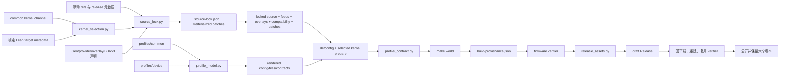
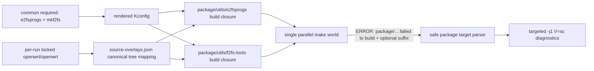
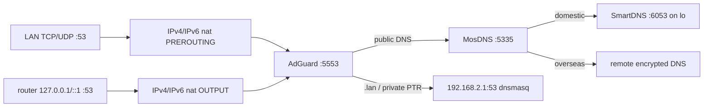
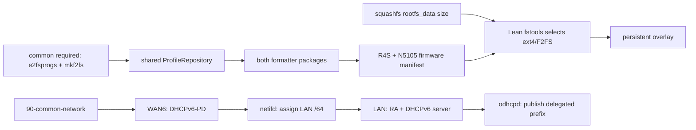

# Lean master + firewall3/iptables 的 R4S 与 N5105 OpenWrt 构建架构

## 1. 文档状态

- 状态：设计修订 7；完成历史方案整合、Linux 6.18 通道和低频自动构建架构，双平台 CI/Release 验收中
- 日期：2026-08-10
- 源码基线：Lean `master`
- 防火墙：firewall3 / iptables
- 工具链：Lean 原生 GCC 15
- 目标设备：NanoPi R4S、N5105 PVE
- 正式交付：同一次 source lock 下的双平台固件与一个经回下载复验的 Release

本文是产品决策、模块边界、实施约束和验收口径的唯一架构方案，不另建 Linux 6.18、R4S 或 N5105 的平行设计。具体 package、Kconfig、provider 和动态版本仍由第 3 节列出的机器可读声明拥有；本文解释这些声明为何存在、如何协作，以及哪些边界不得被后续“简化”丢失。当前 6.12 构建与发布闭环已经由 GitHub Actions 完整事务证明；整个仓库目标是否完成，以第 17 节的自动验证和第 18 节完成条件为准。

本文的事实分为三层：

1. **稳定产品合同**：Lean master、firewall3/iptables、GCC15、精简应用集合、双平台同轮发布，以及 R4S/N5105 各自硬件定位。除非用户明确改变需求，否则不得自行重新选择。
2. **动态构建事实**：Lean/feed commit、selected kernel point release、受控 release 版本、BBRv3 port 和 SHA256。它们每轮解析并进入 `source-lock.json`，不能抄进仓库成为永久锁。
3. **审计依据**：某次上游 commit、历史 Action run 和 Release，用于说明设计曾在什么代码上核验；它们不是 production resolver 的输入。

修订 6 重新整合了最初方案中仍然有效的产品决策、设备假设、模块接口、package/driver 取舍、sbwml 审计、CI 事务、回滚和风险说明。修订 7 把自动频率收敛为每日轻量判断、每周完整构建和重大兼容变化提前构建，并把 Release 与 Actions 临时存储的所有权分开；不恢复已被新架构替代的旧 schema、旧分支、重复校验或跨 run 大缓存。

## 2. 目标与边界

项目解决四个问题：

1. 持续跟踪 Lean、feeds 和受控上游的最新版本，同时让同一轮构建可复核。
2. R4S 与 N5105 共用应用和安全默认，各自保留硬件相关优化。
3. 固件只包含用户实际需要的功能，不为未选择 package 维护兼容补丁。
4. 只有两套固件都通过字节级验收，且 draft Release 回下载复验成功，才公开发布。

稳定产品决策如下：

- 跟踪 Lean `master`，不切换到固定稳定分支。
- 使用 firewall3/iptables，不引入 firewall4/nftables 平行栈。
- `CONFIG_GCC_USE_VERSION_15=y` 是明确的工具链代际合同。
- common 只声明本地与自动 resolver 的 testing 回退值；手动 workflow 显式选择 stable/testing（默认 stable），且不永久写死 Linux point release。
- BBRv3 是内核能力，运行时名称保持 `bbr`，package 名保持 Lean 的 `kmod-tcp-bbr`。
- GitHub 官方 Actions 使用 `actions/*@main`，每次运行直接使用其最新默认分支。
- HAProxy LTS、AdGuardHome stable、GeoIP、Geosite、feeds、BBRv3 port 都按“每轮解析最新、轮内冻结”处理。
- DNS 端口、上游、缓存、节点、订阅和凭据属于用户常用的运行时配置，不进入跨设备固件默认。
- 普通 NAT、PassWall 和当前应用闭包没有 MPTCP 产品需求；production common 显式关闭 `CONFIG_KERNEL_MPTCP` 与 `CONFIG_KERNEL_MPTCP_IPV6`，以后只有明确用例和验收才重新纳入。

### 2.1 当前实施与验收状态

| 范围 | 当前状态 | 目标状态 |
|---|---|---|
| Lean master、iptables/firewall3、GCC15 | 已实现 | 保持 |
| 精简 package 闭包、provider、source lock、provenance | 已实现 | 保持 |
| 双平台构建、固件验收、Release 回下载复验 | Linux 6.12 已通过 | Linux 6.18 迁移后重新完整通过 |
| BBRv3 + `fq` + TurboACC factory default | Linux 6.12 已通过 | selected kernel 的 port 必须 clean-apply 并保留 module version 3 |
| R4S target、IRQ、OPP、zram、r8168、ARM crypto | 配置与源码语义已实现 | 保留 Lean 原生 steering |
| N5105 VirtIO、igc、4 queues、irqbalance | 配置与源码语义已实现 | 保持 `x86-64-v2` + Tremont tune；固件不配置 PVE host |
| Linux 6.18 | selected-kernel/schema 5、本地 fixture 已实现 | 同一 source lock 下完成双平台 CI/Release 验收 |

方案验收覆盖源码解析、配置闭包、双平台编译、成品检查和 Release 回下载复验。

Linux 6.12 当前交付证据为 [GitHub Actions run 30740478414](https://github.com/Suysker/Actions-OpenWrt/actions/runs/30740478414) 和 [openwrt-2026.08.02-r870](https://github.com/Suysker/Actions-OpenWrt/releases/tag/openwrt-2026.08.02-r870)。两个静态 profile contract 已通过；Linux 6.18 迁移后必须产生新的构建与 Release 证据。

### 2.2 sbwml 审计与采纳边界

`sbwml/r4s_build_script` 与 `sbwml/builder` 只作为公开优化意图和兼容经验来源，不作为可直接覆盖 Lean target 的第二基座：

- 采纳并持续验证 ARMv8 crypto/CRC、schedutil、RK3399 OPP、r8168、zram、PWM fan、原生 IRQ affinity、BBRv3 分系列 port、Linux 6.18 package 兼容和 PPP/PPPoE 网络改进。
- 保留本项目更适合 RK3399 big.LITTLE 的 `-mtune=cortex-a72.cortex-a53`、六个 CoreMark 线程、精简 package 闭包和无 DRM/Panfrost 的路由器定位。
- 不启用 sbwml 的 `CONFIG_ALL_KMODS`、`CONFIG_ALL_NONSHARED`、GPU、Docker、Samba、qBittorrent、NGINX/QUIC 等宽功能集。
- sbwml 启用的 `CONFIG_KERNEL_PSI` 属于内存压力观测能力，不是吞吐优化；当前没有 PSI consumer，production 保持关闭，只有未来引入明确监控/内存治理用例时再评审。
- O3、全局 LTO、Clang ThinLTO、Mold、LRNG、BPF/XDP、DPDK、PREEMPT_RT 等只可作为有独立指标的实验，不因上游列为“优化”就进入 production。Mold 主要优化构建耗时，不是固件运行时性能证据。
- Lean 已原生提供 sbwml 常用的大部分基础 sysctl；sbwml 的额外 UDP buffer 上限约 7.5 MiB，本项目已采用 16 MiB socket buffer，并只保留 `fq` 和 R4S swappiness 等产品语义，不复制整份 sysctl。
- 不接受删除整个 `target/linux/rockchip`、`target/linux/generic` 或 `package/kernel/linux` 后从私有 Gitea/远程脚本替换的做法，也不把授权凭据、私有 target 或争议源码带入公开生产链。
- sbwml point release 比 Lean 更新时也不单独覆盖 Lean 的 kernel version/hash；selected kernel 必须使用本轮锁定 Lean target 已集成并验证的精确版本。

R4S、内核和工具链的逐项取舍如下。“原生纳入”表示优化目标已经由本轮 Lean 提供，本项目以源码语义和最终配置守住它，而不是复制一份相同 patch：

| 能力 | 决策 | 当前实现与理由 |
|---|---|---|
| R4S target/image、SD、LED | 原生纳入 | 保留 Lean `friendlyarm_nanopi-r4s` target 与 image pipeline，不维护第二套 Rockchip target |
| R4S 网口 IRQ 大核分配 | 原生纳入 | Lean hotplug 动态把两个板载口分到 CPU4/CPU5；不写死 IRQ 号 |
| packet steering | 原生纳入 | 使用 Lean 当前可执行的值 `1`；不写入其脚本不识别的其他值 |
| `irqbalance` | R4S 排除、N5105 纳入 | R4S 避免覆盖 native affinity；N5105 用它分布 4 队列 MSI-X IRQ |
| `autocore-arm` | 保留 UI | 为 R4S 提供状态信息，不把它描述成 CPU/IRQ 加速 daemon |
| `default-settings` | 整包排除 | 其软件源、密码、签名、防火墙和 steering 副作用越过本项目边界；只用窄 overlay 表达确有需要的默认值 |
| R8168 | 原生纳入 | 使用 Lean 当前带依赖、provider、LED 和内核适配的实现；没有已复现缺陷时不只为版本号替换 |
| R8152 vendor/USB NIC | 排除 | 两个板载网口不依赖 RTL8152，当前产品也不包含外接 USB 网卡 |
| U-Boot/ATF/rkbin | 原生纳入 | 使用 Lean 当前 R4S boot chain；不导入更旧或私有替换链 |
| RK3399 2.208/1.8 GHz OPP | 原生纳入并披露风险 | 保留 selected Lean target 的公开语义、schedutil 和 PWM fan；不继续升频或加压 |
| ARM CRC/crypto | 纳入 | userland 使用 `armv8-a+crc+crypto`，内核合同检查 ARM64 AES/GHASH/CRC |
| A72+A53 调度 | 纳入 | `-mtune=cortex-a72.cortex-a53`，符合 RK3399 big.LITTLE；不使用 A72-only kernel flags |
| N5105 调度 | 纳入 | `-march=x86-64-v2 -mtune=tremont`；不错误使用需要 AVX/AVX2 的 x86-64-v3 |
| GCC15 | 纳入并固定代际 | 使用 Lean 原生 GCC15 源码构建，不下载外部预编译工具链，也不自动回退 GCC13 |
| OpenSSL ASM/speed、zlib speed | 纳入 | 对两平台共同有意义且由公开 Kconfig 表达 |
| LTO、GC sections、Mold | production 排除 | 前两者扩大滚动 master 的兼容面；Mold 主要改善链接耗时，不是固件运行性能 |
| Clang ThinLTO、LRNG、BPF/XDP、DPDK、PREEMPT_RT | 排除 | 当前路由/代理产品没有对应需求或可自动验收的收益 |
| ALL_KMODS/ALL_NONSHARED | 排除 | 与只构建当前功能闭包的目标直接冲突 |
| DRM/Panfrost、iGPU、音频 | 排除 | 两个平台都是无显示路由器/虚拟路由器 |
| zram | 仅 R4S 纳入 | 512 MiB LZ4、低 swappiness，作为 OOM 保险；固定内存的 N5105 guest 不启用 |
| BBRv3 | common 纳入 | 按 selected series 动态解析公开 port，保留 Lean package/module/runtime 名称，并验证 ELF version `3` |
| software flow offload | common 纳入 | 由 TurboACC/UCI 唯一管理；hardware flow offload 固定关闭 |
| SFE/shortcut-fe/natflow | 排除 | 不和 iptables fullcone、PassWall、Lean software flow offload 叠加多条 fast path |
| firewall4/nftables | 排除 | 与冻结的 firewall3/iptables 产品合同冲突 |
| MPTCP、PSI | 排除 | 当前没有 consumer 或产品用例，不把观测/多路径能力误称为转发优化 |
| 固定 root 密码、关闭签名、公开私钥 | 排除 | 不用安全边界换取首次使用便利或虚假真实性 |

从 `sbwml/builder` 借鉴的是执行思想，而不是照搬 workflow：

| 执行思想 | 本项目实现 |
|---|---|
| GitHub 托管 runner | `ubuntu-latest`，记录当轮 runner 事实并设置磁盘门槛和 timeout |
| 双设备并行 | 自动发现 profile，`fail-fast: false`、`max-parallel: 2` |
| 构建缓存 | 只保留当轮 runner 内的 OpenWrt 下载目录与本地 ccache；不把滚动源码对应的大目录跨 run 上传到 Actions cache |
| 并行失败后串行诊断 | 只重放第一个安全的 `package/.../compile` 目标，保留原 job 失败 |
| 固件、manifest、buildinfo、hash | 扩展为 SBOM、source-lock、单一 provenance 和 Release 回下载复验 |
| draft Release | 两个平台聚合后创建，全部资产回下载验证后才公开 |
| 远程脚本、第三方清盘 action、外部发布 | 不采用；runner 清理、构建和发布都由仓库内有边界的代码完成 |

### 2.3 设备假设

R4S profile 的设备合同是 NanoPi R4S 4GB：

- RK3399，四个 Cortex-A53 与两个 Cortex-A72。
- SD 卡启动，使用 Lean 的 squashfs sysupgrade image。
- 板载 LAN 为 RTL8211E，经 RK3399 GMAC；板载 WAN 为 R8111H，经 PCIe 使用 `r8168`。
- 使用两个板载网口；USB 网卡、Wi-Fi、显示、音频和存储服务不在当前产品范围。
- 保留 cpufreq、PWM fan 和 zram。
- 接口角色沿用 Lean target：`eth1=LAN`、`eth0=WAN`；common 不在全局生成脚本中改写 ethX。

N5105 profile 的设备合同是运行在 PVE 中的专用 OpenWrt guest，而不是泛化 x86 固件：

- 宿主 CPU 为四核四线程 Jasper Lake/Tremont N5105。
- guest 使用 q35、OVMF、单 socket/4 vCPU、`cpu: host`、固定内存且关闭 balloon。
- VirtIO SCSI 作为虚拟磁盘；唯一 VirtIO NIC 为 LAN，并配置 4 queues。
- 唯一 I225/igc 网卡通过 PCIe passthrough 作为 WAN。
- Intel microcode、物理 cpufreq 和 IOMMU ownership 属于 PVE host，不重复放进 guest。
- 接口角色由 driver 动态发现，不依赖 `eth0`/`eth1` 枚举顺序。

若实际硬件拓扑不同，例如 N5105 改成裸机、出现多个 VirtIO/igc 接口或 R4S 改用 USB 网卡，应先修改设备 profile 及语义合同；不能为了让未知设备“也许能启动”扩大当前精简固件。

### 2.4 最终形态速览

| 层 | 最终方案 |
|---|---|
| Common | Lean master；可选择的 stable/testing kernel channel；firewall3/iptables；GCC15；共享精简 package 闭包；OpenSSL ASM/speed、zlib speed；BBRv3 + `fq`；software flow offload；签名、SBOM、source lock 与 provenance |
| R4S | Lean 原生 Rockchip/R4S target；ARMv8 CRC/crypto + A72/A53 tune；r8168；native CPU4/5 IRQ；packet steering；schedutil/PWM fan；512 MiB LZ4 zram；无 irqbalance、RTL8152、DRM/Panfrost |
| N5105 PVE | x86_64 generic EFI squashfs；x86-64-v2 + Tremont tune；VirtIO built-in + I225/igc；4 queues + irqbalance、RPS off；无 autocore、zram、microcode、USB/GPU/音频 |
| Actions | 每日轻量解析；每周一次双平台构建，兼容边界发生重大上游变化时提前构建，手动构建随时可用；prepare 一次解析 source lock；四个高价值门禁；聚合、回下载复验、公开、保留六个 Release |

## 3. 唯一事实源

每类事实只允许一个声明所有者：

| 领域 | 唯一事实源 |
|---|---|
| profile 集合 | `profiles/<device>/config.seed` 目录发现 |
| 共用/设备 Kconfig | `profiles/common/config.seed` 与 `profiles/<device>/config.seed` |
| 必选 package/布尔 config | 对应层的 `required-packages.txt` |
| 禁止 package | 对应层的 `forbidden-packages.txt` |
| 设备环境与目标 | 对应层的 `profile.env` |
| rootfs 默认 | 对应层的 `files/` |
| 锁定上游源码语义 | 对应层的 `semantics.json` |
| 手动 kernel channel 选择 | workflow_dispatch 的 `kernel_channel`（stable/testing，默认 stable） |
| 本地/自动 resolver 回退 channel | `profiles/common/config.seed` 中的 `CONFIG_TESTING_KERNEL` |
| 当轮最终 kernel channel | `source-lock.json` 各 profile 的 `kernel_channel` |
| 自定义 feeds | `feeds.custom.conf` |
| package provider | `profiles/common/providers.tsv` |
| Geo 数据角色与可信来源 | `profiles/common/geodata-sources.json` |
| 官方源码窄同步 | `profiles/common/source-overlays.json` |
| 源码兼容规则 | `profiles/common/source-compatibility.json` |
| BBRv3 provider 策略 | `patchsets/common/kernel/bbr3-sources.json` |
| BBRv3 module version 兼容 | `patchsets/common/kernel/bbr3-sources.json` 的兼容声明与 `patchsets/common/kernel/bbr3-module-version.patch` |
| selected-kernel PPP TX scatter-gather 兼容 | `patchsets/common/kernel/selected-kernel-compatibility.json` 与对应系列窄补丁 |
| 当轮动态版本、commit、hash | 运行时生成的 `source-lock.json` |

文档、workflow 和测试只引用这些声明，不复制设备名、包清单、版本或 hash。

### 3.1 目录与配置所有权

```text
.github/workflows/
  openwrt-builder.yml             # 双平台构建与 Release 事务
  update-checker.yml              # 每日轻量解析；每周或重大上游变化时派发双平台构建

profiles/
  common/
    profile.env                   # 所有设备共享的环境接口
    config.seed                   # shared non-package Kconfig
    required-packages.txt         # shared positive package/config contract
    forbidden-packages.txt        # shared final package blacklist
    providers.tsv                 # 重名 package 的唯一 provider
    geodata-sources.json          # GeoIP/Geosite 静态供应链接口
    source-overlays.json          # 官方 OpenWrt core 的窄同步映射
    source-compatibility.json     # 当前闭包的声明式源码兼容规则
    semantics.json                # shared locked-upstream source 行为
    files/                        # shared factory defaults
  r4s/                            # R4S target/image/hardware 声明与 rootfs
  x86-n5105-pve/                  # N5105 PVE target/image/hardware 声明与 rootfs

patchsets/
  common/kernel/
    bbr3-sources.json             # provider/ref/path/算法身份策略
    bbr3-module-version.patch     # module stripping 的窄兼容补丁
  common/series                   # 仓库 common patch 顺序
  feeds/passwall/series           # PassWall feed-local patch 顺序
  feeds/kenzo/series              # AdGuardHome/SmartDNS feed-local patch 顺序
  r4s/series                      # R4S patch 顺序
  x86-n5105-pve/series            # N5105 patch 顺序

scripts/
  profile_model.py                # profile 领域模型
  kernel_selection.py             # selected-kernel 领域模型
  kernel_patch.py                 # kernel patch 安全解析
  source_lock.py                  # 动态输入解析与 schema
  profile_contract.py             # 最终 profile 合同
  profile_semantics.py            # 声明式行为解释器
  apply_source_lock_artifacts.py  # 锁定 release metadata 写入
  apply-source-compatibility.py   # 声明式兼容执行器
  collect-build-provenance.sh     # 单一 provenance 收集
  firmware_image.py               # gzip/fwtool 镜像容器解释器
  release_assets.py               # Release 聚合、命名与重建
  *.sh                            # 薄 CLI 与流程编排

tests/
  test-*                          # 与上述共享模块一一对应的 fixtures

docs/build-architecture.md        # 本架构与决策依据
lessons.md                        # 跨问题的根因模式和预防规则
```

目录设计遵循两个复用约束：同一事实出现在两个消费者时，消费者必须调用共享模块或读取同一声明；只有设备真正不同的 target、image、driver、CPU flags 和 rootfs 行为才进入设备目录。新增 profile 应只增加 `profiles/<device>` 的声明与相应语义，不应修改 matrix、checker 或 update checker 的设备枚举。

## 4. 总体数据流

```text
daily OpenWrt Upstream Update Monitor or manual OpenWrt Firmware Build & Release dispatch
  -> weekly due / significant upstream impact decision
  -> repository declarations + rendered common/device intent + floating upstreams
  -> kernel_selection.py selects stable/testing metadata from locked Lean
  -> source_lock.py resolve/validate/materialize
  -> one immutable source-lock artifact
  -> locked Lean + feeds + source overlays
  -> apply controlled metadata and narrow compatibility
  -> defconfig -> normalize exact-forbidden children -> defconfig
  -> make download -> target/linux/prepare
  -> one final profile contract including prepared kernel source semantics
  -> make world reusing the prepared tree
  -> collect one build-provenance.json
  -> verify one profile delivery
  -> release_assets.py verifies and assembles both profiles
  -> draft Release upload
  -> download every asset -> reconstruct both deliveries -> verify again
  -> delete verified Actions transaction artifacts
  -> publish the same draft -> retain six verified production Releases
```

正式路径只有四层门禁：

1. `resolve-lock`：解析和冻结所有浮动输入。
2. `check-final-config`：验证最终 `.config`、package、provider、target、selected kernel 和 target/prepared-kernel 源码语义。
3. `verify-firmware`：验证真实固件、manifest、SBOM、模块、工具链、provenance 和 hash。
4. `verify-release`：从 draft Release 回下载，重建每个平台目录并复用同一个固件 verifier。

## 5. 模块划分与依赖关系

### 5.1 模块职责

| 模块 | 职责 |
|---|---|
| `scripts/source_lock.py` | 上游解析、schema 校验、digest、BBRv3 物化、feeds 与 source overlay 投影 |
| `scripts/kernel_selection.py` | 从渲染 Kconfig 与锁定 Lean target 唯一解析 channel、series、version 和 source hash；向所有消费者提供同一结构 |
| `scripts/kernel_patch.py` | 识别 Git/OpenWrt quilt patch、规范化 touched paths、拒绝危险路径并供 resolver/clean-apply 复用 |
| `scripts/profile_model.py` | profile 发现、common/device 合并、Kconfig 派生、package 合同计算 |
| `scripts/profile_contract.py` | 最终 config、seed drift、package、provider、target、kernel 与 locked-source 语义验收 |
| `scripts/profile_semantics.py` | 声明式验证 Lean target patch 与 prepared kernel upstream 等价语义 |
| `scripts/apply_source_lock_artifacts.py` | 把 lock 中的精确 release metadata 写入唯一 package provider |
| `scripts/apply-source-compatibility.py` | 按声明式规则处理当前编译闭包内的非内核源码兼容，并以 selected kernel series 驱动系列相关 Kconfig 守卫 |
| `scripts/selected_kernel_compatibility.py` | 解释 selected-kernel 能力声明，区分 Lean 原生补丁、仓库适配、部分实现与未来 upstream kernel |
| `scripts/apply-profile-patches.sh` | 在各自 Git 工作树应用 OpenWrt common/device 与 feed patchset、selected-kernel/源码兼容规则和本轮 BBRv3 patch stack |
| `scripts/collect-build-provenance.sh` | 从真实 build tree 生成平台交付目录和 `build-provenance.json` |
| `scripts/verify-firmware-artifacts.sh` | 平台交付的唯一验收器 |
| `scripts/release_assets.py` | 双平台聚合、专业资产命名、完整包/release index、回下载重建和复验 |
| `.github/workflows/openwrt-builder.yml` | 编排四层门禁和 Actions 中转制品生命周期，不解释自动频率或领域 schema |
| `.github/workflows/update-checker.yml` | 唯一拥有自动频率；每日调用同一个 resolver，周一或重大上游变化时派发双平台 source lock |

### 5.2 复用接口

- shell 只编排进程与文件，JSON/schema 解释由 Python 模块拥有。
- `source_lock.py`、`profile_contract.py` 和 patch applicator 不再分别用正则解释 `KERNEL_PATCHVER`；它们只消费 `kernel_selection.py` 的统一结果。
- BBRv3 resolver 与 clean-apply checker 不再分别解析 patch 路径；它们只消费 `kernel_patch.py` 的同一规范化 touched-path 集合。
- `apply-profile-patches.sh` 把 source-lock 中已经解析完成的 `kernel_series` 传给源码兼容执行器；兼容规则不得重新读取 target Makefile、猜测版本或维护第二份 series 映射。
- `render-profile.sh`、`check-profile-contract.sh`、`resolve-source-lock.sh`、`assemble-release.sh` 和 `verify-release-assets.sh` 都是薄 CLI。
- build、aggregate 和 release-download 三个边界复用 `verify-firmware-artifacts.sh`。
- 失败日志属于 diagnostics；正式资产只保留可复核交付及一个结构化 provenance。
- 自动与手动入口都汇入同一个 `openwrt-builder.yml`；不增加 weekly builder、紧急 builder、冷却脚本或第二套 source-lock 解析器。
- `source_lock.py` 从最近正式 Release 的 lock 与当前 lock 生成兼容性投影：内核 target/channel/series、Git 来源身份、受控 semver 兼容线、BBRv3 算法 commit 和 port 拓扑。只有投影变化属于重大更新；point release、普通 feed commit 与 Geo 数据 tag 漂移由周构建吸收。
- Release 是长期产品存储，Actions artifact 只是同一 run 内 `prepare -> build -> aggregate` 的事务传输接口；回下载验证通过后由 builder 按 run 动态发现并删除，不维护 artifact 名单。

### 5.3 命名与风格

- profile 与文件名使用 kebab-case，例如 `x86-n5105-pve`。
- Release tag 使用 `openwrt-YYYY.MM.DD-r<run>[.<attempt>]`；用户直接刷写的镜像使用 `openwrt-<profile>-<release-id>-<image-role>.img.gz`。
- Release 不暴露内部 `<profile>--<file>` 名称。每个 profile 只提供一个主刷写镜像和一个 `-full.tar.gz` 完整可复核包。
- JSON 字段与 Python 标识符使用 snake_case。
- 内核选择统一使用 `kernel_channel`、`kernel_series`、`kernel_version` 和 `kernel_source_sha256`；channel 只允许 `stable`/`testing`，不把 selected kernel 统称为 stable。
- report schema 使用明确整数版本；不为旧内部 schema 保留平行解释器。
- 路径安全检查位于真正执行 clone、copy、remove、archive reconstruction 的边界。
- 新设备只增加 `profiles/<device>` 声明，不修改 checker 或 matrix 分支。
- 自动判定统一使用 `weekly`、`significant`、`routine` 三种原因；不把普通 source digest 变化命名为重大更新，也不使用 cache hit 表示发布历史。

### 5.4 稳定接口

共享模块通过少量稳定 CLI 暴露能力，workflow 只编排它们：

```text
render-profile.sh list
render-profile.sh bundle <profile> <output-directory>
render-profile.sh env|config|required|forbidden <profile> [output]
render-profile.sh files <profile> <output-directory>

resolve-source-lock.sh resolve <profile-list> <output-json> [stable|testing]
resolve-source-lock.sh materialize <source-lock.json> <output-directory>
resolve-source-lock.sh digest <source-lock.json>
resolve-source-lock.sh compare <old-json> <new-json>
resolve-source-lock.sh update-impact <released-json> <current-json>
resolve-source-lock.sh profile-kernel-plan <source-lock.json> <profile>
resolve-source-lock.sh bbr-patch-plan <source-lock.json> <series>

check-profile-contract.sh <profile>
check-profile-contract.sh <profile> <openwrt-root> <source-lock.json> [report] [diagnostics]

apply-source-lock-artifacts.sh <openwrt-root> <source-lock.json> <report-json>
assemble-release.sh <source-lock.json> <output-dir> <release-id> <profile-deliveries...>
verify-release-assets.sh <downloaded-release-directory>
```

`render-profile.sh bundle` 一次产生不可变的 common+device 快照，CI 不分别渲染后再自行拼装。静态 `check-profile-contract.sh <profile>` 验证仓库声明；带 OpenWrt tree 的形式在 kernel prepare 后一次验证最终 config、package、provider、selected kernel 和源码语义。二者调用同一个 `ProfileRepository`/`RenderedProfile` 模型，不是两套规则。

### 5.5 依赖图与运行时所有权



运行时设置同样只能有一个所有者：

| 设置 | 唯一所有者 |
|---|---|
| GeoIP/Geosite 的角色、可信仓库和 recipe 字段 | `geodata-sources.json`；当轮 tag/hash 进入 source lock |
| BBRv3 provider 与算法身份策略 | `bbr3-sources.json` |
| selected kernel channel/series/version/hash | common Kconfig intent + `kernel_selection.py` + source lock |
| BBRv3/`fq` 是否进入固件 | common required Kconfig/package contract |
| 初次 CCA 选择 | `zz-common-turboacc`，仅在 module version `3` 和 `sch_fq` 成立后执行一次 |
| 后续 CCA 与 software flow offload | TurboACC UCI/init；项目不建立第二个 sysctl 所有者 |
| common qdisc/socket buffer | `90-router-performance.conf` |
| DHCP `.32/232` 与 IPv6-PD LAN 发布 | `90-common-network` |
| 服务角色去重 | `90-common-system` 只禁用官方 HAProxy 示例服务；PassWall 与 LuCI AdGuardHome 实例分别拥有实际进程 |
| R4S IRQ affinity/接口映射 | Lean Rockchip target；项目语义合同只验证 |
| R4S zram/packet steering | `91-r4s-performance` 与 `91-r4s-memory.conf` |
| N5105 接口角色、4 queues、RPS | `91-x86-n5105-performance` 与 `91-n5105-multiqueue` |
| N5105 IRQ 分布 | `irqbalance` |
| DNS listener、upstream、cache、规则和凭据 | 设备运行时 UCI/YAML，不属于固件构建 |

## 6. 最新追踪与 source lock

### 6.1 “最新”与“可复核”同时成立

每次 prepare 都从浮动策略解析当前值：

- Lean `master`
- `feeds.custom.conf` 中每个 feed 的目标分支或默认分支
- OpenWrt 官方 core source overlay
- 当前受支持的最高 HAProxy LTS 分支最新 patch release
- 最新 AdGuardHome stable release
- `Loyalsoldier/geoip` 最新 `geoip.dat`
- `Loyalsoldier/v2ray-rules-dat` 最新 `geosite.dat`
- Lean 本轮 profile 所选 channel 对应的 target kernel
- 与该 kernel series 匹配的最新受信任 BBRv3 port

resolver 随即把 commit、精确 URL 和 SHA256 写入同一个 schema 5 lock。两个 build job 只消费该 lock，不在构建中再次查询 `latest` 或 branch HEAD。

这意味着：

- 仓库不永久钉死普通上游版本/hash。
- 同一轮 R4S 与 N5105 不会解析到不同版本。
- Release 中的 lock 能解释固件实际使用了什么。
- 新上游若与当前 Lean 不兼容，构建明确失败，不静默回退。

### 6.2 schema 5 内容

Linux 6.18 通道迁移把 source-lock 从 schema 4 升为 schema 5，不保留两个内部 schema 的平行解释器。顶层字段保持：

```text
schema
resolved_at
repository_commit
openwrt
feeds
source_overlays
upstream_artifacts
profiles
kernel_features
profile_digests
patch_digest
```

每个 `profiles.<name>` 至少记录：

```text
kernel_channel
kernel_target
kernel_series
kernel_version
kernel_source_sha256
target_check_regex
image_pattern
```

`kernel_features.bbr3.profile_kernel_series` 必须与 profile 的 selected kernel 完全一致；channel 变化即改变 profile digest 和 source-lock digest。

GitHub Actions 不写入 source lock。Action 在 workflow 开始时已由 GitHub 解析，运行中查询其 HEAD 不能证明已执行的字节。仓库只约束复用 Action 必须是官方 `actions/*@main`；最新行为由 GitHub 在每次运行时直接解析。

### 6.3 hash 策略

- release asset 必须有真实 SHA256。
- Geo 数据同时校验发布方 checksum 资产。
- BBRv3 patch 下载后计算 hash，并对精确 Linux version clean-apply。
- package metadata 不允许 `PKG_HASH:=skip` 或 `releases/latest/download`。
- `make download -j8` 是 OpenWrt 全部 source 的统一 hash 门禁。

### 6.4 stable/testing selected kernel channel

selected kernel 只有一条带明确优先级的解析路径：

1. 手动 workflow 的 `kernel_channel` 显式选择 `stable` 或 `testing`，默认 stable；本地调用省略参数时才沿用 common seed 的 testing 回退值。两个设备 seed 都不重复拥有该 symbol。
2. resolver 通过 `kernel_selection.py` 将显式选择应用到两个渲染结果；非法值在解析前失败。
3. resolver 从本轮锁定 Lean 的 `target/linux/<target>/Makefile` 分别读取 `KERNEL_PATCHVER` 或 `KERNEL_TESTING_PATCHVER`，再从 `include/kernel-<series>` 解析精确 version/hash，并把最终选择写入 source lock。
4. build 不再重新猜测通道，而是依据 source lock 原子改写渲染后的 `CONFIG_TESTING_KERNEL`，再执行 defconfig。各 target 独立解析同一 channel 对应的 series；若 Lean 为两个 target 提供不同 series，source lock 分别记录并为每个 series 解析 BBRv3 port。
5. build 在最终 `.config`、target metadata、source lock 和 provenance 四处复核同一个 selection；产物 verifier 会再次按 lock 重建期望 seed，任何一处不同立即失败。

2026-08-02 审计时，Lean `f9dcc54b24e3f7fc7e8cd6db05f9e545eff67486` 为 Rockchip/x86 同时提供 stable 6.12、testing 6.18，精确 testing version 为 6.18.38；Linux 6.18 已是 kernel.org longterm。它们是可行性证据而不是永久构建输入，后续仍由 Lean master 动态解析。即使 sbwml 已更新到更高的 6.18 point release，本项目也不越过 Lean target 独立改 kernel hash。

testing channel 以后可能按 target 前进到其他 series。任一 profile 的 selected series 缺少可信 BBRv3 port、target patch 或当前闭包兼容性时，整轮构建必须停止且不发布；不得静默切回 6.12、普通 BBR 或其他 provider。

Lean 6.18 patch stack 当前还包含 PPP TX scatter-gather、PPPoE GRO/GSO、R4S target/OPP 与 I225/I226 EEE disable；仓库验证这些能力的源码语义与成品落地。stable 6.12 缺少 PPP TX scatter-gather 时，`selected-kernel-compatibility.json` 会在确认 Lean 的 `direct_xmit` 前置补丁存在后，把由 Linux 上游 `42fcb213e58a` 窄适配的补丁安装到 `backport-6.12`。testing 6.18 已有完整语义时不重复安装。完整、部分、缺失三种 patch-stack 状态由同一解释器判定，最终 prepared-source 合同仍是能力是否真正落地的裁决者。

### 6.5 schema 5/6.18 迁移结果

当前实现已经完成以下收敛，不再保留旧路径：

- common 唯一声明本地/自动 resolver 的 `CONFIG_TESTING_KERNEL=y` 回退值与 MPTCP/MPTCP IPv6 负选择；手动选择由 source lock 传递，两个设备 seed 不重复拥有 kernel channel。
- `source_lock.py`、`profile_contract.py` 与 patch applicator 统一消费 `kernel_selection.py`；生产代码只有该模块解释 `KERNEL_PATCHVER`/`KERNEL_TESTING_PATCHVER`。
- BBRv3 resolver、materializer 与 clean-apply checker 统一消费 `kernel_patch.py`，同时接受真实 Git/quilt 格式并拒绝危险或不完整路径。
- source-lock schema 5 在 profile entry 中完整记录 channel/target/series/version/source hash；resolver、validator、digest、summary、applicator、provenance、firmware/Release verifier 与 fixtures 已同步升级，schema 4 明确拒绝。
- N5105 igc VLAN 合同使用 backport/prepared-upstream alternatives；common 直接检查 prepared kernel source 中的 PPP TX scatter-gather 与 PPPoE IPv4/IPv6 GRO/GSO 语义。
- workflow 在 `make download` 后执行 `make target/linux/prepare`，再运行唯一 final profile contract；`make world` 复用已验收的 prepared tree。

## 7. Profile 合并模型

### 7.1 common 与 device

```text
profiles/common/             两个平台共享
profiles/r4s/                NanoPi R4S 专属
profiles/x86-n5105-pve/      N5105 PVE 专属
```

renderer 按以下规则合并：

- 相同 Kconfig symbol 不能同时由 common 与 device 拥有。
- required/forbidden 规则不能跨层重复。
- common 与 device 的 rootfs 同路径不能覆盖。
- required package 自动派生 `CONFIG_PACKAGE_<name>=y`。
- required config 自动派生 `<symbol>=y`。
- exact-forbidden package 自动派生对应负选择。
- `config.seed` 只保存 target、CPU flags、数值、字符串和不能由 package 合同表达的选项。
- common 拥有两个设备共同的 kernel channel 回退值以及 MPTCP 负选择；手动 workflow 的选择在渲染后由 source lock 覆盖，设备 seed 不重复声明 kernel channel。

首次 `make defconfig` 后，normalizer 只处理 exact-forbidden 父应用遗留的已选子项；第二次 `defconfig` 后，`profile_contract.py` 一次性验证：

- rendered seed 的正选择未消失或变值；负选择未被重新选中。
- required/forbidden package 和 config。
- package provider 唯一性。
- target 与 image pattern。
- Lean selected kernel channel/series/version/hash 与 source lock。
- common/device rootfs 与锁定源码的稳定语义。

## 8. Feeds、provider 与精简闭包

自定义 feeds 保持用户指定的源头：

- `small`：`kenzok8/small`
- `kenzo`：`kenzok8/openwrt-packages`
- `sbwml`：`sbwml/luci-app-mosdns`
- `xiaorouji`：`Openwrt-Passwall/openwrt-passwall-packages`
- `passwall`：`Openwrt-Passwall/openwrt-passwall`
- `packages`：`openwrt/packages@master`

`source_lock.py` 解析并排序 feeds，`manage-custom-feeds.sh` 只消费其投影。provider selector 根据 `providers.tsv` 精确保留当前产品所需实现，再从 lock 重建全部 feed 索引。

安装阶段只把当前 profile 的 required package 交给 OpenWrt feeds installer，由 OpenWrt 展开真实 source/build/runtime dependency。未选择应用不会进入 Kconfig，也不会因为其 recipe 陈旧而成为本项目维护对象。

GeoIP 与 Geosite 的角色只在 `geodata-sources.json` 定义。resolver、validator 和 applicator 共用该合同；`v2ray-geodata` package 最终打包 Loyalsoldier 的两个当轮精确资产。

### 8.1 Feed 与 provider 分工

| Feed | 产品职责 |
|---|---|
| `packages` | 以同名 custom feed 明确替换 Lean 默认 packages，追踪 `openwrt/packages@master`，为当前闭包提供维护更活跃的通用包 |
| Lean `luci`/`routing`/`telephony` | 基座自带 feed；只安装当前 required 依赖展开到的源码 |
| `small` | 当前选择的 `dns2socks`、`tcping`、`v2dat` 等 PassWall 依赖 |
| `kenzo` | AdGuardHome、SmartDNS、ddns-go 及对应 LuCI 应用 |
| `sbwml` | MosDNS 与 `luci-app-mosdns` |
| `xiaorouji` | `Openwrt-Passwall/openwrt-passwall-packages` 中的代理核心与依赖 |
| `passwall` | `Openwrt-Passwall/openwrt-passwall` 的 LuCI 应用 |

历史 owner `xiaorouji/*` 已迁移时，合同使用 GitHub 返回的 canonical `Openwrt-Passwall/*` 仓库；不依赖重定向或已经删除的旧入口。feed 名仍保持 `xiaorouji`，因为它是仓库内部稳定标识，不等于远端 owner。

关键 provider 由 `providers.tsv` 单点声明，例如：

| Package/组件 | 唯一 provider |
|---|---|
| HAProxy | `feeds/packages/net/haproxy` |
| AdGuardHome 与 LuCI | `feeds/kenzo` |
| SmartDNS 与 LuCI | `feeds/kenzo` |
| ddns-go 与 LuCI | `feeds/kenzo` |
| PassWall LuCI | `feeds/passwall` |
| MosDNS 与 LuCI | `feeds/sbwml` |
| Xray、Hysteria、Geoview、ipt2socks | `feeds/xiaorouji` |
| GeoIP/Geosite package | `feeds/xiaorouji/v2ray-geodata` |
| tcping、dns2socks、v2dat | `feeds/small` |
| TurboACC | locked Lean LuCI feed |

selector 只删除合同明确列出的同名源码冲突目录，随后从 source lock 枚举全部 feed 并重建索引。provider 选择决定“哪个 recipe 提供某 package”，required 文件决定“是否安装该 package”；两者不能混成一份表。

### 8.2 只维护真实构建闭包

`feeds install -a` 会把所有 feed recipe 注入 Kconfig，即使某应用没有选中，其缺失依赖和陈旧 Makefile 也可能产生大量 warning 或让 `defconfig` 失败。这些 warning 不等于固件真的需要对应软件，逐个修复会把维护范围扩张到整个 Lean/package 世界。

本项目采用更窄且可证明的边界：

1. 由 rendered required contract 得到直接安装入口。
2. 让 OpenWrt feeds installer 递归展开这些入口的真实 source/build/runtime dependency。
3. 只把该闭包注入 Kconfig。
4. 最终 `.config` 与 image manifest 同时验证 required 存在、forbidden 不存在。

因此，未选择的 Samba、telephony、数据库、Wi-Fi 或其他 recipe 的缺依赖 warning 不进入修复范围；一旦它通过真实依赖进入当前闭包，就必须修根因，不能删掉 required package 逃避编译。

连续暴露的 `tcping`、`wol`、`lsof` 等失败证明了另一条根因：Lean packages 的部分通用 recipe 对 GCC15/C23 的维护滞后，逐包在仓库永久写版本/hash 会不断追赶下一个包。本项目于是用 `openwrt/packages@master` 统一提供当前通用 package 闭包，并从同一轮锁定的 `openwrt/openwrt@master` 窄同步 Lean core 缺少或落后的部分：

| 官方 core overlay | 原因 |
|---|---|
| `package/libs/gmp` | 使用官方已经适配 GCC15/C23 的 canonical 子树 |
| `package/libs/pcre2` | 当前 HAProxy/wget 等依赖需要，而官方 packages 不再内置该 core 库 |
| `package/utils/e2fsprogs` | `e2fsprogs` 进入闭包后，Lean 1.47.0 的 `tdb.c` 在 C23 下无条件定义 `bool`；复用官方已增加标准版本保护的 canonical 子树 |
| `package/utils/f2fs-tools` | `mkf2fs` 进入闭包后，Lean 的旧 recipe 在 GCC15/C23 下因自行定义 `bool` 而失败；复用官方已改用 `stdbool.h` 的 canonical 子树 |
| `package/system/mtd` | 使用官方已解决当前 GCC15/C23 问题的实现 |
| 隔离的 SBOM generator 文件 | Lean 保留 SBOM Kconfig 却缺少完整 image 生产链；只补官方生成器及其依赖，不覆盖整个 `include/image.mk` |

只有 canonical 来源也不能解决当前闭包时，才允许进入 `source-compatibility.json`。当前窄规则是：

- `libsepol` 和用户明确保留的旧 `wol` CLI 使用 package-local GNU17 语义，不降低全局 GCC15。
- `small/tcping` 的自定义 `Build/Compile` 恢复 `$(TARGET_CONFIGURE_OPTS)`/`$(MAKE_FLAGS)` 语义，使 `CC`、`STRIP` 等仍来自 target toolchain。
- R4S zram backend 的 kernel-series guard 由 selected series 动态扩展；上游原生支持时 no-op。
- CycloneDX image SBOM 生产规则只在 Lean 缺失时补齐，并验证官方生成器文件和 executable mode。

这些规则都不保存 package version、`PKG_HASH` 或 release URL；recipe 漂移到无法证明时直接失败并重新审计。

#### overlay formatter/GCC15 故障的统一设计

实际双平台 CI 先在 `package/utils/f2fs-tools` 看到 C23 拒绝旧源码的 `typedef u8 bool`；补齐 ext4 formatter 后，R4S 与 N5105 又同时在 Lean `e2fsprogs` 1.47.0 的 `lib/ext2fs/tdb.c` 因 `typedef int bool` 失败。两者都是共享 formatter 闭包与 GCC15/C23 的兼容问题，不是设备差异，也不应通过降低全局 GCC、删除启动依赖、写死 package 版本/hash，或继续增加私有补丁来回避。锁定的官方 OpenWrt core 已分别提供兼容 recipe/source，因此复用同一 canonical overlay 机制。

| 模块 | 职责与复用边界 |
|---|---|
| `profiles/common/required-packages.txt` | 声明产品保留 `mkf2fs`；同时独立要求当前较小 rootfs_data 会实际调用的 `e2fsprogs` |
| `profiles/common/source-overlays.json` | 把锁定的 OpenWrt 官方 core 中 `package/utils/e2fsprogs` 与 `package/utils/f2fs-tools` 映射到同名 Lean 路径；它是 overlay 路径的唯一事实源 |
| `scripts/source_lock.py` | 每轮解析一次官方 core 最新 commit，并让两个 profile 共用同一不可变 lock |
| `scripts/sync-source-overlays.sh` | 只消费 lock 和声明式 mapping，原子同步 canonical 子树，不维护 package 版本或补丁枚举 |
| `scripts/collect-build-failure-diagnostics.sh` | 从并行日志解析安全的 `package/...` 语义前缀；允许 OpenWrt 在其后附加 build variant 等说明 |
| 现有 overlay/diagnostics tests | 从 manifest 动态取得 mapping，并用真实错误格式验证定向串行诊断；不维护第二份 package 清单 |



命名继续使用上游 canonical 路径 `package/utils/e2fsprogs`、`package/utils/f2fs-tools` 和现有 `failed_package` 概念；不创建 formatter 专用 GCC15 patchset、固定版本副本或第二套同步器。这样后续官方 recipe 更新由下一轮 source lock 自动吸收，而 overlay manifest、同步器和测试仍各自只有一个职责。

### 8.3 受控最新产物

| 组件 | 每轮策略 | 完整性来源 |
|---|---|---|
| HAProxy | 官方仍受支持的最高 LTS 分支最新 patch release | HAProxy 官方 release metadata 与 SHA256 |
| AdGuardHome | GitHub 最新非 prerelease stable | 精确 tag/commit、源码与 frontend 资产 hash |
| GeoIP | `Loyalsoldier/geoip` 最新非 prerelease | `geoip.dat` asset digest 与发布 checksum |
| Geosite | `Loyalsoldier/v2ray-rules-dat` 最新非 prerelease | `geosite.dat` asset digest 与发布 checksum |

resolver 在 prepare 中解析一次，applicator 只把 lock 中的精确版本、不可变 URL 和 64 位 SHA256 写进当前 worktree；它不访问网络，也不解析 `latest`。若 feed recipe 已是同一版本就只核验，若落后就更新本轮工作目录。`make download` 再使用 OpenWrt 自身的 hash 校验全部 source。

因此仓库中看见的某个上游 recipe `PKG_HASH` 是该 recipe 自身的 metadata，不代表项目永久锁死；项目新增的普通上游版本/hash不得写死。允许稳定固定的是用户明确选择的功能/ABI 代际，例如 GCC15、BBRv3 module version 3 和 N5105 x86-64-v2 基线。

AdGuardHome 保持 package 的 `--no-check-update`：最新版本由 Actions 生成新的、可回滚的双平台固件，设备内二进制不绕过 OPKG、非特权 jail、provenance 和 Release 自行替换。

## 9. 共同固件策略

完整 package 集以 `profiles/common/required-packages.txt` 和各设备 required 文件为准。稳定功能意图包括：

- LuCI 与简体中文。
- firewall3/iptables、dnsmasq-full、IPv4/IPv6、PPPoE、iptables UPnP。
- PassWall 的 Xray、Hysteria、HAProxy、GeoIP/Geosite。
- MosDNS、SmartDNS、AdGuardHome。
- ddns-go、nlbwmon、ARP 绑定、自动重启、内存释放、ttyd、TurboACC、WOL。
- CoreMark、htop、lsof、SFTP server。
- squashfs block-root 首次启动所需的 `e2fsprogs` 与 `mkf2fs`，覆盖 Lean fstools 的 ext4/F2FS 两条格式化路径。
- signed packages、signature check、TLS certificate check、CycloneDX SBOM。

不在产品范围内的应用和替代栈由 `forbidden-packages.txt` 统一约束。精简通过 Kconfig 与最终 manifest 完成，不删除无关源码目录。

common 的内核/构建策略同样遵循精简原则：

- `CONFIG_TESTING_KERNEL` 只表达 Lean 的 stable/testing channel：手动 workflow 显式选择并写入 lock，本地/自动 resolver 才使用 common 的 testing 回退值；精确 series/version/hash 仍由当轮 lock 决定。
- `CONFIG_KERNEL_MPTCP` 与 `CONFIG_KERNEL_MPTCP_IPV6` 显式关闭。MPTCP 不加速普通 NAT 转发，也不是当前 PassWall 运行合同。
- 继续使用 `-O2`、GCC15、OpenSSL ASM/runtime dispatch；生产路径不启用全局 LTO、GC sections、Mold 或 Clang ThinLTO。
- 新的编译器/链接器选项必须分别证明运行性能、镜像体积或构建耗时收益，不能混称为“固件优化”。

### 9.1 Common 功能集合

精确清单以 `profiles/common/required-packages.txt` 为准，稳定功能分组如下：

| 分组 | 保留内容 |
|---|---|
| 管理与语言 | LuCI、firewall/package manager、IPv6/PPP protocol、简体中文 |
| 路由基础 | dnsmasq-full、firewall3、iptables/ip6tables、ipset、fullcone、TProxy/socket/iprange、PPPoE、odhcp6c/odhcpd、iptables UPnP |
| 代理 | PassWall iptables transparent proxy、Xray、Hysteria、HAProxy、ipt2socks |
| Geo | `v2ray-geoip`、`v2ray-geosite` 与 `geoview`；数据分别来自 Loyalsoldier 两个可信 release |
| DNS | MosDNS、SmartDNS、AdGuardHome；只保证 package/provider/接口，不固化用户端口链 |
| 运维 | ddns-go、nlbwmon、ARP bind、autoreboot、ramfree、ttyd、TurboACC、WOL |
| 工具 | CoreMark、htop、lsof、OpenSSH SFTP server |
| 启动基础 | `e2fsprogs` + `mkf2fs`；仅负责首次创建持久 ext4/F2FS overlay，不扩展为分区或自动挂载功能 |
| 内核网络 | `kmod-tun`、`kmod-tcp-bbr`、`kmod-sched`、`kmod-ipt-fullconenat` |
| 交付 | build log、config/image metadata、CycloneDX SBOM、签名与 TLS certificate check |

firewall/PassWall 的关键代际合同是：

```text
firewall + iptables + ip6tables + ipset
iptables-mod-extra/fullconenat/iprange/socket/tproxy
kmod-ipt-fullconenat + kmod-tun
luci-app-passwall_Iptables_Transparent_Proxy=y
luci-app-passwall_Nftables_Transparent_Proxy=n
```

`kmod-tcp-bbr` 是 Lean/TurboACC 依赖的 package symbol，`tcp_bbr.ko` 是模块名，`bbr` 是运行名；它们保持不变。代际由 source lock、prepared source 和 ELF `.modinfo version=3` 证明，不用另一个 `kmod-tcp-bbr3` package 名制造平行 provider。

`net.core.default_qdisc=fq` 必须有真实 provider。Lean 的 `fq_codel` 与 `fq` 不是同一 qdisc，因此 common 显式选择 `kmod-sched`，firmware verifier 同时检查 `sch_fq.ko` 和 selected kernel vermagic。

### 9.2 明确排除的功能面

精确黑名单以 `profiles/common/forbidden-packages.txt` 为准，长期产品边界包括：

- Docker/containerd/runc、Samba/ksmbd、qBittorrent、OpenList、Rclone、FTP 和文件/磁盘管理。
- HomeProxy、Nikki、Mihomo/Clash、SSR Plus、Shadowsocks/Sing-box 等第二套代理栈。
- firewall4、nftables、nft UPnP、natflow、shortcut-fe/SFE 等替代防火墙或 fast-path。
- 第二套 DDNS scripts；只保留 ddns-go。
- WireGuard、ZeroTier、bonding 等当前未使用的 VPN/接口栈。
- `default-settings` 及其软件源、签名、密码、防火墙和 OTA 副作用。
- ALL_KMODS、ALL_NONSHARED 以及没有当前硬件/功能所有者的内核模块。

禁用父 LuCI 应用不保证所有 `INCLUDE_*` 子 symbol 自动关闭。renderer 从 `exact:` forbidden 规则派生负选择，首次 `defconfig` 后 normalizer 只收敛该父包遗留的正选子项，再次 `defconfig`；最终 manifest 仍独立阻止 `3proxy` 等非产品依赖被 selector 重新带入。

### 9.3 工具链、构建与安全合同

生产配置明确要求：

```text
CONFIG_DEVEL=y
CONFIG_TOOLCHAINOPTS=y
CONFIG_GCC_USE_VERSION_15=y
CONFIG_CCACHE=y
CONFIG_BUILD_LOG=y
CONFIG_JSON_OVERVIEW_IMAGE_INFO=y
CONFIG_JSON_CYCLONEDX_SBOM=y
CONFIG_INCLUDE_CONFIG=y
CONFIG_REPRODUCIBLE_DEBUG_INFO=y
CONFIG_SIGNED_PACKAGES=y
CONFIG_SIGNATURE_CHECK=y
CONFIG_DOWNLOAD_CHECK_CERTIFICATE=y
CONFIG_OPENSSL_OPTIMIZE_SPEED=y
CONFIG_OPENSSL_WITH_ASM=y
CONFIG_ZLIB_OPTIMIZE_SPEED=y
CONFIG_USE_APK=n
CONFIG_USE_GC_SECTIONS=n
CONFIG_USE_LTO=n
CONFIG_USE_MOLD=n
CONFIG_ALL_KMODS=n
CONFIG_ALL_NONSHARED=n
```

GCC15 是用户明确冻结的代际，不跟随 Lean 默认 GCC13，也不自动选择“可用的最高 major”。构建始终由本轮锁定的 Lean 源码生成工具链；不下载 sbwml 或其他第三方预编译 toolchain。package-local GNU17 兼容不会改变编译器身份、优化级别、hardening 或其他包的 C 标准。

OpenSSL ASM/runtime dispatch 分别利用 R4S ARMv8 crypto 和 N5105 AES/PCLMUL/SHA；不能把 target CFLAGS 的效果错误外推到 Go 程序或所有内核数据路径。CoreMark 自身使用 O3 与多线程是独立 benchmark package 选择，不等于全局固件 O3：R4S 线程数为 6，N5105 为 4。

OPKG、package 签名和 TLS certificate check 保持启用。固件不嵌入公开固定 root 密码、不追加私有可变软件源、不关闭 WAN firewall，也不把 Actions secret 烘焙成可复用设备凭据。

### 9.4 Runtime sysctl 与 TurboACC

项目不复制 Lean `/etc/sysctl.d/10-default.conf`。common 只拥有三项窄设置：

```text
net.core.default_qdisc=fq
net.core.rmem_max=16777216
net.core.wmem_max=16777216
```

16 MiB 是 Hysteria/QUIC 等本机高吞吐 UDP socket 的上限，不会为每条连接预分配 16 MiB。未经当前产品语义证明的 conntrack timeout、backlog、dirty ratio 等“万能调优”不进入固件。

`zz-common-turboacc` 只在上游 TurboACC factory 初始化之后运行一次：

1. 加载并确认 `tcp_bbr` module version 为 `3`，`sch_fq` 存在且 available CCA 包含 `bbr`。
2. 要求上游已探测为 software `flow_offloading`，同时 `fastpath_fo_hw=0`。
3. 只设置 `turboacc.config.tcpcca=bbr` 和保护上游配置的 `global.set=1`，不改写 fullcone 或其他探测值。
4. reload 后确认实际 `tcp_congestion_control=bbr`，成功才写 `project_factory_applied=1`。
5. sysupgrade 保留 UCI 时不再覆盖用户后来选择的 CCA。

TCP CCA 此后只由 TurboACC/UCI 管理，不在 sysctl 文件维护第二份值。BBRv3用于路由器本机建立或终止的 IPv4/IPv6 TCP；UDP/QUIC 和普通 NAT 转发连接不由路由器本机 CCA 接管。普通转发性能仍主要取决于规则复杂度、software flow offload、IRQ、RPS/XPS 与网卡队列。

## 10. 出厂配置与运行时边界

共同出厂默认：

- LAN `192.168.2.1/24`。
- DHCP 从 `.32` 开始，`limit=232`，租期 12 小时。
- WAN 使用 DHCP，WAN6 使用 DHCPv6。
- WAN6 获取 DHCPv6-PD，LAN 用 RA/DHCPv6 server 发布独立委派前缀，NDP relay 关闭。
- 不写死跨设备的 `ethX`。
- 时区 `Asia/Shanghai`，启用 NTP client，保留上游 server 列表。
- 默认 qdisc 为 `fq`，socket receive/send buffer 上限 16 MiB。

固件不写入：

- 固定 root 密码。
- 私有软件源或跳过签名验证。
- WAN 管理入口。
- DNS 监听端口、上游、缓存、过滤规则和完整查询链。
- PassWall 节点、订阅和凭据。

dnsmasq-full、AdGuardHome、MosDNS、SmartDNS 和 PassWall 可以同时安装；监听端口、转发路径和缓存关系属于运行时配置，不进入跨设备固件默认。

### 10.1 网络默认的最小所有权

`90-common-network` 只表达用户已经确认且能跨两个设备复用的协议/地址默认：

```text
LAN static 192.168.2.1/24
DHCP start=32, limit=232, leasetime=12h
LAN ip6assign=64
LAN interface=lan, ra/dhcpv6=server, ndp=disabled
WAN proto=dhcp, WAN6 proto=dhcpv6
WAN interface=wan, ignore=1
```

IPv6 使用正常路由的 PD 合同：WAN6 从上游取得委派前缀，netifd 按 `ip6assign=64` 分配给 LAN，odhcpd 只在 LAN 发布该前缀。不能把 WAN 链路 `/64` relay 到客户端，否则客户端源地址不属于 LAN 的委派前缀，PassWall ipset、策略路由和回程邻居状态会产生不同所有者。`90-common-network` 还显式补齐两个 `dhcp` section 的类型、逻辑 interface，以及 WAN 的 `ignore=1`。WAN 静态地址、网关、自定义 bridge/端口和转发规则没有被确认为跨设备默认，不能从历史设备配置扩大推断。

common 只拥有协议与地址，R4S 的物理接口映射由 Lean target 拥有，N5105 的物理/虚拟接口角色由设备 overlay 按 driver 拥有。任何层都不使用宽泛 `sed` 修改 Lean `config_generate`。

### 10.2 DNS 与私密配置边界

同时编译五个 DNS/代理组件不等于让五个服务争抢 `:53`。构建阶段只负责 package、provider、iptables 依赖、安全 package default 和配置接口兼容；其中 Kenzo feed compatibility 保证 AdGuardHome 的 redirect 同时覆盖 TCP/IPv6，并修复 SmartDNS 启动脚本在显式 loopback 设备后再次追加 `lo` 的问题；PassWall compatibility 保证临时 dnsmasq 规则目录的 jail mount 声明与目录生命周期一致。SmartDNS 本身虽然会记录“already configured, skip”，但重复生成的 UDP/TCP loopback bind 已在实机上造成接收队列耗尽和解析链 SERVFAIL，因此 package patch 必须在配置生成前去重。实际 listener、redirect 端口、upstream、cache、域名规则、PassWall DNS mode、节点和订阅仍由设备上的 UCI/YAML 决定。

#### 10.2.1 AdGuard-first 的统一 53 入口

Kenzo feed patch 为 `redirect` 模式提供两层互补但汇聚到同一 AdGuard 实例的入口：

- LAN 入方向：先在 IPv4/IPv6 `mangle PREROUTING` 按 `network.lan.device` 放行 TCP/UDP 53，避免更早执行的 PassWall TPROXY 抢走 DNS；随后在 `nat PREROUTING` 重定向到 AdGuard。匹配不再依赖查询目标恰好是路由器地址，因此客户端硬编码的传统 DNS 同样进入 AdGuard。
- 路由器本机：在 IPv4/IPv6 `nat OUTPUT` 把发往 `127.0.0.1:53` 和 `[::1]:53` 的 TCP/UDP 查询重定向到 AdGuard 的实际监听端口。OUTPUT 与 PREROUTING 不使用第二个隐藏开关，统一跟随现有的 AdGuard `enabled` 和 `redirect='redirect'` 生命周期创建、重载与清除。

插入和删除规则逐项对称，AdGuard 重启和 firewall reload 仍由同一 init 生命周期管理。`_do_redirect` 使用 `/bin/lock` 串行化 procd reload、firewall include 和人工重启可能并发触发的规则变更；删除操作会循环到所有匹配项消失，因此也能收敛升级前或异常并发留下的重复规则。该设计没有 `redirect_local` UCI/LuCI 状态；网页中的“将 53 端口劫持到 AdGuardHome”就是唯一开关。

当前设备采用的低风险运行时拓扑保持 dnsmasq 的标准端口不变：



启用 `redirect` 之前，设备配置必须同时满足以下合同：

1. dnsmasq 继续监听 `53`，不迁移端口；删除其 `127.0.0.1#5553` 通用上游，使它只承担 DHCP、本地域名和私网反查数据源。
2. AdGuard 继续监听 `5553`；`upstream_dns` 中的 `[/lan/]127.0.0.1:53` 改为 `[/lan/]192.168.2.1:53`，`local_ptr_upstreams` 同样改为 `192.168.2.1:53`。这里使用设备当前 LAN 网关；LAN 地址变化时必须同步更新，补丁本身不写死该地址。
3. 旧配置迁移必须先提交 YAML 中的两处本地上游，再启动或重启新版 AdGuard；确认四条 OUTPUT 规则存在且本机解析正常后，才执行 `uci -q del_list dhcp.@dnsmasq[0].server='127.0.0.1#5553'`、提交并 reload dnsmasq。不能把仍指向 `127.0.0.1:53` 的旧 YAML 与新版 `redirect` 同时启用，否则 AdGuard 的本地查询会被 OUTPUT 送回自身。验证失败时应先关闭现有 redirect 模式，而不是继续删除回退路径。
4. PassWall 关闭自己的 DNS 劫持。新版 AdGuard redirect 已在 mangle 阶段保护 53；PassWall 的 TCP/UDP 53“不转发”条目可以继续保留，作为配置层的重复保护且不改变链路结果。若以后希望精简，也只能在新版规则实机生效后删除；旧固件没有这层保护，不能提前删除。
5. SmartDNS 在 `lo:6053` 只生成一组 UDP/TCP 监听；Kenzo package patch 对隐式追加的 `lo` 去重，若上游启动脚本变化导致补丁失配，package 构建必须失败。当前链路已有 AdGuard optimistic cache 与 MosDNS lazy cache，SmartDNS 的 `prefetch_domain`、`serve_expired` 和全局极低 `rr_ttl_min` 默认不再叠加启用，除非通过压力测试证明有明确收益。

这条链中 dnsmasq 不再把公网查询回送给 AdGuard；它只接受 AdGuard 对 `.lan` 和私网 PTR 的定向查询。LAN 客户端与路由器默认 resolver 的第一站都是 AdGuard，同时不改变 dnsmasq 的监听端口和 DHCP 职责。该拓扑是设备运行时配置，不作为 R4S/N5105 的跨设备 factory default。

切换后的最小验收必须同时覆盖 UDP/TCP、IPv4/IPv6 与规则生命周期：检查 `iptables/ip6tables -t nat -S OUTPUT`，从路由器执行默认 `nslookup`，从 LAN 客户端查询路由器地址及一个硬编码外部 DNS，并在重启 AdGuard、reload firewall、重启 PassWall 后复验。AdGuard 查询日志中的 LAN 请求应保留真实客户端地址，本机请求则显示 loopback；`.lan` 与私网 PTR 必须由 dnsmasq 返回且不能出现递归超时。

这种边界有三个目的：

1. R4S 与 N5105 可以共享同一固件功能集合，而不共享某台设备的运行拓扑。
2. sysupgrade 保留用户配置时，factory overlay 不重写已经调好的 DNS/代理链。
3. 包含 UUID、密码、订阅、账户摘要、AdGuardHome 数据库和 query log 的文件不会进入 Git 或公开 Release。

设备配置迁移时只选择性恢复 DNS/代理 UCI/YAML；不能跨 R4S/x86 整包覆盖 `network`、物理接口、软件源、二进制、数据库或日志。端口是否冲突和查询是否形成环路应从设备当时的 UCI/YAML、真实 socket 与 firewall redirect 联合判断，不把任何用户常用端口写成 build-time 常量。

### 10.3 首次启动与升级语义

- `90-common-*` 与 `91-<device>-*` 都必须幂等，只写本层拥有的字段。
- OpenWrt uci-defaults 在成功后移除；需要等待硬件出现的 N5105 接口脚本在合同不成立时失败并保留，hotplug 后续继续恢复 4 queues。
- `zz-common-turboacc` 有持久 marker，成功后只应用一次；模块或上游 fastpath 尚未准备好时不写完成标记。
- sysupgrade 保留 `/etc/config` 后尊重用户修改；项目不通过源码 patch 强制覆盖运行值。
- 全新安装保持防火墙和管理面安全基线，用户首次登录后自行设置 root 密码。

### 10.4 overlay formatter 与 IPv6-PD 的实现设计

本节是这两项启动能力的实现设计，继续复用现有 profile 模型，不增加平行脚本或新的事实源：

| 模块 | 唯一职责 | 复用接口 |
|---|---|---|
| `profiles/common/required-packages.txt` | 两个 squashfs/block-root profile 同时保留 `e2fsprogs` 与 `mkf2fs` | `ProfileRepository` 自动合并 common/device required，渲染两个 formatter package |
| `profiles/common/source-overlays.json` | 从本轮锁定的 OpenWrt 官方 core 提供 canonical `e2fsprogs` 与 `f2fs-tools` recipe | 复用统一 source lock 与 overlay 同步器，不保存版本/hash 或私有兼容 patch |
| 设备 `forbidden-packages.txt` | 只保留真正的设备黑名单，不再否定 common 的启动依赖 | 现有 required/forbidden 冲突检查 |
| `profiles/common/files/etc/uci-defaults/90-common-network` | 网络 UCI 值的唯一事实源，一次性写入 WAN6 DHCPv6-PD 与 LAN RA/DHCPv6 server | OpenWrt `uci batch`；renderer 只复制并拒绝路径冲突，shell 语法检查不复述字段 |
| `profiles/*/semantics.json` | 只描述仓库外、会随 Lean 漂移的 locked-source 语义 | 现有 `profile_semantics.py`；禁止镜像 rootfs 文件内容 |
| 最终 package/firmware contract | 证明两个声明的 formatter package 经过 `defconfig` 且进入 manifest | 现有 `profile_contract.py` 与 firmware verifier |



命名继续沿用 OpenWrt UCI 域名：`network.lan`、`network.wan`、`network.wan6`、`dhcp.lan`、`dhcp.wan`；不发明设备别名或 helper abstraction。网络值只在 `90-common-network` 修改，`semantics.json`、测试和 checker 都不得维护第二份逐行清单。两个 formatter 都只服务首次启动，不扩展为 `block-mount`、分区管理或运行时存储服务。

## 11. R4S 专属优化

R4S 使用 Lean 当前原生 target 能力，并把可验证的 sbwml 优化意图纳入设备合同：

- RK3399 NanoPi R4S squashfs sysupgrade image。
- `-O2 -pipe -march=armv8-a+crc+crypto -mtune=cortex-a72.cortex-a53`。
- ARM64 AES/GHASH/CRC 加速。
- schedutil governor 与 Lean/R4S OPP patch 语义。
- R8168 驱动、PWM fan、cpufreq。
- 512 MiB LZ4 zram，`vm.swappiness=5`。
- 使用 target 自带网口映射：LAN `eth1`、WAN `eth0`。
- 使用 target 自带 IRQ affinity：两个网口分别固定在 CPU4/CPU5。
- 当前 packet steering 开启，不再叠加通用 irqbalance 作为第二所有者。
- 移除该路由器不需要的 Rockchip DRM/GPU 选择。

这些条目中，`CONFIG_TARGET_OPTIMIZATION` 控制 target userland，不能证明内核本身按 RK3399 微架构重新编译。sbwml 的 A72-only `CONFIG_KERNEL_CFLAGS` 不适用于同时包含 Cortex-A72 与 Cortex-A53 的 R4S，因此不复制，也不引入额外 kernel-specific flags。

### 11.1 OPP 超频风险

当前 Lean OPP 语义不是普通 governor 调整，而是把 RK3399 大核提升到 2.208 GHz、小核提升到 1.8 GHz，最高声明电压 1.325 V。项目跟随并验证该公开 target 的源码语义，明确记录其超频属性，不额外提高电压/频率、不删除温度保护，也不为此替换整个 Rockchip target。

### 11.2 IRQ、RPS 与 XPS 所有权

Lean 原生 R4S hotplug 把 eth0/eth1 IRQ 分配给 CPU4/CPU5，通用 packet steering 把物理设备的 RPS/XPS mask 写为全部六核 `0x3f`。production 固定复用这一套原生所有权，不叠加 irqbalance 或其他 steering 覆盖。

R4S 源码验收关注 target/prepared-kernel 的真实语义，不永久绑定 kernel point release 或某个 patch 文件名。

### 11.3 Target、镜像与启动链

R4S 直接使用 Lean `rockchip/armv8/friendlyarm_nanopi-r4s`：

```text
CONFIG_TARGET_ROOTFS_SQUASHFS=y
CONFIG_TARGET_ROOTFS_EXT4FS=n
CONFIG_TARGET_ROOTFS_TARGZ=n
CONFIG_TARGET_KERNEL_PARTSIZE=32
CONFIG_TARGET_ROOTFS_PARTSIZE=944
IMAGE_PATTERN=*friendlyarm_nanopi-r4s*squashfs*sysupgrade.img.gz
```

944 MiB rootfs partition 为 overlay 留出空间，不代表允许把额外应用塞进 manifest。当前 Lean 把 F2FS 阈值提高到 1 GiB，因此该 profile 首次启动实际需要 `e2fsprogs` 提供 `mkfs.ext4`；`mkf2fs` 继续保留以兼容后续分区或 fstools 策略变化。镜像仍使用 Lean target 当前的 squashfs/image pipeline，不维护一份 R4S 私有 image Makefile。

selected kernel 由 common testing channel 和本轮 Lean Rockchip metadata 共同决定。设备 seed 不写 `CONFIG_LINUX_6_18` 或 point release，source lock 记录真实 series/version/hash。若 Lean testing channel 前进，R4S 必须同时具备 target config/patch 语义和对应 BBRv3 port，否则整轮停止。

U-Boot、ATF、rkbin、BL31、DTS、SD signaling 与 LED 都使用本轮 Lean 原生定义。sbwml 的某个 boot component 版本号更新或降低都不能单独证明应该替换；只有当前 Lean target 的真实启动缺陷才允许评审窄修复，禁止删除整个 target 后拉取私有 tree。

### 11.4 CPU、驱动与 package 边界

```text
CONFIG_TARGET_OPTIMIZATION="-O2 -pipe -march=armv8-a+crc+crypto -mtune=cortex-a72.cortex-a53"
CONFIG_COREMARK_NUMBER_OF_THREADS=6
CONFIG_KERNEL_ZRAM_BACKEND_LZ4=y
CONFIG_KERNEL_ZRAM_DEF_COMP_LZ4=y
```

common required 合同提供启动所需的 `e2fsprogs` 与 `mkf2fs`；设备 required 合同包含 `autocore-arm`、`kmod-r8168`、`luci-app-cpufreq`、`kmod-hwmon-pwmfan`、`kmod-zram`、`kmod-lib-lz4` 与 `zram-swap`。LZ4 backend/default 两个 Kconfig 和真实 library package 缺一不可；selected-kernel guard 只修声明可见性，不替换整份 kernel module 定义。

`autocore-arm` 仅作为 LuCI 状态/端口信息来源。R4S 的 CPU governor、IRQ 与 packet steering 已由 Lean target 处理，不把它误认为第二个调优 daemon。

R4S 明确排除：

- x86/VirtualIO 驱动、Intel/AMD microcode 与无关物理 NIC。
- `irqbalance`，避免重新分配 Lean 已放到 CPU4/CPU5 的板载网口 IRQ。
- RTL8152/USB-net、USB mode switch、UAS、自动挂载和额外存储工具。
- DRM/Panfrost、GPU firmware、音频、显示。
- `partx-utils` 等非启动必需的分区维护工具；`e2fsprogs` 与 `mkf2fs` 是 overlay formatter，不在此列。

Lean Rockchip target 可能把基础 USB host/storage 能力 built-in。精简合同阻止外接 NIC、UAS、自动挂载、文件系统和存储服务 package，不为删除一个 target 内建且无用户态服务的能力维护整套私有 kernel config。

### 11.5 运行时所有权

R4S 设备 overlay 只做三件事：设置 512 MiB/LZ4 zram、`vm.swappiness=5`，并确认 `network.globals.packet_steering=1`。它不写 IRQ 号、不固定最高频率、不设置 `mitigations=off`，也不覆盖 Lean hotplug。

Lean target 的动态语义是：

- board network 将 `eth1` 设为 LAN、`eth0` 设为 WAN。
- hotplug 按 interface/driver 找 IRQ，把两个网口分别送到 CPU4/CPU5。
- packet steering 使用全六核 RPS/XPS mask；项目不再叠加 A72-only mask 或 irqbalance。
- kernel 默认 governor 为 schedutil，PWM fan 与温度保护保持启用。

R4S 自有 rootfs 脚本直接表达 zram 与 packet steering 默认；`profiles/r4s/semantics.json` 只在锁定 Lean tree 中验证 native interface/IRQ、governor、crypto/CRC 和 OPP 等上游源码能力，不复述仓库内脚本。

## 12. N5105 PVE 专属优化

N5105 profile 面向固定虚拟化合同：

- x86_64 generic、squashfs combined EFI gzip image。
- `-O2 -pipe -march=x86-64-v2 -mtune=tremont`。
- VirtIO NET/SCSI 使用 Lean x86_64 kernel built-in。
- WAN 使用 I225/igc PCIe passthrough。
- 唯一 `virtio_net` 识别为 LAN，唯一 `igc` 识别为 WAN。
- 两侧都设置为 4 combined queues，启用 irqbalance，关闭 RPS/packet steering。
- 接口缺失、重复或不能达到 4 队列时保留首次启动脚本并重试，不猜测接口角色。
- 验证 I225 EEE disable 与 igc VLAN offload 语义存在于本轮 Lean target patch stack 或 selected upstream kernel source。
- 排除未使用的通用物理网卡、USB、音频、GPU 和磁盘镜像格式。

推荐 PVE 配置：

```text
machine: q35
bios: ovmf
cpu: host
sockets: 1
cores: 4
balloon: 0
disk: VirtIO SCSI single + iothread + discard
LAN: VirtIO NIC, multiqueue=4
WAN: I225/igc PCIe passthrough
serial0: socket
```

`x86-64-v2` 要求 guest 可见 SSE3、SSSE3、SSE4.1、SSE4.2、POPCNT 和 CMPXCHG16B。`cpu: host` 还应暴露 AES/PCLMUL/SHA，供 OpenSSL runtime dispatch 使用。

N5105 属于 Jasper Lake/Tremont，四核四线程、无 AVX/AVX2。production 固定使用 `-march=x86-64-v2 -mtune=tremont`：针对 Tremont 调度，同时保留 guest/迁移兼容性；不使用 `-march=tremont`，也禁止需要 AVX 的 `x86-64-v3`。

PVE host 是 N5105 数据路径的一部分，但不属于固件可配置范围。方案只给出 OVMF/q35、`cpu: host`、vhost、VirtIO multiqueue=4、IOMMU、I225 passthrough 和无 balloon 的部署参数；guest 内不添加无法控制物理 CPU 的重复 cpufreq 策略。

### 12.1 Target、镜像与 ISA

N5105 profile 使用 Lean `x86/64/generic`，只生成 PVE 直接可导入的 squashfs combined EFI gzip image：

```text
CONFIG_TARGET_ROOTFS_SQUASHFS=y
CONFIG_TARGET_ROOTFS_EXT4FS=n
CONFIG_TARGET_ROOTFS_TARGZ=n
CONFIG_GRUB_EFI_IMAGES=y
CONFIG_GRUB_IMAGES=n
CONFIG_GRUB_CONSOLE=y
CONFIG_GRUB_TIMEOUT="0"
CONFIG_TARGET_IMAGES_GZIP=y
CONFIG_TARGET_KERNEL_PARTSIZE=32
CONFIG_TARGET_ROOTFS_PARTSIZE=365
CONFIG_ISO_IMAGES=n
CONFIG_QCOW2_IMAGES=n
CONFIG_VDI_IMAGES=n
CONFIG_VMDK_IMAGES=n
CONFIG_VHDX_IMAGES=n
IMAGE_PATTERN=*x86-64-generic-squashfs-combined-efi.img.gz
```

不为同一 guest 同时生成 ext4、legacy GRUB、ISO 或五种虚拟磁盘格式；减少的不是可启动性，而是没有实际消费者的产物和驱动组合。

365 MiB squashfs rootfs partition 在当前 Lean 的 1 GiB F2FS 阈值以下，因此 N5105 与 R4S 都实际使用 common 的 `e2fsprogs` 创建 ext4 overlay，同时保留 `mkf2fs` 作为未来兼容。x86 selected kernel 已 built-in F2FS；这不要求重新引入 `kmod-fs-f2fs`、`block-mount` 或完整磁盘工具集。

```text
CONFIG_TARGET_OPTIMIZATION="-O2 -pipe -march=x86-64-v2 -mtune=tremont"
CONFIG_COREMARK_NUMBER_OF_THREADS=4
```

`-mtune=tremont` 只改变调度模型，`-march=x86-64-v2` 定义 guest 必须暴露的 ISA。严格 `-march=tremont` 会让编译器按微架构集合启用 N5105 SKU 不一定拥有的扩展，x86-64-v3 又要求 N5105 没有的 AVX/AVX2，因此两者都不是 production 合同。

target CFLAGS 主要影响 C/C++/CGO userland；Xray、Hysteria、MosDNS、AdGuardHome 等纯 Go 主程序受 Go feed 的 GOAMD64 选择控制，OpenSSL 自身又有 runtime dispatch。文档不把一组 CFLAGS 宣传成所有组件的统一加速。

### 12.2 VirtIO、I225 与队列模型

设备 required 只增加 `kmod-scsi-core`、`kmod-igc` 和 `irqbalance`。`CONFIG_VIRTIO_SUPPORT` 不是可由用户 seed 选择的公开 symbol；Lean x86_64 selected kernel config 直接 built-in `CONFIG_VIRTIO_NET=y` 与 `CONFIG_SCSI_VIRTIO=y`，语义合同检查这两个真实能力。

首次启动脚本要求恰好一个 `virtio_net` 和一个 `igc`：

1. `virtio_net` 加入 `br-lan`，`igc` 同时成为 WAN/WAN6 device。
2. 对两个接口执行 `ethtool -L <iface> combined 4`，并读取 current settings 证明值为 4。
3. 关闭 `network.globals.packet_steering`，避免硬件/虚拟多队列之后再由 RPS 重复转向并制造 IPI。
4. 启用 `irqbalance` 分布队列 MSI-X IRQ，不再维护手工 affinity。
5. hotplug 在接口重建时恢复 4 queues；接口缺失、重复或不支持 4 queues 时记录失败，不猜测角色或切换到另一套 fallback。

selected Lean 的 I225/I226 EEE disable 必须存在于 x86 target patch stack。igc VLAN tag insertion/stripping 既可来自 target backport，也可来自 prepared Linux upstream；合同验证源码语义，不永久要求某个 `backport-*` 文件名。

### 12.3 Guest 精简边界

N5105 guest 明确排除：

- guest 内 Intel/AMD microcode、cpufreq 和 zram；这些分别属于 host 或固定内存策略。
- `autocore-x86`；它会写另一套 RPS/RFS，并可能把 CPU 数量误当位掩码，与 4-queue ownership 冲突。
- 除 igc 外的通用物理 NIC，以及 USB/HID/removable storage、MMC/SDHCI。
- GPU/display/audio、lm-sensors 和磁盘维护工具。
- VirtIO console helper；恢复入口由 PVE `serial0: socket` 提供。

PVE 部署必须配套 q35/OVMF、`cpu: host`、4 vCPU、VirtIO multiqueue=4、IOMMU passthrough 和固定内存。固件可以验证 guest 中的 config、driver 和脚本，但不能替宿主机开启 IOMMU、vhost 或改变 PVE CPU model，因此这些参数作为部署前置条件而不是 guest 内的伪配置。

## 13. BBRv3 合同

BBRv3 不能作为与内核无关的普通 kmod 下载。正确路径是：

1. 从 Lean target 解析 selected kernel channel、series、精确 version 与 source hash。
2. 从受信任 provider 策略解析匹配 series 的最新 BBRv3 port。
3. 下载 patch，计算 SHA256，并对精确 pristine Linux tag clean-apply。
4. 把当轮 patch 物化到 source-lock artifact。
5. 安装进 Lean 对应 `hack-*`/`backport-*` patch stack。
6. 继续使用 Lean `kmod-tcp-bbr`、`tcp_bbr.ko` 和运行名 `bbr`，保持 TurboACC 依赖关系。
7. 从 build tree 的每一份 `tcp_bbr.ko` ELF `.modinfo` 读取 `version=3` 和 vermagic。
8. 同时验证 `sch_fq.ko` 与同一 locked kernel vermagic。

BBRv3 provider patch 允许两种真实格式：

- Git format-patch：包含 `diff --git a/<path> b/<path>`。
- OpenWrt/quilt unified diff：使用配对的 `--- a/<path>` 与 `+++ b/<path>`，可以没有 `diff --git`。

`kernel_patch.py` 必须从两种格式生成同一 touched-path 集合，拒绝 NUL、绝对路径、`..`、不配对 header、空 patch 和逃逸目标。resolver、materializer 与 clean-apply checker 复用该解析结果；测试不能只用 `diff --git` 的一行伪 fixture。

2026-08-02 可行性审计已把 sbwml 当前 6.18 公开 port 的 20 个 quilt patch 顺序应用到 pristine Linux v6.18.38：20/20 clean-apply，通过 17 个 touched source paths；随后本项目 module-version companion 同样 clean-apply，最终保留 `BBR_VERSION=3` 与 `MODULE_INFO(version, ...)`。该结果证明 6.18 迁移可做，但正式构建仍必须按每轮 selected version 重新解析、冻结和验证，不能把本次 commit/hash 写成永久输入。

Lean 的 module stripping 会去掉普通 `MODULE_VERSION`。兼容合同仅在 provider 仍受影响时追加 direct `MODULE_INFO(version, ...)`；provider 已经保留时自动使用上游实现。

BBRv3 适用于路由器本机 IPv4 与 IPv6 TCP socket。它不控制 UDP/QUIC，也不改变普通 NAT 转发连接的端到端拥塞算法。PassWall/Xray 在路由器本机建立的 TCP outbound 会直接使用它。

首次启动只有在以下条件同时成立时才把 factory CCA 设置为 BBR：

- `/sys/module/tcp_bbr/version` 为 `3`。
- `sch_fq` 已加载。
- kernel 报告可用 CCA 包含 `bbr`。
- TurboACC 已选择 software flow offload，hardware flow offload 关闭。

脚本写入一次性标记；以后尊重用户的 TurboACC/CCA 选择。

## 14. 源码兼容策略

持续追踪 Lean master 与 GCC15 时，只有当前两套 profile 编译闭包内、且有真实失败证据的兼容项可以进入 `source-compatibility.json`。

执行器对每条规则只接受三种状态：

- 上游已经包含等价完整语义：记录为 upstream。
- 已知基线缺少该语义：执行最小、幂等变换。
- 文件或 recipe 漂移到不再可证明：明确失败并要求重新审计。

当前官方 source overlay 只同步产品闭包需要的窄路径，包括 GMP、PCRE2、E2FSProgs、F2FS tools、MTD 和隔离的官方 CycloneDX generator 文件。同步目标由 `source-overlays.json` 决定，既不覆盖整份 Lean 核心目录，也不维护未选择 package。

### 14.1 target backport 与 upstream 等价语义

内核能力不能永久要求“必须存在某个 backport 文件”。每条 kernel source semantic 只接受三种结果：

- selected Lean patch stack 含有合同要求的完整语义：记录为 `backport`。
- patch 不再存在，但 `make target/linux/prepare` 后的 selected upstream kernel source 含有同一完整语义：记录为 `upstream`。
- 两边都不存在、只存在半实现或无法定位 prepared source：明确失败。

N5105 的 igc VLAN tag insertion/stripping 是首个必须使用该模型的合同：6.12 可由 backport 提供，6.18 已在 upstream `drivers/net/ethernet/intel/igc/igc_main.c` 中默认启用。判断必须检查真实源码锚点，不能只按“版本大于 6.16”推断，也不能因为 patch 文件消失就放弃验证。

最终 profile contract 在 `make download` 与 `make target/linux/prepare` 之后运行一次，同时检查最终 Kconfig、Lean target patch 和 prepared kernel source。这样没有第二个 checker，也不需要 resolver/build 各维护一套版本特判。

### 14.2 selected-kernel package Kconfig 兼容

Lean master 的 `package/kernel/linux/modules/other.mk` 当前只在 `LINUX_6_12` 条件内声明 `KERNEL_ZRAM_BACKEND_LZ4`，而 6.18 kernel 仍要求先启用 `ZRAM_BACKEND_LZ4` 才能选择 `ZRAM_DEF_COMP_LZ4`。直接删除 R4S 的 backend 合同会让界面配置看似收敛、实际内核却回落到其他压缩后端；替换整份 modules 文件则会把无关 package 和上游漂移一起纳入维护。

该兼容使用一条声明式 `kernel-series-config-guard` 规则，依赖链固定为：

```text
rendered profile intent
  -> source-lock selected kernel_series
  -> apply-profile-patches.sh
  -> apply-source-compatibility.py
  -> KernelPackage/zram/config
```

执行器只在目标 `define` 中定位声明 `KERNEL_ZRAM_BACKEND_LZ4` 的最内层 kernel-series guard，并接受三种状态：

- guard 已包含本轮 `LINUX_<major>_<minor>`：记录 `upstream`，不修改。
- backend 已由上游无条件声明：记录 `upstream-unconditional`，不修改。
- backend 仍只受其他明确 kernel series 保护：把本轮 token 幂等追加到同一 guard，并验证后置条件。

缺少声明、存在多个声明、条件结构不闭合或 guard 不是可证明的纯 kernel-series 表达式时必须失败。series token 只能从同一 source-lock 结果生成，规则文件不保存 `6.18.38`、kernel hash 或未来 series 枚举。R4S 继续同时要求 backend/default 两个 LZ4 Kconfig 和实际 `kmod-lib-lz4` package；x86 不因此选择 zram 或增加固件闭包。

## 15. GitHub Actions 事务

### 15.0 构建与发布授权边界

构建选择与 Release 授权是两个独立职责：

- `prepare / Discover Build Profiles` 只从 profile 目录发现构建矩阵；选择 `all` 就进入完整 Release 事务，不枚举或特判分支名。
- `build` 只依赖 profile 矩阵和 source lock，不理解发布令牌、tag 或资产命名。
- Release jobs 由当前 ref 自动选择授权：默认分支使用内置 `GITHUB_TOKEN`；非默认分支使用仓库已有的 `ACTIONS_TRIGGER_PAT`，因为当目标 commit 相对默认分支修改 workflow 时，GitHub 不允许内置 token 创建或更新指向该 commit 的 Release。
- 所有 `gh release` 调用显式使用 `--repo "$GITHUB_REPOSITORY"`。checkout 只为读取仓库脚本和文档服务，Release create/download/edit/list/delete 不依赖当前目录存在 `.git`；因此不需要源码的 publish/cleanup job 可以保持最小权限和零 checkout。

依赖图为 `每日轻量 schedule -> 当前 lock -> weekly/significant/routine 判定 -> repository dispatch` 或 `手动 dispatch`，随后共同进入 `prepare 矩阵 -> build artifacts -> aggregate -> draft -> re-download -> 删除 Actions 中转制品 -> publish`。自动入口只决定是否提前生成一次最新固件，手动入口只决定用户何时立即构建；两者从 `prepare` 起完全共用同一事务。令牌选择只存在于 Release jobs 的 `GH_TOKEN` 环境边界，不新增第二套发布逻辑。tag 始终指向真实构建 commit，不得为规避权限而错挂到默认分支。

Release job 的授权矩阵是该依赖图的一部分：

| job | Release API 行为 | `GITHUB_TOKEN` 权限 | 原因 |
|---|---|---|---|
| `aggregate` | 创建 draft 并上传资产 | `contents: write` | 创建和上传本身需要写权限 |
| `release-verify` | 按 tag 重新发现并下载 draft 资产 | `contents: write` | GitHub 只向具有 push 权限的调用者暴露 draft；只给 `contents: read` 会把已存在的 draft 表现为 `release not found` |
| `publish-final` | 删除本 run 已验证的 Actions 中转制品，再把同一个 draft 公开 | `actions: write`、`contents: write` | Release 已完成回下载复验，中转制品已无后续消费者；修改 Release 状态需要 contents 写权限 |
| `cleanup` | 删除超过保留数量的已发布 Release | `contents: write` | 删除 Release 与 tag |

这里不增加等待、重试或 Actions artifact fallback：权限不足不是最终一致性问题，而以 artifact 代替回下载会绕过需要验证的 GitHub Release 交付边界。四个 job 继续复用同一个默认分支/非默认分支 `GH_TOKEN` 选择表达式和同一个 release tag 输出，不引入第二套 token helper、资产下载器或发布状态机。

### 15.1 prepare / resolve-lock

- 从 profile 目录自动发现目标。
- 渲染 common/device kernel intent，并由共享 resolver 解析或接收一个完整 schema 5 source lock。
- incoming lock 必须属于当前 repository commit 且 digest 与 dispatch metadata 一致。
- 物化两种受支持格式的 BBRv3 patch，并对每个 selected kernel version clean-apply。
- 上传一个 `source-lock` artifact 供两个 build job 共用。

### 15.2 build / check-final-config / verify-firmware

每个平台：

1. checkout locked Lean commit。
2. 使用 locked feeds 与 source overlays。
3. 选择唯一 package providers，并只安装 required package 闭包。
4. 应用受控 release metadata、源码兼容和 BBRv3 patch。
5. 渲染 profile rootfs 与 config。
6. 两次 `make defconfig`，中间收敛 exact-forbidden 子选项。
7. `make download -j8`，随后 `make target/linux/prepare` 生成 selected prepared kernel tree。
8. 执行一次最终 profile contract，覆盖 config、package、provider、selected kernel、target backport 与 upstream source semantics。
9. 一次并行 `make world`，复用已准备的 kernel tree；失败时仅对首个安全 package target 收集 `-j1 V=sc` 诊断。
10. 收集并验证交付目录。

diagnostics 只在失败时上传。成功路径只上传 verified firmware artifact。

### 15.3 aggregate / verify-release / publish

- `release_assets.py assemble` 要求输入 profile 集合与 lock 完全一致。
- assembler 在复制前先对每个平台运行唯一 firmware verifier。
- assembler 从 lock 的 `image_pattern` 找到每个 profile 唯一主刷写镜像，发布为带 release id 的直接下载文件；完整平台交付打包为同名 `-full.tar.gz`。
- `release-index.json` 只保存 profile、主镜像原名/资产名、完整包名、大小和 SHA256，不向 Release 平铺内部 metadata 文件。
- 创建 draft Release 后，从 GitHub 重新下载所有资产。
- verifier 校验顶层 SHA256、index 覆盖范围和 tar 安全边界，从完整包重建两套原始目录，证明直接下载镜像与包内原件字节一致，再复用 firmware verifier。
- 全部通过后动态列出并删除本 run 的 Actions 中转制品，再公开同一个 draft；不得硬编码 profile 或 artifact 名称。
- 成功发布后只清理超出最近六个的已发布 `openwrt-*` Release。

任何 build、aggregate 或回下载失败都不会公开半套固件，也不会清理已有生产 Release。

### 15.4 Runner、并发与权限

- `runs-on: ubuntu-latest` 按用户的低维护要求跟随 GitHub 当前稳定 runner 映射；`runner` OS、CPU、内存、磁盘和 compiler 事实进入 provenance，而不是把浮动标签描述成可复现环境。
- prepare/aggregate/release-verify 为 30 分钟，build 为 360 分钟，publish/cleanup 为 10 分钟。
- concurrency 按 Git ref 分组，`cancel-in-progress: false`，避免较新的 run 取消一个正在形成完整双平台 Release 的旧 run。
- build matrix `fail-fast: false`、`max-parallel: 2`；一个平台失败时另一个平台仍能留下独立根因，但 aggregate 不会启动。
- build 只有 `contents: read`；Release jobs 才获得写权限。非默认分支只有在 workflow 变更导致内置 token 无法创建指向真实 build commit 的 Release 时，才在 Release job 边界使用仓库已配置的 `ACTIONS_TRIGGER_PAT`。
- 所有复用 Action 必须是官方 `actions/*@main`。workflow 不维护 tag、major、SHA 或平行 action lock；这是用户选择的“直接追最新”合同，其漂移由真实构建与四层交付门禁暴露。

`prepare-runner.sh` 只在预期系统前缀内做白名单磁盘整理，先解析真实路径并记录前后空间；不下载第三方 free-disk 脚本，也不对 `$HOME`、workspace 根或不确定路径执行递归删除。构建前可用空间低于门槛时立即失败。

### 15.5 缓存与存储合同

双平台构建按周运行，Lean、feeds 和 release metadata 又持续滚动，因此跨 run 的大目录常因 source digest 变化产生新条目。`$OPENWRT_ROOT/dl` 每个 source digest 约产生一份完整下载缓存，现有观测中多个约 1.5 GB 条目会迅速顶满仓库 cache；跨 run ccache 则因架构、GCC15、profile、patch 和 source-lock 身份变化而极少命中。继续上传这些目录只会消耗网络、job 尾部时间和仓库存储。

production 路径因此只保留当轮 runner 本地状态：

| 状态 | 生命周期 | 信任边界 |
|---|---|---|
| OpenWrt source downloads | 本次 build job 的 `$OPENWRT_ROOT/dl` | 每个 upstream recipe hash 与 `make download` 在当轮验证 |
| local ccache | 本次 build job 的 `/builder/.ccache`，上限 5 GiB | 只减少同一 job 内的重复编译；不跨 R4S/x86 或 run 恢复 |
| source-lock / firmware Actions artifacts | 同一 run 的 job 间传输；配置 1 天兜底保留，正式双平台 Release 回下载验证后立即删除 | 仅是事务中转，不是用户交付或长期备份 |
| failure diagnostics | 失败后保留 7 天 | 用于定位本次失败，不进入 Release |
| verified Release | 保留最近六个生产版本 | 用户下载、回滚和长期审计的唯一产品存储 |

不使用 Actions cache、外部预编译 toolchain cache 或第三方缓存。source lock、package hash、最终 config 和成品 verifier 才是发布信任边界。历史 cache/artifact 按其原有平台到期策略自然淘汰；一次性提前删除属于独立、不可逆的仓库运维动作，不由 workflow 迁移隐式执行。

### 15.6 失败诊断与成功资产

并行 `make world` 失败后，workflow 从 `build.parallel.log` 提取第一个经过严格路径校验的 `package/...` target，只运行：

```text
make -j1 V=sc package/.../compile
```

解析器匹配的是 `ERROR: package/... failed to build` 这个稳定语义前缀；末尾既可以是句点，也可以是 `(build variant: default).` 等上游附加信息。捕获结果仍必须通过严格的 package 路径白名单。它只用于收集真实编译器/链接器诊断，并保持原 job 失败；日志没有可安全解析的目标时才允许 whole-world 详细 fallback。不得使用 `make -j || make -j1`、`IGNORE_ERRORS`、`continue-on-error` 或删除 required package，让第二次成功掩盖第一次失败。

失败时上传 7 天 diagnostics，包括并行/串行日志、OpenWrt logs、最终 config、provider/compatibility 信息、当轮本地 ccache 统计与模块候选。成功路径上传已经通过 verifier 的 delivery artifact 供当前事务聚合，`compression-level: 0` 避免再次压缩固件镜像；中转 artifact 的兜底保留期为 1 天，正式双平台 Release 回下载验证后立即删除。

### 15.7 自动频率与 OpenWrt Upstream Update Monitor

`OpenWrt Upstream Update Monitor` 在 `Asia/Shanghai` 每天 03:17 运行一次。该 job 的现有观测耗时约 20～36 秒，只解析完整双 profile source lock 和 Release 基线，不编译工具链或固件。每周一无条件把当天最新 lock 交给一次 `profile=all` 构建；其余日期只有 `source_lock.py update-impact` 判定为重大上游变化时才提前派发。选择 03:17 而不是整点，是为了避开 GitHub 定时任务的高峰拥塞。需要立即构建时直接手动运行 `OpenWrt Firmware Build & Release`；不再保留 monitor 的第二个人工入口或 `force_build` 分支。

重大更新使用最近一个已发布 `openwrt-*` Release 内的 `source-lock.json` 作为持久基线，不使用七天可能淘汰的 Actions cache。比较由 source-lock 领域模块生成兼容性投影，workflow 不读取 schema 字段：

- profile 集合、selected kernel target/channel/series 变化；
- OpenWrt、feed 或 source overlay 的仓库/ref 身份变化，而普通 commit 前进不算；
- 任意带标准三段版本的受控 artifact 跨越 `major.minor` 兼容线，而 patch release 与 Geo 日期 tag 不算；
- BBRv3 算法 commit、模块代际/runtime 身份、port provider 或 patch 拓扑变化，而同一拓扑内的适配内容更新由周构建吸收。

找不到正式 Release、基线资产缺失或基线无法按当前 schema 验证时，checker 必须派发一次构建以重新建立基线，不能静默跳过。判定输出只允许 `weekly`、`significant` 或 `routine`；`weekly`/`significant` 携带当前精确 source lock 派发，`routine` 只写摘要。每周触发和重大更新共用同一个决策点，同一天只派发一次。

旧表达式 `0 */18 * * *` 中的步长只在 0–23 小时字段内展开，实际每天在 00:00 和 18:00 UTC 各运行一次，并形成 18 小时、6 小时交替间隔，不是滑动的“每 18 小时”。上游滚动时，它会让一次约 200 job-minutes 的双平台事务在十天内重复十余次。新策略通常约为四至五次双平台事务/月，加上不足一分钟/天的检查；相较旧频率大幅降低，同时保证每周吸收普通更新、重大兼容变化最多等待到下一次日检。

update checker 不另写版本解析器，也不只检查 Lean commit。它把本次精确 source lock 交给 builder，builder 验证 lock 属于当前 repository commit 和 dispatch digest，再让两个 profile 共同消费。因此“几个月不维护仍追最新”依赖每日轻量判断、每周完整构建和真实双平台验收，而不是把每个 commit 当成紧急事件、使用 `latest/download`、`PKG_HASH:=skip` 或设备内自更新。

## 16. 交付内容与 provenance

每个平台 delivery 包含：

- 固件 image。
- OpenWrt 生成的 manifest、config/version/feeds buildinfo、profiles.json、CycloneDX SBOM 和规范化为 `openwrt-sha256sums` 的上游校验表。
- 本轮 `source-lock.json`。
- 最终 `openwrt.config`。
- 单一 `build-provenance.json`。
- 覆盖交付目录全部文件的项目级 `SHA256SUMS`。

`build-provenance.json` 记录：

- profile、生成时间、source-lock digest、kernel channel/series/version/source hash。
- 受控 artifact metadata 变换证据。
- patch/源码兼容/BBRv3 断言。
- runner 事实。
- GCC path、GCC 15 version、target/kernel compiler flags、是否外部预编译工具链。
- 每一份 `tcp_bbr.ko` 与 `sch_fq.ko` 的路径、SHA256、vermagic；BBR 另含 module version。

正式 Release 不依赖工作流内临时日志。失败诊断仍保留 provider、patch、config、build log、ccache 和 module candidate 原始信息。

### 16.1 专业命名与资产集合

Release tag：

```text
openwrt-YYYY.MM.DD-r<run-number>[.<run-attempt>]
```

一个正式 Release 只平铺七个用户资产：

```text
openwrt-r4s-<release-id>-sysupgrade.img.gz
openwrt-r4s-<release-id>-full.tar.gz
openwrt-x86-n5105-pve-<release-id>-combined-efi.img.gz
openwrt-x86-n5105-pve-<release-id>-full.tar.gz
release-index.json
source-lock.json
SHA256SUMS
```

实际直接镜像角色从各 profile 的 `IMAGE_PATTERN` 和 release assembler 规则确定；Release 不展示 `<profile>--<internal-file>` 形式的内部映射，也不把几十个 build metadata 文件平铺给用户。每个平台的 `-full.tar.gz` 保留原始 delivery 目录，供复核、故障定位和完整回滚。

OpenWrt 原始 `sha256sums` 在 delivery 边界规范化为 `openwrt-sha256sums`，避免与项目顶层 `SHA256SUMS` 混淆，也避免 Windows 大小写不敏感文件系统解压冲突。

`release-index.json` 将 profile、直接镜像资产、包内原名、完整包名、大小和 SHA256 连接起来。回下载 verifier 要证明：

- index 精确覆盖实际资产，没有重名、遗漏或额外文件。
- tar 成员没有绝对路径、`..`、symlink/hardlink 逃逸或平台碰撞。
- 从 full package 重建的 delivery 仍通过同一个 firmware verifier。
- 直接下载镜像与 full package 内原件字节一致。

### 16.2 Release 展示、回滚与保留

公开 Release notes 只展示用户需要的产品信息：R4S + N5105 PVE、Linux kernel version、source-lock digest、GCC15、firewall3/iptables、刷写提示和校验方式。BBRv3 provider、module metadata 与版本断言属于 full package/provenance 内的技术验收证据，不在公开说明中宣传。

回滚规则：

1. 新 Release 未成功公开前不删除旧 Release。
2. 任一 profile 缺失、构建失败或回下载验证失败时，整个生产发布失败。
3. 回滚使用上一个完整双设备 Release，不混用不同 source lock 的两套固件。
4. 成功公开后才清理超额版本，并始终保留最近六个已验证的 `openwrt-*` Release。
5. draft 验证失败时保留故障上下文，不把它伪装成正式版本，也不影响现有生产资产。

## 17. 验证方法

### 17.1 本地静态与 fixture 测试

```sh
bash -n diy-part1.sh diy-part2.sh scripts/*.sh tests/test-*.sh
find profiles -type f \( -path '*/etc/uci-defaults/*' -o -path '*/etc/hotplug.d/*' \) \
  -print0 | xargs -0 bash -n
python3 -m py_compile scripts/*.py tests/*.py
for test in tests/test-*.sh; do bash "$test"; done
for test in tests/test-*.py; do python3 "$test"; done
while IFS= read -r profile; do
  bash scripts/check-profile-contract.sh "$profile"
done < <(bash scripts/render-profile.sh list)
git diff --check
```

fixture 必须覆盖：

- schema 5 source-lock resolve/validate/digest/materialize，以及 schema 4 被明确拒绝。
- stable/testing channel 解析、缺失/重复 Kconfig、target 缺少对应变量、同 channel 不同 target series 的独立锁定，以及 final config/lock 不一致。
- feeds 与 source overlay 投影。
- profile common/device 合并和 seed drift。
- provider、artifact metadata 与源码兼容。
- selected-kernel package Kconfig guard 的当前系列原生、自动扩展、重复执行幂等和非规范条件漂移拒绝；R4S 必须在真实 Lean `make defconfig` 后同时保留 LZ4 backend/default 与 `kmod-lib-lz4`。
- Git format-patch 与 OpenWrt/quilt patch 的等价 touched-path 解析，以及绝对路径、`..`、NUL、空 patch、不配对 header 的拒绝。
- BBRv3 module-version 状态机、selected 6.18 directory provider 与 ELF metadata。
- kernel semantic 的 `backport`、`upstream`、missing/partial 三种状态，至少覆盖 6.12 backport 与 6.18 prepared-source 两条 igc VLAN 路径。
- source lock 选择的 stable/testing channel 与 common 的 MPTCP 负选择不能在 defconfig 后漂移。
- firmware gzip/fwtool 容器。
- build provenance、固件 verifier、Release assemble 与 Release reconstruct verifier 的端到端闭环。

### 17.2 真实 resolver

```sh
profiles="$(bash scripts/render-profile.sh list | paste -sd, -)"
bash scripts/resolve-source-lock.sh resolve \
  "$profiles" /tmp/source-input/source-lock.json
bash scripts/resolve-source-lock.sh materialize \
  /tmp/source-input/source-lock.json /tmp/source-input
bash scripts/resolve-source-lock.sh digest \
  /tmp/source-input/source-lock.json
```

该步骤访问真实上游并验证受控 release、selected channel/series/version/hash、两 profile 同代和对应 BBRv3 port。命令末尾可显式传 `stable` 或 `testing`；省略时使用 common seed 回退值。2026-08-02 审计中，testing 输出为 R4S/x86 的 `kernel_series=6.18`，精确 point release 仍由当轮 Lean 决定。

### 17.3 最终配置与完整构建

每个 matrix job 的配置闭环固定为：

```sh
make defconfig
python3 "$GITHUB_WORKSPACE/scripts/normalize-forbidden-suboptions.py" apply \
  .config "$PROFILE_FORBIDDEN" "$GITHUB_WORKSPACE/forbidden-suboptions-report.txt" \
  tmp/.config-package.in
make defconfig
python3 "$GITHUB_WORKSPACE/scripts/normalize-forbidden-suboptions.py" check \
  .config "$PROFILE_FORBIDDEN" "$GITHUB_WORKSPACE/forbidden-suboptions-check.txt"
make download -j8
make target/linux/prepare
bash "$GITHUB_WORKSPACE/scripts/check-profile-contract.sh" \
  "$PROFILE" "$OPENWRT_ROOT" "$SOURCE_LOCK" \
  "$GITHUB_WORKSPACE/profile-contract-report.txt" "$GITHUB_WORKSPACE"
make -j"$BUILD_JOBS" world
```

最终 profile contract 必须证明：

- seed 的正/负选择经过两次 defconfig 没有漂移。
- required package/config 全部存在，forbidden 和父应用残留子选项全部关闭。
- package provider 与 `providers.tsv` 一致，当前 feeds/source overlays 全部来自 source lock。
- firewall3/iptables、GCC15、OPKG/签名/TLS、SBOM、OpenSSL/zlib 优化成立，两个 squashfs profile 的 `e2fsprogs` 与 `mkf2fs` 启动依赖进入最终 manifest；LTO/GC/Mold、MPTCP、ALL_KMODS/ALL_NONSHARED 关闭。
- 两个平台都使用 source lock 选择的同一 stable/testing channel，实际 target/series/version/hash 与 lock 完全一致。
- R4S target、A72+A53 flags、LZ4 zram backend/default/library、native interface/IRQ、schedutil、crypto/CRC 和 OPP 语义存在。
- N5105 target、x86-64-v2/Tremont flags、VirtIO built-in、igc、EEE disable、VLAN upstream/backport 等价语义存在。
- common prepared source 具备 PPP TX scatter-gather 与 PPPoE IPv4/IPv6 GRO/GSO 语义。
- BBRv3 patch stack 对本轮精确 kernel 已 clean-apply，source compatibility 没有半应用或不明漂移。

`make world` 必须一次并行成功。失败诊断只用于找到根因，不能改变 config、换 provider、降级 GCC、跳过 hash 或产生可发布固件。

### 17.4 固件、容器与 Release 验收

平台 firmware verifier 检查：

- profile 唯一主镜像符合 `IMAGE_PATTERN` 且非空。
- `.img.gz` 的完整 gzip member 与可选 OpenWrt fwtool trailer 均按真实 ABI 解析；trailer 存在时验证 magic、顺序、长度、CRC、metadata JSON，任何未解释尾字节失败。
- manifest、config/version/feeds buildinfo、profiles.json、CycloneDX SBOM、`openwrt-sha256sums`、source lock、最终 config 和 provenance 齐全。
- manifest 满足同一个 required/forbidden 合同，没有 `default-settings` 或不需要的替代栈。
- `config.buildinfo`/provenance 的 target、CPU flags、GCC15 和 selected kernel 与 profile/lock 一致。
- build tree 中每一份 `tcp_bbr.ko` 与 `sch_fq.ko` 具有同一 selected kernel vermagic；BBR module version 为 `3`。
- delivery 级 `SHA256SUMS` 覆盖全部文件并可重新校验。

OpenWrt `.img.gz` 可能在 gzip member 后附加合法 fwtool INFO/SIGNATURE chunk；GNU `gzip -t` 会把这类合法容器报告为 trailing garbage。项目不以 `|| true` 放宽，也不只检查解压 payload，而由 `firmware_image.py` 统一定位 gzip EOF 并解释全部 trailer。build 与 Release 回下载复用这一个容器解释器。

Release 级验收在 GitHub 上完成完整闭环：aggregate 先复验两个 delivery，draft 上传后重新下载七个资产，验证顶层 `SHA256SUMS` 和 index，安全展开两个 full package，重建原始 delivery，再调用相同 firmware verifier。只有整个事务成功，draft 才公开。

## 18. 实施顺序与完成条件

### 18.1 一次性实施顺序

本次迁移作为一个完整变更实施，不建立长期阶段分支：

1. 把 testing channel 与 MPTCP 负选择收敛到 common，先实现 `kernel_selection.py` 和 schema 5，再切换所有消费者。
2. 实现共享 `kernel_patch.py`，让 BBRv3 resolver/materializer/clean-apply 同时支持 Git 与 quilt patch，并补齐安全 fixture。
3. 扩展声明式 kernel semantics 为 backport/prepared-upstream alternatives，修复 igc VLAN 6.18 误报。
4. 调整 build 顺序为 download、target prepare、唯一 final contract、world；同步 provenance 与固件/Release verifier。
5. 一次运行全部现有和新增测试，再使用真实 resolver 生成同一份双平台 6.18 source-lock。
6. 执行一次 GitHub Actions `profile=all`，完成双平台构建、聚合、draft 回下载复验和发布。
7. 全部通过后更新本节状态与实际 Action/Release 证据，移除实施期间的临时覆盖。

### 18.2 完成条件

以下条件全部成立才算完成：

1. 本地全部现有测试、语法检查和两个静态 profile contract 通过，并新增 selected-kernel、双 patch 格式和 upstream-or-backport fixtures。
2. common 唯一拥有 `CONFIG_TESTING_KERNEL=y` 与 MPTCP 负选择；设备 seed 不再声明 stable/testing。
3. schema 5 source-lock 记录两个 profile 的 channel/series/version/source hash，且不包含永久动态版本、Action 伪执行身份或跳过 hash 的输入。
4. workflow 中不存在 package 专用下载硬编码、文件大小启发式、成功态 diagnostics 或重复 kernel/patch 解释器。
5. R4S 与 N5105 在同一新 source lock 下选择 Linux 6.18 并都完成 `target/linux/prepare`、最终 source semantics 和 `make world`。
6. 对本轮精确 6.18 tag，BBRv3 provider patch 与 module-version compatibility clean-apply；两套成品都验证 BBRv3/sch_fq ELF metadata。
7. 两个平台都通过最终 config、firmware、manifest、SBOM、GCC15、selected kernel、SHA256 和 provenance 验证。
8. aggregate 只接受 lock 声明的完整 profile 集合；draft Release 只包含两个专业命名主镜像、两个完整包和全局 index/lock/SHA256，全部回下载后再次通过同一 verifier。
9. 任意分支的 `all` 都成功公开指向当次构建 commit 的同一 draft，cleanup 仅在发布成功后执行。
10. 文档状态更新为 Linux 6.18 双平台 CI/Release 已验收，并附实际 Action 与 Release 证据。

## 19. 维护规则与风险

- 更新 package 或功能时，只修改对应 profile 声明；不在 workflow/checker 增加设备分支。
- 新动态上游必须进入 resolver 与 source lock；不能把 `latest/download` 直接交给 package build。
- 新兼容规则必须有当前 profile 构建失败证据、稳定语义锚点和 fixture。
- 上游已包含等价实现时，兼容执行器应 no-op；出现半实现或漂移时失败。
- Linux upstream 的 longterm 身份不等于 Lean target 已将其设为 stable；selected channel 以锁定 Lean metadata 为准。
- testing channel 前进且没有可信 BBRv3/target/package 适配时允许构建失败，不允许静默降级或发布半兼容固件。
- 不因为 sbwml 或 kernel.org 出现更新 point release 就越过 Lean 单独改 version/hash；不引入私有 target、授权凭据或远程覆盖脚本。
- R4S 2.208/1.8 GHz 是 selected Lean target 的显式超频风险；项目不在其上继续增加电压或频率。N5105 固定使用 `x86-64-v2` + Tremont tune，不引入严格 Tremont 或 x86-64-v3 候选。
- R4S IRQ/RPS/XPS 与 N5105 queues/irqbalance 各只有一个 production 所有者，不积累开关和 fallback。
- MPTCP 当前明确关闭；Lean master 默认变化不得把未拥有的内核功能重新带入最终 config。
- `actions/*@main`、Lean master 和 feeds master 都会带来上游行为变化；本项目选择直接跟踪最新，因此依靠四层交付门禁阻止不兼容结果发布。
- source-lock schema 5 是 6.18 架构目标内部接口；迁移时同步升级所有消费者、fixture 和本文，不保留 schema 4 兼容分支。

### 19.1 风险与处理表

| 风险 | 处理 |
|---|---|
| Lean/feed/release 在构建期间变化 | prepare 只解析一次，build 只消费 commit-addressed URL、精确版本和 SHA256 |
| 最新 HAProxy/AdGuardHome/Geo 数据与当前 recipe 不兼容 | 严格失败并修 recipe/接口；手动回滚也必须指定精确版本后重新生成完整 lock，不使用 `skip` |
| release metadata/checksum 缺失或不一致 | resolver 拒绝该输入，不进入 matrix |
| selected testing series 暂无可信 BBRv3 port | prepare 在双 build 前失败；provider 后续发布兼容 port 时下一轮自动吸收，不降级普通 BBR 或另一内核通道 |
| BBR patch 应用但模块身份不符 | pristine clean-apply、prepared source 断言、cross-built ELF version/vermagic 与 firmware provenance 共同失败 |
| 配置写了 `fq` 但固件缺 provider | common 必选 `kmod-sched`，成品检查 `sch_fq.ko` 及 vermagic |
| GCC15 暴露旧 package 错误 | 只在真实闭包内优先使用 canonical OpenWrt packages/core；仍未解决才加窄语义规则，不回退 GCC、不关闭告警、不删 required package |
| 未选 feed recipe 报依赖 warning | 不使用 `feeds install -a`；只安装 required dependency closure，不为非产品 package 扩大维护面 |
| 同名 feed/package 抢错 provider | custom feed lock + `providers.tsv` + 冲突目录白名单 + 全 feed reindex；最终 contract 再验证 |
| 已禁父应用子项夹带 package | exact-forbidden 派生负选择、defconfig 后统一 normalizer、第二次 defconfig 与 manifest 复验 |
| R4S zram symbol 随 kernel series 漂移 | selected-series guard 最小扩展；backend/default/library 三项合同同时保留，上游原生支持时 no-op |
| N5105 VLAN backport 文件消失 | 接受 target backport 或 prepared upstream 等价语义，拒绝按版本号猜测 |
| Action `@main` 或 `ubuntu-latest` 漂移 | 这是明确的最新跟踪策略；只允许官方 action，记录 runner 事实，并由真实构建/交付门禁阻止坏版本发布 |
| runner 磁盘不足或清理越界 | 白名单 realpath 验证、空间门槛和 timeout；不运行第三方清盘脚本 |
| 高频 schedule 耗尽 Actions minutes | OpenWrt Upstream Update Monitor 每日只做不足一分钟的解析；每周一构建一次，其他日期仅在 Release 基线的重大兼容投影变化时提前构建 |
| “重大更新”退化为硬编码版本列表 | `source_lock.py` 按 schema 结构生成兼容投影；workflow 不枚举组件、版本或 profile，普通 commit/patch/tag 漂移留给周构建 |
| 跨 run cache 吞噬存储且低命中 | 不上传 dl/ccache；只保留当轮本地状态，下载仍由 OpenWrt hash 验证 |
| 成功 artifact 与 Release 重复占空间 | Actions artifact 只做当前 run 中转；Release 回下载验证后动态删除，兜底 1 天，最近六个 Release 才是长期产品 |
| 并行失败被串行重试掩盖 | 原 job 保持失败，只重放安全 package target 收集 `V=sc` 诊断 |
| 非默认分支 Release 返回 403 | tag 始终指真实 build commit；只在 Release job 边界选择具备 workflows 权限的已配置 token |
| 第二个平台失败或资产不完整 | aggregate 严格依赖完整 matrix；draft 回下载失败不公开、不清理旧版本 |
| gzip 后有合法 fwtool trailer | 共享容器解释器验证 gzip 与全部 trailer，不使用 `gzip -t || true` |
| SBOM Kconfig 存在但上游生产规则缺失 | 从同一锁定官方 core 窄同步生成器，并以声明式规则补齐完整调用；拒绝空文件或伪造产物 |

## 20. 上游致谢

- `coolsnowwolf/lede`
- `sbwml/builder`
- `sbwml/r4s_build_script`
- `openwrt/openwrt`
- `openwrt/packages`
- `Openwrt-Passwall/*`
- `sbwml/luci-app-mosdns`
- `Loyalsoldier/geoip`
- `Loyalsoldier/v2ray-rules-dat`
- `google/bbr`
- `CachyOS/kernel-patches`

### 20.1 2026-08-02 上游审计记录

以下只记录本次方案依据，不参与构建解析；production 始终由 source-lock 重新锁定：

- Lean `f9dcc54b24e3f7fc7e8cd6db05f9e545eff67486`：[Rockchip](https://github.com/coolsnowwolf/lede/blob/f9dcc54b24e3f7fc7e8cd6db05f9e545eff67486/target/linux/rockchip/Makefile) 与 [x86](https://github.com/coolsnowwolf/lede/blob/f9dcc54b24e3f7fc7e8cd6db05f9e545eff67486/target/linux/x86/Makefile) 均声明 stable 6.12、testing 6.18；[`include/kernel-6.18`](https://github.com/coolsnowwolf/lede/blob/f9dcc54b24e3f7fc7e8cd6db05f9e545eff67486/include/kernel-6.18) 为 6.18.38。
- `sbwml/r4s_build_script@565ec5f5c880ac3b2402c2f32c449dbf96084118`：公开 [6.18 BBRv3 20-patch port](https://github.com/sbwml/r4s_build_script/tree/565ec5f5c880ac3b2402c2f32c449dbf96084118/openwrt/patch/kernel-6.18/bbr3)、6.18.40 metadata、R4S/PVE 优化意图，以及 [不可纳入的私有 target 替换路径](https://github.com/sbwml/r4s_build_script/blob/565ec5f5c880ac3b2402c2f32c449dbf96084118/openwrt/scripts/01-prepare_base-mainline.sh)。
- [`sbwml/builder@71a27b5a5244f6b509d048cdb6eb93ccb976cb8d`](https://github.com/sbwml/builder/blob/71a27b5a5244f6b509d048cdb6eb93ccb976cb8d/README.md)：GCC16、O3/LTO、Clang ThinLTO、LRNG/BPF/DPDK 和宽 package 集仅作为实验目录，不改变本项目 GCC15/精简生产决策。
- [kernel.org](https://www.kernel.org/category/releases.html)：Linux 6.18 是预计维护到 2028-12 的 longterm；与 Lean 的 testing/stable channel 身份分开判断。
- [Intel N5105](https://www.intel.com/content/www/us/en/products/sku/212328/intel-celeron-processor-n5105-4m-cache-up-to-2-90-ghz/specifications.html)、[Jasper Lake 数据手册](https://edc.intel.com/content/www/us/en/design/ipla/software-development-platforms/servers/platforms/intel-pentium-silver-and-intel-celeron-processors-datasheet-volume-1-of-2/001/features-supported_1/) 与 [GCC x86 options](https://gcc.gnu.org/onlinedocs/gcc-16.1.0/gcc/x86-Options.html)：N5105 是 Jasper Lake/Tremont，production 固定使用 `x86-64-v2` + Tremont tune，不使用严格 Tremont 或需要 AVX/AVX2 的 `x86-64-v3`。
- [Linux v6.18.38 upstream igc](https://github.com/gregkh/linux/blob/v6.18.38/drivers/net/ethernet/intel/igc/igc_main.c#L7238-L7242) 已包含 VLAN tag insertion/stripping 默认语义，证明语义合同必须支持 backport/upstream 二选一。

## 21. 原始需求与历史设计覆盖

### 21.1 文档沿革

| 修订节点 | 架构贡献 | 当前承接位置 |
|---|---|---|
| `1a2e7e3` 初始方案 | 冻结 Lean master、iptables、双 profile、common/device、精简包、上游锁、CI 事务、发布回滚和风险框架 | 第 2～19 节 |
| `168e6d9` 至 `52cf8eb` | 补齐 LuCI/Kconfig、forbidden 子项、动态 BBR、官方 packages/core overlay、provider、源码兼容与统一 profile 模型 | 第 3、5、6、7、8、13、14 节 |
| `36eb356`、`13a370c`、`2c48f67` | 将 BBR ELF identity、OpenWrt fwtool trailer、CycloneDX SBOM 提升为真实产物合同 | 第 13、14、16、17 节 |
| `0747655` | 把正式验证路径收敛为 source lock、final config、firmware、Release 四个边界 | 第 4、15、17 节 |
| `50fd9b6`、`a26a7de` | 修正 Release 授权、专业命名、资产收敛和回下载重建 | 第 15、16 节 |
| `a7c225b`、`e09c085` | selected-kernel/schema 5、Linux 6.18、Git/quilt BBR、upstream/backport 等价语义、zram series guard | 第 6、11、12、13、14、18 节 |

修订 6 的原则是：实现可以减少重复 checker、重复 report 和并行解释器，但架构文档必须继续保留产品决策、设计理由、模块接口、设备边界、取舍与风险。代码精简不能等价为知识删除。

### 21.2 用户需求对齐

| 原始要求 | 当前方案 |
|---|---|
| GitHub Actions 自动编译 | update checker + builder 完成解析、双平台 build、聚合、draft 回下载和公开 |
| 长期无人维护仍跟随最新 | Lean/feeds/core overlays/受控 release/BBRv3 每轮解析最新，轮内锁定；官方 Actions 使用 `@main` |
| 继续 Lean master | 两个 profile 的 `REPO_REF=master`，本轮 commit 写入 source lock |
| 继续 firewall3/iptables | common 必选 iptables/fullcone/PassWall iptables，forbidden 阻止 firewall4/nftables |
| GCC15 固定 | common 明确 `CONFIG_GCC_USE_VERSION_15=y`，不自动降级或切最高 major |
| R4S 与 N5105 共用该共用的 | 应用、网络协议、上游锁、工具链、安全、发布和 verifier 都在 common/共享模块 |
| 两个平台该优化的分别优化 | R4S ARMv8/A72+A53/r8168/IRQ/OPP/zram；N5105 x86-64-v2/Tremont/VirtIO/igc/4 queues/irqbalance |
| Linux 6.18 | common 选择 testing channel，精确 6.18 point release/hash 从本轮 Lean 动态解析 |
| 默认 BBRv3，兼容 IPv4/IPv6 TCP | selected-series public port + module version `3`；运行名/包名保持 `bbr`/`kmod-tcp-bbr` |
| 只编译实际需要的插件 | required dependency closure + exact/regex forbidden + final manifest；不维护未选择 package |
| Geodata 与 Geoview | GeoIP/Geosite 均来自 Loyalsoldier 动态 release，`v2ray-geodata` 打包，Geoview 由 PassWall packages provider 编译 |
| HAProxy/AdGuardHome/Geo 始终新 | prepare 解析最新 LTS/stable，写入真实 hash；设备内不绕过 package manager 自更新 |
| 使用指定上游 feed | `kenzok8/small`、`kenzok8/openwrt-packages`、`sbwml/luci-app-mosdns`、canonical Openwrt-Passwall 两个仓库 |
| 网络共同偏好 | LAN `192.168.2.1/24`、DHCP `.32/232`、WAN6 DHCPv6-PD + LAN RA/DHCPv6 server；其他 WAN/桥接/端口不扩大推断 |
| DNS 链不要固化进编译 | 只编译组件与接口，端口、upstream、cache、规则、节点、订阅和凭据留在设备运行时 |
| 学习 sbwml 但保持公开可维护 | 逐项纳入或用 Lean 原生等价实现；不运行远程脚本、不引入私有 target/授权输入/宽功能集 |
| 避免多头维护和过量校验 | 声明单一所有者、共享领域模块、四个高价值边界；workflow/shell 不复制 schema 或设备枚举 |
| 一次性双平台交付 | 同一 source lock 下的完整 matrix，缺一不可；一个 Release 同时包含两套专业命名固件 |
| Release 可用、可校验、可回滚 | 两个直接镜像 + 两个 full package + index/lock/SHA；draft 回下载复验后公开，保留最近六个完整版本 |

至此，最初方案中仍然成立的目标、设备前提、common/device 分层、包与驱动取舍、sbwml 审计、上游策略、模块接口、CI/cache/发布事务、自动验收、回滚和风险均在本文件中有明确归属；后续实现变更必须同步修改对应章节与机器可读事实源。
