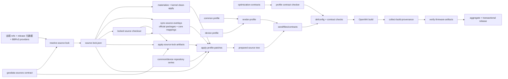
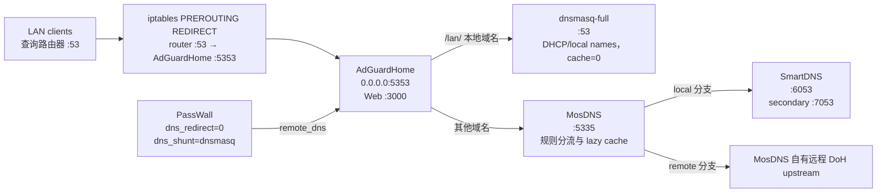
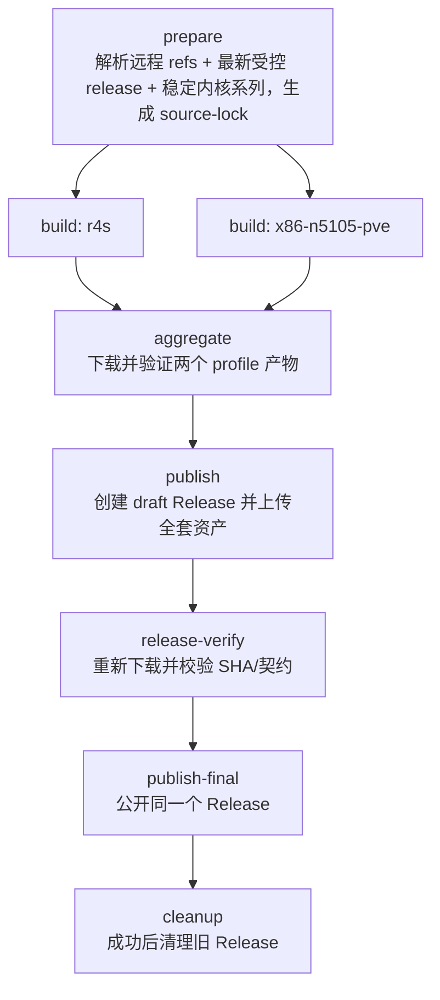

# Lean master + firewall3/iptables 的 R4S 与 N5105 一次性交付方案

## 1. 文档状态

- 状态：设计修订 2 已冻结并进入一次性实施；以本文件第 14、15 节门禁和 GitHub Actions 双平台结果作为完成依据
- 日期：2026-07-31
- 仓库：`Suysker/Actions-OpenWrt`
- 当前开发分支：`experiment/sbwml-public-r4s`
- 目标交付：一个维护分支、一个构建工作流、两个设备 profile、一次双平台验收、一个包含两套固件的 Release

本文是后续实现、验证、文档和发布的唯一方案来源。实施时不得把其中任一设备拆成独立维护分支，也不得用临时兼容路径替代本文定义的统一架构。

本次审计得到的可复用根因和预防规则同步记录在仓库根目录 `lessons.md`；实施中若出现新的 course correction，必须同时更新本文与该文件。

本次方案逐文件核验了以下审计基线。表中的 commit 证明做出设计决策时实际阅读过哪份代码，不是永久生产版本锁。后续 prepare job 会统一解析 Lean、feeds、受控 release、Google BBRv3 分支和兼容内核移植来源的当前 SHA；build job 不临时 clone 或执行第三方构建脚本，只消费本次 source-lock 已物化并校验的输入：

| 上游 | 审计 commit | 在本方案中的角色 |
|---|---|---|
| `coolsnowwolf/lede` | `6c92c15df3dce19c73eb7d986f48cf6b2304306f` | 唯一 OpenWrt 源码基座 |
| `google/bbr` | `90210de4b779d40496dee0b89081780eeddf2a60` | BBRv3 身份契约的权威来源；生产每轮重新解析 `v3` HEAD |
| `CachyOS/kernel-patches` | `c9ed808e86cc1f5fafdbe208627533ee10499b5b` | 单文件、按 kernel series 组织的 BBRv3 port provider；生产每轮重新解析 provider HEAD |
| `sbwml/r4s_build_script` | `32a48c306abc3938ae73e50fb2ae4a4549e95b0d` | R4S 优化审计样本及多文件 BBRv3 port provider；不执行其远程脚本 |
| `sbwml/builder` | `71a27b5a5244f6b509d048cdb6eb93ccb976cb8d` | GitHub Actions、缓存、发布思想的审计样本 |

“纳入 sbwml 的 R4S 专属优化”在本文中的准确含义是：每项公开能力都必须进入后文的纳入、替代或排除表，不允许因为名字带有 `r4s` 或 `optimize` 就无条件移植。Lean master 已经拥有更新或更合适实现时，保留 Lean 实现同样属于纳入该优化目标，而不是遗漏。

## 2. 已冻结的产品决策

以下约束来自最终需求，实施时不再重新选择：

1. 源码继续追踪 `coolsnowwolf/lede` 的 `master`。
2. 网络栈固定为 firewall3 + iptables，不迁移 firewall4/nftables。
3. 保留当前精简应用集合，不引入 Docker、Samba、下载器、文件服务、第二套代理栈等未使用功能。
4. R4S 与 N5105 共用应用、代理、DNS、管理工具、构建规则和发布流程。
5. CPU、内核、驱动、镜像和运行时调优由设备 profile 独立定义。
6. 所有改动在同一实现分支中完成；只有 R4S 与 N5105 同时通过完整构建后才发布，不进行分阶段上线。
7. “全部优化”指能够解释、能够审计、能够在目标设备上验证，而且不会破坏 iptables、PassWall 或可维护性的优化；不等于照搬所有第三方补丁。
8. 两个平台默认使用 BBRv3；它作为 common 的版本化内核能力实现，不为两个设备维护两套算法补丁。
9. 所有浮动上游采用“每轮解析最新、轮内冻结、发布可追溯”；不得为了省 hash 使用 mutable URL，也不得把一次解析出的 SHA 永久误当更新策略。

### 2.1 最终形态速览

| 层 | 冻结方案 |
|---|---|
| Common | Lean master 与最新稳定上游产物单次锁定；firewall3/iptables；历史双分支共享应用 allowlist；GCC 15；OpenSSL ASM/speed；zlib speed；ccache/log/SBOM；LTO/GC/Mold 关闭；按稳定内核版本应用 BBRv3 并作为首次运行默认；software flow offload 启用、hardware flow offload 不启用 |
| R4S | Lean 原生 rockchip/R4S target 和稳定内核；ARMv8 CRC/crypto + A72/A53 tune；native U-Boot/rkbin、r8168、SD/LED、CPU4/5 IRQ affinity、packet steering=1；无 irqbalance/RTL8152/default-settings；512 MiB LZ4 zram；schedutil/PWM fan |
| N5105 PVE | Lean x86/64 generic 和稳定内核；x86-64-v2 + Tremont tune；CPU host、1 socket/4 vCPU、固定内存、4 queues；VirtIO + passthrough I225/igc；irqbalance；无 autocore/RPS/zram/default-settings |
| Actions | prepare 动态解析并物化 source-lock；双 profile matrix；严格 config/package/target contract；分层缓存；失败日志保留；aggregate 后 draft→重下载验 SHA→公开→cleanup；仅使用官方 `actions/*@main` 直接追踪最新代码 |

## 3. 设备假设

### 3.1 R4S

- NanoPi R4S 4GB
- RK3399：四核 Cortex-A53 + 双核 Cortex-A72
- SD 卡启动
- 使用板载双网口
- 板载 LAN 为 RTL8211E，经 RK3399 原生 GMAC；板载 WAN 为 R8111H，经 PCIe 使用 `r8168`
- 外接 USB 网卡不在本次设备契约中，因此不保留 RTL8152/USB-net 驱动
- 保留 cpufreq、PWM fan 和 zram

FriendlyElec 的规格确认 R4S 使用 RK3399 big.LITTLE 架构，包含 2 个 Cortex-A72、4 个 Cortex-A53、RTL8211E 与 R8111H 两个板载千兆网络接口：

- <https://wiki.friendlyelec.com/wiki/index.php/NanoPi_R4S>
- <https://opensource.rock-chips.com/wiki_RK3399>

R4S 有两个 USB 3.0 Type-A 接口。Lean Rockchip target 已把 USB host 和基础 `CONFIG_USB_STORAGE` 编入内核，本方案接受这部分 target baseline，但不再选 USB 网卡、UAS、文件系统、自动挂载、音频或模式切换包；以后确有外设需求时再按 VID/PID 和实际文件系统增加用户态/模块支持。

### 3.2 N5105

当前仓库的 x86 profile 明确描述为 PVE 虚拟机，因此本方案固定为：

- N5105 是 PVE 宿主机 CPU
- OpenWrt 运行在 PVE VM 中
- VM 使用 4 vCPU、VirtIO SCSI、VirtIO 网络
- Intel I225 网卡通过 PCIe 直通给 OpenWrt，使用 `kmod-igc`
- VirtIO NIC 作为 LAN，直通 I225 作为物理 WAN；设备层按 driver 动态识别，不依赖 ethX 枚举顺序
- PVE VM CPU 类型必须设为 `host`
- VM 使用单 socket、固定内存并关闭 balloon
- VirtIO NIC 固定 4 个队列，和 4 vCPU 对齐
- Intel microcode 由 PVE 宿主机负责，不重复放入 guest 固件

Intel 文档确认 N5105 是 Jasper Lake 产品且不支持 SGX；GCC 的 Tremont march 集合却包含 SGX，因此本方案只使用 Tremont 调度模型。Proxmox 的 `host` CPU 类型把宿主 CPU flags 暴露给 guest：

- <https://www.intel.com/content/www/us/en/products/sku/212328/intel-celeron-processor-n5105-4m-cache-up-to-2-90-ghz/specifications.html>
- <https://gcc.gnu.org/onlinedocs/gcc/x86-Options.html>
- <https://pve.proxmox.com/wiki/Migrate_to_Proxmox_VE>

如果实际部署是 N5105 裸机，则这不是本方案所定义的设备，实施前必须先取得 `lspci -nn`、启动盘类型和实际网卡列表，然后修改 profile；不得把裸机驱动猜测性地塞入 PVE 固件。

## 4. 当前故障和必须消除的根因

最近的 R4S 与 x86 Actions 都在 `make download` 之前失败，首个确定错误相同：

```text
missing selected symbol: CONFIG_PACKAGE_miniupnpd=y
missing selected symbol: CONFIG_PACKAGE_luci-i18n-adguardhome-zh-cn=y
```

根因及最终修复：

1. `miniupnpd` 是 provider 名，不是当前 Lean feed 的实际 Kconfig 包名。
   - `CONFIG_PACKAGE_miniupnpd=y` 改为 `CONFIG_PACKAGE_miniupnpd-iptables=y`
   - `package:miniupnpd` 改为 `package:miniupnpd-iptables`
2. `luci-app-adguardhome` 已内置 `adguardhome.zh-cn.lmo`，不需要独立翻译包。
3. 当前 LuCI 把各应用的 `luci-i18n-*-zh-cn` 定义为隐藏生成包；common 只选择公开入口 `CONFIG_LUCI_LANG_zh_Hans=y`，由 Kconfig 为已选应用生成对应翻译。
4. 保留严格的 seed drift 检查。
   - 不允许通过放宽 `check-seed-config.sh` 掩盖上游 Kconfig 漂移

同时必须修复以下 CI 根因：

- `Organize files` 只能在 compile 成功后运行
- release tag 只能在固件目录验证成功后生成
- Release 只能在两个 profile 都成功后创建
- 旧 Release 只能在新 Release 已成功发布并校验后清理
- 失败 workflow 不自动删除，至少保留足够日志用于定位首个错误

## 5. 上游策略：追踪 master，但冻结单次构建

“追踪 master”和“构建可审计”并不冲突。采用以下模型：

```text
远程 master/main/HEAD + 上游 release 元数据
        │
        │ 每次 workflow 启动时解析一次
        ▼
完整 commit SHA + 精确版本/URL/SHA256
        │
        │ 本次构建全程只使用这些锁定输入
        ▼
source-lock.json + cache key + Release provenance
```

规则：

1. `profiles/*/profile.env` 继续写 `REPO_REF=master`。
2. `feeds.custom.conf` 继续表达要追踪的 branch/default branch。
3. workflow 的 prepare job 在下载源码前统一解析 Git ref 和受控上游 release。
4. HAProxy 选择官方仍受支持的最高 LTS 分支及该分支最新 patch release；AdGuardHome 选择 GitHub 最新非 prerelease；GeoIP/Geosite 分别选择 Loyalsoldier 对应仓库的最新非 prerelease。
5. 每个 release 立即展开成精确版本、不可变 tag/URL 和 SHA256。HAProxy 使用官方 `releases.json` 的 SHA256；AdGuardHome 使用精确 tag/commit、GitHub asset digest 和计算后锁定的源码归档 hash；GeoIP/Geosite 同时核对 release asset digest 与发布的 `.sha256sum`。
6. 从锁定 Lean commit 解析每个 profile 的稳定 kernel series；再按 `patchsets/common/kernel/bbr3-sources.json` 的 provider 顺序查找当前 series 的最新兼容 BBRv3 port。resolver 解析 Google `v3` HEAD 与选中 provider HEAD，下载全部 patch、计算 SHA256，并给每个文件分配 source-lock artifact 内的安全相对路径。
7. 将 OpenWrt、所有 feeds、声明式官方源码覆盖、上游产物、每个 profile 的稳定内核系列、BBRv3 当前算法 HEAD/适配 commit/patch hash、补丁摘要、workflow 中 `actions/*@main` 的观测 HEAD 和仓库实现 SHA 写入 `source-lock.json`。覆盖仓库、浮动 ref 与 source→target 映射只在 `profiles/common/source-overlays.json` 声明一次：`openwrt/packages` 提供 Go、nlbwmon 与 libwebsockets，`openwrt/openwrt` 提供已经带 canonical GCC 15/C23 修复的 `package/libs/gmp`。resolver 按仓库只解析一次 commit，冻结全部映射；同步器按仓库只稀疏 checkout 一次，执行代码不枚举包名。
8. prepare 随即执行 `materialize`：只从 lock 中的 commit-addressed immutable raw URL 下载 BBRv3 patch，逐文件复验 SHA256，并与 JSON 一起上传为同一个 `source-lock` artifact；精确 Linux 源码上的顺序 clean-apply 在 matrix 前完成。
9. build job 只 checkout 和下载 source-lock 中的精确输入，不读取远程 branch HEAD、release `latest` 或 API。
10. `source-lock.json` 及其物化 patch 作为每次构建的产物和 Release 附件，不提交为永久版本锁；仓库只保存 provider/ref/path 规则和算法身份断言。
11. update checker 使用同一个解析脚本计算远程指纹；源码 ref、任一受控 release、Google BBRv3 HEAD、选中 port commit 或 patch hash 变化都触发完整双 profile 构建。
12. workflow_dispatch 可以提供精确版本作故障回滚，但 resolver 仍负责解析不可变 URL 和 hash；不接受用户提供 `skip`。
13. 缓存 key 至少包含：
   - source-lock digest
   - profile digest
   - patch digest
   - toolchain identity
14. GitHub Actions 自身按用户明确选择只允许官方 `actions/*@main`，直接追踪各 action 默认分支。resolver 在 prepare 观察每个 `main` 的当前完整 SHA 并写入 source-lock，使 action HEAD 变化进入 update fingerprint；由于 action 在 prepare 之前已由 GitHub 解析，该 SHA 是本轮观察值而不是可证明的执行锁，Release 必须明确披露这一边界。

这样每次构建都会拿到启动时最新的 master、最新稳定 AdGuardHome/GeoIP/Geosite 和最新 HAProxy LTS，同时 BBRv3 始终绑定本次 target 的稳定内核系列，任何已发布固件都能追溯到精确输入。

`source-lock.json` 使用有版本的稳定 schema，至少包含：

```json
{
  "schema": 3,
  "resolved_at": "UTC RFC3339",
  "repository_commit": "full SHA",
  "openwrt": {"url": "...", "requested_ref": "master", "commit": "full SHA"},
  "feeds": {
    "packages": {"url": "...", "requested_ref": "...", "commit": "full SHA"}
  },
  "source_overlays": {
    "openwrt-core": {
      "url": "https://github.com/openwrt/openwrt.git",
      "requested_ref": "master",
      "resolved_ref": "refs/heads/master",
      "commit": "full SHA",
      "mappings": [
        {"source": "package/libs/gmp", "target": "package/libs/gmp"}
      ]
    },
    "openwrt-packages": {
      "url": "https://github.com/openwrt/packages.git",
      "requested_ref": "master",
      "resolved_ref": "refs/heads/master",
      "commit": "full SHA",
      "mappings": [
        {"source": "lang/golang", "target": "feeds/packages/lang/golang"},
        {"source": "libs/libwebsockets", "target": "feeds/packages/libs/libwebsockets"},
        {"source": "net/nlbwmon", "target": "feeds/packages/net/nlbwmon"}
      ]
    }
  },
  "upstream_artifacts": {
    "haproxy": {
      "policy": "latest-lts",
      "branch": "x.y",
      "version": "x.y.z",
      "url": "immutable URL",
      "sha256": "..."
    },
    "adguardhome": {
      "policy": "latest-stable",
      "version": "x.y.z",
      "tag_commit": "full SHA",
      "source": {"url": "immutable URL", "sha256": "..."},
      "frontend": {"url": "immutable URL", "sha256": "..."}
    },
    "geoip": {
      "policy": "latest-stable",
      "tag": "...",
      "url": "immutable URL",
      "sha256": "..."
    },
    "geosite": {
      "policy": "latest-stable",
      "tag": "...",
      "url": "immutable URL",
      "sha256": "..."
    }
  },
  "kernel_features": {
    "bbr3": {
      "algorithm": {
        "url": "https://github.com/google/bbr.git",
        "requested_ref": "v3",
        "commit": "本轮解析的 full SHA",
        "module_version": 3,
        "runtime_name": "bbr"
      },
      "profile_kernel_series": {
        "r4s": "6.12",
        "x86-n5105-pve": "6.12"
      },
      "ports": {
        "6.12": {
          "provider": "cachyos-single",
          "origin_url": "https://github.com/CachyOS/kernel-patches.git",
          "origin_ref": "master",
          "origin_commit": "本轮解析的 full SHA",
          "install_directory": "hack-6.12",
          "patches": [
            {
              "origin_path": "6.12/0002-bbr3.patch",
              "url": "commit-addressed immutable raw URL",
              "sha256": "...",
              "artifact_path": "bbr3/6.12/0001-bbrv3.patch",
              "install_name": "995-bbrv3.patch"
            }
          ]
        }
      }
    }
  },
  "profile_digests": {"r4s": "sha256:...", "x86-n5105-pve": "sha256:..."},
  "patch_digest": "sha256:...",
  "actions": {
    "actions/checkout": {
      "requested_ref": "main",
      "commit": "prepare 观察到的 full SHA"
    }
  }
}
```

JSON 写入时键排序、UTC 时间格式固定，digest 对规范化内容计算。`resolved_at` 不参与“上游是否变化”的 update fingerprint，避免仅时间变化触发无意义构建；BBRv3 patch 字节不重复嵌入 JSON，但其 immutable URL、安装顺序和 SHA256 全部参与 digest，`materialize` 后再次逐字节验证。

## 6. 目标目录结构

```text
.github/workflows/
  openwrt-builder.yml
  update-checker.yml

profiles/
  common/
    profile.env
    geodata-sources.json
    source-overlays.json
    config.seed
    required-packages.txt
    forbidden-packages.txt
    files/
      etc/sysctl.d/90-router-performance.conf
      etc/uci-defaults/90-common-system
      etc/uci-defaults/90-common-network
      etc/uci-defaults/zz-common-turboacc

  r4s/
    profile.env
    config.seed
    required-packages.txt
    forbidden-packages.txt
    files/
      etc/sysctl.d/91-r4s-performance.conf
      etc/uci-defaults/91-r4s-performance

  x86-n5105-pve/
    profile.env
    config.seed
    required-packages.txt
    forbidden-packages.txt
    files/
      etc/uci-defaults/91-x86-n5105-performance

patchsets/
  common/
    series
    kernel/
      bbr3-sources.json
  r4s/
    series
  x86-n5105-pve/
    series

scripts/
  render-profile.sh
  resolve-source-lock.sh
  apply-source-lock-artifacts.sh
  prepare-runner.sh
  apply-profile-patches.sh
  manage-custom-feeds.sh
  sync-source-overlays.sh
  check-seed-config.sh
  check-required-packages.sh
  check-forbidden-packages.sh
  check-profile-contract.sh
  verify-firmware-artifacts.sh
  collect-build-provenance.sh

tests/
  fixtures/source-lock/
  test-resolve-source-lock.sh
  test-apply-source-lock-artifacts.sh
  test-apply-profile-patches.sh
  test-sync-source-overlays.sh
  test-profile-renderer.sh

docs/
  build-architecture.md

lessons.md
```

`profiles/x86` 一次性重命名为 `profiles/x86-n5105-pve`。workflow 输入同步从 `x86` 改为 `x86-n5105-pve`，不保留两个名字的兼容别名，避免以后把通用 x86 和 N5105 专用指令集混淆。

补丁目录不放置“优化合集”。设备 `series` 和通用非内核 `series` 初始为空；`bbr3-sources.json` 只定义受信任 provider、浮动 ref、按 kernel series 展开的路径规则、安装栈和算法身份断言，不保存某一轮的 commit、hash 或 patch 内容。prepare 将选中的 patch 物化进 source-lock artifact，每个文件都必须有 SHA256、前置/后置断言和定向 clean-apply。R4S 和 x86 均继续使用 Lean 已有 target/device 定义，不维护私有 target 分叉；master 切换稳定内核系列时 resolver 自动尝试受信任 provider，若没有可 clean-apply 的 port 则在 matrix 前明确失败。

普通 package 兼容变换也不得把上游 `PKG_VERSION`、`PKG_HASH` 或 release URL 当作 patch 上下文。当前 `libsepol` 的 GNU17 兼容只允许由 `apply-profile-patches.sh` 在唯一的 `include $(INCLUDE_DIR)/package.mk` 语义锚点后幂等插入，并验证最终只有一个语言标准选项；若上游已经声明语言标准则尊重上游。`nlbwmon` 与 `libwebsockets` 不维护本地源码补丁，而是复用 source-lock 中同一官方 packages commit 的 `net/nlbwmon` 与 `libs/libwebsockets` 子树：前者保留真实 `PKG_MIRROR_HASH`，后者直接消费官方已吸收的 canonical 上游修复。这样既不降低 GCC 代际或在本仓库全局关闭 `-Werror`，也不永久复制 package 版本/hash 或会在未来反向应用失败的补丁上下文。

Geo 数据只保留一份声明式静态合同 `profiles/common/geodata-sources.json`。每个条目声明数据角色、可信 GitHub 仓库、release asset、手工回退环境变量，以及 `v2ray-geodata` recipe 的版本字段/download block；它不保存 release tag、版本或 hash。resolver、source-lock validator 与 artifact applicator 必须通过同一个 loader 消费该合同，不得各自复制 `GeoIP`/`Geosite` tuple。release/tag/URL/SHA256 每轮动态解析后进入 source-lock；可信 owner、asset 身份和 package schema 属于供应链/接口合同，变更时只修改这一处并触发 profile digest 变化。

## 7. 模块职责与接口

### 7.1 Profile renderer

继续复用现有 `scripts/render-profile.sh`，不创建第二套配置框架。统一接口：

```text
render-profile.sh env       <profile> [output]
render-profile.sh config    <profile> <output>
render-profile.sh required  <profile> <output>
render-profile.sh forbidden <profile> <output>
render-profile.sh files     <profile> <output-directory>
```

合并规则：

1. `common` 先于设备 profile。
2. config 中同一个 symbol 不得在 common 和设备层重复出现。
3. required/forbidden 中重复规则视为错误，不静默去重。
4. `exact:` forbidden package 自动渲染为 `# CONFIG_PACKAGE_<name> is not set`；seed 若正向选择同一包立即失败，随后仍由 defconfig 和 manifest 门禁复验。
5. required 和 forbidden 指向同一 package/config 时立即失败。
6. rootfs files 默认不允许同路径覆盖；当前方案不需要 override 机制。

### 7.2 Source resolver

新增 `scripts/resolve-source-lock.sh`，供 builder 和 update checker 共用：

```text
resolve-source-lock.sh resolve <profile-list> <output-json>
resolve-source-lock.sh materialize <source-lock.json> <output-directory>
resolve-source-lock.sh digest  <source-lock.json>
resolve-source-lock.sh compare <old-json> <new-json>
```

这是 build 与 update checker 共用的唯一浮动输入解析器。Git ref、HAProxy LTS、AdGuardHome stable、GeoIP/Geosite release、Google BBR `v3` HEAD、受信任 BBRv3 port provider，以及锁定 Lean commit 中各 profile 的 `KERNEL_PATCHVER` 都只能在这里解析，禁止在 workflow 或 `diy-part2.sh` 维护第二份查询逻辑。

`resolve` 只生成 schema 3 JSON；`materialize` 只下载 lock 内 commit-addressed URL，并把逐文件 hash 验证后的 BBRv3 patch 写到 lock 约定的相对路径。单文件 provider 和按序多文件 provider 由同一规范化数据结构表示。resolver 按策略顺序选择第一个确实包含当前 kernel series 的 provider，随后必须在精确 Linux tarball 上按安装顺序 clean-apply；不存在适配或任一 hunk 不兼容时在 matrix 前失败，不启用 `CONFIG_TESTING_KERNEL`、不改用另一代 BBR，也不静默跳过。schema 2 的 incoming lock 不再兼容：重新运行 resolver/update checker 即可生成 schema 3；这只迁移构建输入格式，不改变设备配置或 sysupgrade 行为。

### 7.3 Source overlay synchronizer

用 `scripts/sync-source-overlays.sh` 取代单仓库 `sync-official-packages.sh`，不为 Go、nlbwmon、libwebsockets 或 GMP 创建包名分支。模块划分为：

1. `profiles/common/source-overlays.json` 是唯一声明接口。repository `id` 使用小写 kebab-case；每条映射只包含上游 `source` 与 Lean tree 内 `target`，两者都使用 POSIX 相对路径并保持上游目录命名。
2. `resolve-source-lock.sh` 按 repository `id` 各解析一次浮动 ref，验证每个 source 子树存在、所有 target 全局唯一，并把完整 commit 与原序映射冻结进 `source_overlays`。
3. `sync-source-overlays.sh` 只接受 schema 3 lock；每个 repository 只做一次稀疏 checkout，再按映射完整替换目标子树。它不知道包名、版本、hash 或 GCC 错误类型。
4. target 只允许位于 `feeds/packages/<category>/<package>` 或 `package/libs/<package>`；同步前解析真实父目录并证明仍在 OpenWrt root 下，拒绝绝对路径、`..`、重复 target、控制字符与 symlink 越界。
5. `test-sync-source-overlays.sh` 使用两个本地 Git origin 和四个不同映射，证明按仓库复用 checkout、旧目录完整替换、未声明目录不复制、重复 target 与越界路径拒绝。
6. profile digest 覆盖 common overlay 合同，所以映射变化同时失效两个平台缓存；每个 overlay commit 进入 source-lock digest，任一官方仓库变化都会触发双平台重建。

依赖接口固定为：

```text
profiles/common/source-overlays.json
  -> resolve-source-lock.sh
  -> source-lock.json:source_overlays
  -> sync-source-overlays.sh
  -> feeds/packages/<category>/<package> | package/libs/<package>
  -> defconfig/download/build/provenance
```

这个边界用于“Lean core/feed 落后且对应 OpenWrt 官方 master 已有可复用修复”的窄 package 子树。若官方也没有修复，才进入窄语义兼容或 repository patch 评审；不得先在 workflow 中添加包名特判、降级 GCC 或全局关闭 `-Werror`。被同步的官方 recipe 仍作为 source-lock 输入原样审计；其中若存在上游维护者的单警告 `-Wno-error=<name>` 兼容选择，诊断仍保留为 warning，不能在本仓库扩大成全局规则。

### 7.4 Locked artifact applicator

新增统一入口：

```text
apply-source-lock-artifacts.sh <openwrt-root> <source-lock.json> <report-json>
```

它只把已经锁定的 HAProxy、AdGuardHome、GeoIP 和 Geosite 元数据写入本次工作目录中的预期 package Makefile：

1. 先断言 package provider、Makefile 路径和待替换字段唯一。
2. 只接受 `source-lock.json` 中的精确版本、tag URL 和 64 位 SHA256。
3. 不访问网络、不解析 `latest`、不接受 `PKG_HASH:=skip`。
4. AdGuardHome 同时更新源码归档和 frontend 的版本/hash，不能只改其中一个。
5. 写入后重新解析 Makefile，证明版本、URL 和 hash 与 lock 完全一致。
6. 输出原值、新值、provider 和 lock digest 到 `artifact-override-report.json`。
7. 随后的定向 `make download` 必须通过 OpenWrt 自带 hash 校验。

如果锁定版本与当前 feed recipe 不兼容，构建严格失败；允许使用 workflow_dispatch 指定一个精确旧版本重新解析和回滚，不自动退回 feed 版本。

### 7.5 Patch applicator

保留 `scripts/apply-profile-patches.sh` 这个统一入口，但改变其职责：

1. 只读取仓库内 `patchsets/common/series`、设备 `series`，以及 source-lock artifact 已物化的 BBRv3 patch 清单。
2. source-lock 的 profile/kernel series、artifact path、安装目录、安装名与逐文件 SHA256 必须自洽；所有 artifact path 必须位于 source-lock 目录内，拒绝绝对路径和 `..`。
3. 禁止运行第三方 build script，也禁止在 apply 阶段 clone 远程仓库。
4. 仓库 common/device patch 先对 OpenWrt tree 执行 `git apply --check`；BBRv3 patch 已在 prepare 对精确 kernel 顺序 clean-apply，build 再验证物化字节的 SHA 后安装进锁定的 OpenWrt kernel patch stack。
5. patch 应用失败立即终止；不存在 `skipped-conflict`。
6. BBRv3 后置断言至少确认 `BBR_VERSION=3`、拥塞控制运行名为 `bbr`、`MODULE_VERSION` 存在，并确认 Lean 的 `KernelPackage/tcp-bbr` 定义未被整体替换。
7. 每个其他 patch 也必须声明后置检查，证明预期行为确实存在。
8. 最终生成 `patch-report.txt`，记录 profile、kernel series、provider/origin commit、每个物化 patch 的 SHA256/安装顺序和所有后置断言。

生产补丁路径只有这个小型、可审计的 applicator 与仓库内 series。

### 7.6 Contract checks

复用现有三个 checker，并新增 `check-profile-contract.sh`：

- `check-seed-config.sh`：seed symbol 必须在 `make defconfig` 后保持
- `check-required-packages.sh`：最终包必须存在
- `check-forbidden-packages.sh`：禁用包不得进入最终配置
- `check-profile-contract.sh`：
  - common/device symbol 无重叠
  - required/forbidden 无冲突
  - feed 中一个关键 package 只有一个预期 provider
  - firewall3/iptables 必选
  - firewall4/nftables 必须不存在
  - target、image、CPU flags 与 profile 契约相符
  - target 稳定内核系列与 source-lock、BBRv3 materialized port 相符
  - `kmod-tcp-bbr`、`kmod-sched` 和 TurboACC BBR CCA dependency 存在；内核源码后置断言为 BBRv3
  - 统一读取 `profiles/optimization-contracts.json`，验证 common、R4S 与 N5105 的 rootfs 调优语义；不能只检查 overlay 文件存在
  - 对本轮锁定 Lean tree/feeds 执行 source-aware 优化检查：TurboACC 的 software-flow runtime；R4S 的 LAN/WAN 映射、CPU4/CPU5 IRQ affinity、stable-kernel `schedutil`、RK3399 OPP；N5105 的 VirtIO built-in、I225/I226 EEE disable 与 igc VLAN tag offload

`optimization-contracts.json` 是这些性能意图的唯一声明层。它只保存稳定的功能语义、相对路径模板和内容断言，不保存 kernel 版本、Lean commit、patch 文件名或逐轮 hash。`check-profile-contract.sh` 提供一个通用解释器：rootfs 规则在 prepare 的静态检查中执行；带 `{kernel_series}` 的 upstream 规则在 build 已 checkout 本轮 source-lock 后展开；需要在 patch stack 中定位的能力按目录 glob 和语义内容匹配，而不是依赖可能被上游改名的 patch。任一声明必须命中且不得靠另一个 profile 的文件满足。

每个平台的 `profile_digest` 统一覆盖 `profiles/common/`、对应设备目录和这份共享优化合同。修改任何共同性能意图都会同时改变 R4S/N5105 的两个 profile digest；修改某一设备目录只改变对应设备的 profile digest。完整 source-lock digest 还独立包含仓库 commit，继续作为整轮 update fingerprint 和 exact cache key 的组成部分。路径集合只在 resolver 的 `profile_digest()` 中定义，workflow 不复制。

规则命名统一使用 `<scope>.<capability>`，例如 `r4s.irq-affinity`、`x86-n5105-pve.igc-vlan-offload`；检查结果使用相同名称写入 `profile-contract-report.txt`。新优化必须先在这个声明层定义可验证行为，再进入配置或文档；不建立第二套设备专用 checker。

### 7.7 Artifact verifier

新增 `scripts/verify-firmware-artifacts.sh`，由 build job 和 publish job 共同使用：

```text
verify-firmware-artifacts.sh <profile> <target-directory> <source-lock.json>
```

验证：

- 固件文件模式和非零大小
- gzip 完整性
- manifest 存在
- `config.buildinfo` 存在
- `version.buildinfo` 和 `feeds.buildinfo` 存在
- `profiles.json` 或等价 image metadata 存在
- CycloneDX SBOM 存在
- SHA256 可验证
- 镜像字节数与交付索引一致
- required 包出现在 manifest
- forbidden 包未出现在 manifest
- source-lock、artifact-override-report、patch-report、runner/toolchain provenance 存在
- target/kernel/compiler/CPU flags 与 profile contract 一致
- BBRv3 algorithm commit、kernel port hash 与实际 `tcp_bbr.ko` 的 module version `3` 一致
- manifest 包含 `kmod-sched`，构建树包含 `sch_fq.ko`

### 7.8 依赖图、复用边界与配置所有权



复用规则：

- source ref、受控 release 与 BBRv3 provider 解析/物化只属于 `resolve-source-lock.sh`。
- Geo 数据角色、可信仓库、asset 与 package 字段映射只属于 `profiles/common/geodata-sources.json`；resolver、validator、applicator 共用一个解析结果，执行代码不得重复枚举。
- profile 合并只属于 `render-profile.sh`。
- 官方覆盖仓库与 source→target 映射只在 common `source-overlays.json` 声明，由 resolver 校验并写入 source-lock；`sync-source-overlays.sh` 只通用、安全地同步 lock 中的相对路径，不复制 Go/nlbwmon/libwebsockets/GMP 枚举，workflow 也不内联同步逻辑。
- 锁定 package 版本/URL/hash 的机械写入只属于 `apply-source-lock-artifacts.sh`。
- 行为性源码变更只属于 `apply-profile-patches.sh`、仓库内 common/device `series` 和 source-lock 物化的 BBRv3 port；不依赖版本/hash 行的窄语义兼容变换也由该接口执行并写入 patch report。BBRv3 的 provider/kernel-series 选择只由 resolver 驱动。
- Kconfig/package/target 边界只属于 contract checkers。
- 运行时调优与 Lean 继承优化的稳定语义只在 `profiles/optimization-contracts.json` 声明；`check-profile-contract.sh` 通用解释 rootfs/source 规则，kernel series 由本轮 source-lock/target 动态提供，不在声明或代码中复制版本与 patch 文件名。
- 成品身份收集只属于 `collect-build-provenance.sh`，校验只属于 artifact verifier。
- workflow 只编排这些接口，不内联第二份业务判断。

运行时只有一个所有者：

| 设置 | 所有者 |
|---|---|
| GeoIP/Geosite 数据角色、可信源与 package 字段 | `profiles/common/geodata-sources.json`；不包含本轮版本/hash |
| BBRv3 provider 策略 | `patchsets/common/kernel/bbr3-sources.json` |
| BBRv3 本轮内核实现与版本适配 | source-lock JSON + 同 artifact 内物化 patch + clean-apply/patch contract |
| BBRv3 与 `fq` 模块是否进入固件 | common profile 的 `kmod-tcp-bbr`/`kmod-sched` Kconfig/package contract |
| TurboACC 首次运行 CCA | `zz-common-turboacc` 在确认 module version `3` 后一次性设为 `bbr`，并写入完成标记 |
| TCP CCA、software flow offload 后续运行值 | TurboACC 的 UCI/init |
| common socket buffer | `90-router-performance.conf` |
| R4S IRQ affinity、packet steering | Lean Rockchip target 原生脚本 |
| R4S zram | `91-r4s-performance` |
| N5105 queue count、packet steering | `91-x86-n5105-performance` |
| N5105 IRQ distribution | `irqbalance` |
| 时区/NTP | `90-common-system` |
| DNS 包与依赖是否进入固件 | common profile 的 Kconfig/package contract |
| DNS listener、端口、上游、规则和凭据 | 用户运行时 UCI/YAML；构建只校验包和接口兼容性 |
| DHCPv4 / RA-DHCPv6 | dnsmasq / odhcpd；`90-common-network` 写入用户明确指定的 `.32/232` 与 IPv6 relay 产品默认 |

命名统一使用 `common`、`r4s`、`x86-n5105-pve`；文件名前缀 `90-` 表示 common、`91-` 表示设备层。`zz-` 只用于必须在上游 package uci-defaults 之后运行的一次性初始化，本方案仅有 `zz-common-turboacc`。不存在 `x86` 兼容别名、`sbwml-*` 生产 fallback 或多套 config renderer。

## 8. Common 配置

### 8.1 保留的应用集合

common 层保留：

- LuCI base、firewall、package manager
- PassWall
  - HAProxy
  - Hysteria
  - Xray
  - geoview
  - v2ray geoip/geosite
  - ipt2socks
- MosDNS
- SmartDNS
- AdGuardHome
- ddns-go
- nlbwmon
- arpbind
- autoreboot
- ramfree
- ttyd
- turboacc
- UPnP
- WOL
- coremark
- lsof
- htop
- OpenSSH SFTP server

继续禁用：

- Docker/containerd/runc
- Samba/ksmbd
- qbittorrent/openlist
- homeproxy/nikki/mihomo/clashoo/SSR Plus
- 第二套 DDNS scripts
- 文件管理器、磁盘管理器、FTP server
- ZeroTier/WireGuard/bonding
- firewall4/nftables/natflow

该 allowlist 已再次对照历史 `R4S`、`X86` 分支：两边共同使用的 LuCI、PassWall、DNS、DDNS、监控和维护工具进入 common；BBRv3 作为共享内核能力进入 common；cpufreq/PWM fan/zram 与 VirtIO/igc 等硬件差异留在设备层。简体中文由 common 的公开语言入口 `CONFIG_LUCI_LANG_zh_Hans=y` 统一选择，各应用的隐藏翻译包交给当前 LuCI Kconfig 生成。

禁用父应用并不自动证明其所有无父级依赖的子选项都失效。当前 Lean 的 SSR Plus `INCLUDE_Mihomo` 在父应用关闭时仍会默认选择 Mihomo，因此 common 同时固定 `CONFIG_PACKAGE_luci-app-ssr-plus_INCLUDE_Mihomo=n`，并由 seed drift 和 forbidden 门禁验证。

### 8.2 网络栈

common 层固定选择：

```text
firewall
iptables
ip6tables
ipset
iptables-mod-extra
iptables-mod-fullconenat
iptables-mod-iprange
iptables-mod-socket
iptables-mod-tproxy
kmod-ipt-fullconenat
kmod-tun
kmod-tcp-bbr
kmod-sched
dnsmasq-full
ppp
ppp-mod-pppoe
odhcp6c
odhcpd-ipv6only
miniupnpd-iptables
```

PassWall 固定使用：

```text
CONFIG_PACKAGE_luci-app-passwall_Iptables_Transparent_Proxy=y
# CONFIG_PACKAGE_luci-app-passwall_Nftables_Transparent_Proxy is not set
```

两个设备都由 common 显式选择并要求 `kmod-tcp-bbr`，但该包在版本化 common 内核 patch 应用后承载的是 BBRv3。这里有意保持 Lean 的 package symbol、`tcp_bbr.ko` 模块名和 `bbr` 运行名不变：Google BBRv3 本身仍注册为 `bbr`，TurboACC 也已经依赖 `kmod-tcp-bbr`。算法代际不从包名猜测，而由 source-lock、patch hash、源码中的 `BBR_VERSION=3` 和模块 `version=3` 共同证明；因此不需要 fork `netsupport.mk` 或修改 TurboACC 依赖。

当前审计快照中，R4S 与 x86 target 的默认稳定内核均为 Linux 6.12。审计时 Google `v3` HEAD 为 `90210de4...`，CachyOS 当前 `6.12/0002-bbr3.patch` 的内容 SHA256 为 `15d1563...`；这两个值只证明设计基线，生产不永久固定它们。动态映射规则为：

| 项目 | 动态策略与门禁 |
|---|---|
| 权威算法观察 | 每轮解析 `google/bbr` 的 `v3` HEAD；身份断言固定为源码 `BBR_VERSION=3`、module version `3`、运行名 `bbr` |
| 单文件适配 provider | 每轮解析 `CachyOS/kernel-patches@master`，查找 `<series>/0002-bbr3.patch` |
| 多文件适配 provider | 前者不提供当前 series 时，每轮解析 `sbwml/r4s_build_script@master`，查找 `openwrt/patch/kernel-<series>/bbr3/*.patch` 并保持文件顺序；不执行仓库脚本 |
| 规范化 SHA256 | resolver 对每个 commit-addressed patch 计算；hash、URL、artifact path 和安装顺序进入本轮 source-lock digest |
| 双平台适用性 | prepare 对精确 `kernel_version` 顺序 clean-apply；两个 profile 同 series 时复用同一物化 port，任一 hunk 不兼容即不启动 matrix |
| 运行时身份 | `/sys/module/tcp_bbr/version` 必须为 `3`；available/current CCA 仍显示 `bbr` |

sbwml 的公开 Linux 6.18 实现同样表明 BBRv3 需要一组 TCP-core patch，而不是单独拷贝 `tcp_bbr.c`。它作为动态多文件 provider，使 Lean 稳定内核切换到受支持 series 时不需要先把 patch 复制进本仓库；但每轮仍必须完成精确内核 apply 和双平台门禁，不能把 6.18 patch 套到 6.12，也不能为了 BBRv3 提前启用 testing kernel：

- <https://github.com/google/bbr/blob/90210de4b779d40496dee0b89081780eeddf2a60/README.md>
- <https://github.com/google/bbr/blob/90210de4b779d40496dee0b89081780eeddf2a60/net/ipv4/tcp_bbr.c>
- <https://github.com/CachyOS/kernel-patches/blob/c9ed808e86cc1f5fafdbe208627533ee10499b5b/6.12/0002-bbr3.patch>
- <https://github.com/sbwml/r4s_build_script/tree/32a48c306abc3938ae73e50fb2ae4a4549e95b0d/openwrt/patch/kernel-6.18/bbr3>

BBRv3 作用于路由器本机发起或终止的 TCP，并同时支持 IPv4 TCP 与 IPv6 TCP。`tcp_bbr.c` 位于 `net/ipv4/` 是 Linux 源码布局历史，不是地址族限制：IPv6 的 `tcp_v6_init_sock()` 同样调用通用 `tcp_init_sock()`，随后使用同一套 `tcp_congestion_ops`；BBRv3 以运行名 `bbr` 注册到该通用接口。PassWall/Xray 建立的本机 IPv4/IPv6 outbound TCP 可以使用它，但 UDP/QUIC 不使用 TCP CCA，普通 NAT 转发连接的端到端拥塞控制仍在 LAN 客户端和远端服务器上。转发性能主要由软件 flow offload、iptables 规则复杂度、IRQ/RPS 和网卡队列决定，因此不把 BBRv3 宣传成无条件的转发加速器。BBRv3 作为产品默认，同时保留与 cubic 的同线路 A/B 验收：

- <https://github.com/torvalds/linux/blob/master/net/ipv6/tcp_ipv6.c>
- <https://github.com/torvalds/linux/blob/master/include/net/tcp.h>
- <https://github.com/google/bbr/blob/v3/net/ipv4/tcp_bbr.c>

`net.core.default_qdisc=fq` 必须有真实 provider。Lean 当前把 `sch_fq.ko` 放在上游 `kmod-sched` 中，并由该包的 `AUTOLOAD` 加载；generic kernel config 只有内建 `fq_codel`，两者不是同一个 qdisc。因此 common 显式选择并要求 `kmod-sched`，在 build manifest 和真机 `/sys/module/sch_fq` 双重验证；不为了只少带几个无常驻进程的 scheduler module 再维护一份私有 `netsupport.mk` 拆包：

- <https://github.com/coolsnowwolf/lede/blob/6c92c15df3dce19c73eb7d986f48cf6b2304306f/package/kernel/linux/modules/netsupport.mk#L969-L1005>

BBRv3 不依赖 ECN 才能工作。Google 的 `ecn_low` 只适合已知使用低阈值 ECN 且 ACK 提供精确 ECN 反馈的路径；本方案不对默认路由全局标记 `ecn_low`，也不覆盖 Lean 的 `tcp_ecn` 默认值。以后只有运营商或隧道明确提供 L4S/DCTCP 类语义时，才按 route 做运行时单变量测试。

common network overlay 只设置用户明确指定的共享产品默认值：

- LAN `192.168.2.1/24`
- dnsmasq 拥有 IPv4 DHCP；LAN 地址池从 `.32` 开始、`limit=232`、租期 12 小时，客户端 DNS 指向路由器
- WAN 首次启动使用 DHCP，PPPoE 由 LuCI 配置且不在固件中嵌入账号
- WAN6 使用 DHCPv6 client；按用户常用配置保持 LAN `ra=server`，将 LAN DHCPv6/NDP 设为 relay，并将 WAN DHCPv6/NDP/RA 设为 relay master
- 不直接写 `eth0`/`eth1`

R4S 保留 Lean native 的 `eth1=LAN, eth0=WAN` 映射；N5105 设备 overlay 通过 `ethtool -i`/sysfs 识别 `virtio_net=LAN, igc=WAN`。因此删除 `diy-part2.sh` 中对 `config_generate` 的全局 `sed`，避免 master 上游文件变化或接口枚举变化时静默改错。

- <https://github.com/coolsnowwolf/lede/blob/6c92c15df3dce19c73eb7d986f48cf6b2304306f/target/linux/rockchip/armv8/base-files/etc/board.d/02_network>

### 8.3 DNS/DHCP：构建边界与运行时拓扑

固件包含 dnsmasq-full、AdGuardHome、MosDNS、SmartDNS 和 PassWall；具体端口、上游、规则、过滤列表、节点和凭据由用户运行时配置管理，不作为 common profile 的编译输入。

构建阶段只负责：

1. 通过 Kconfig 选择五个组件及 firewall3/iptables 所需 provider。
2. 通过 required/forbidden/manifest contract 确认包存在且没有 nftables 变体。
3. 保留上游 package schema 和 init script；只允许有明确兼容性根因、固定 SHA 和前后断言的窄 patch。
4. AdGuardHome 数据库/query log、MosDNS cache、PassWall 节点/订阅、SmartDNS 上游和认证信息只保存在设备运行时，不进入仓库和镜像。
5. 新装时保持安全、无端口冲突的 package 默认状态；升级保留现有配置，用户常用配置由设备运行时管理。

用户常用配置的运行时拓扑如下。它用于设备配置和验收，不是 factory default 或编译输入：



用户常用运行时配置：

| 组件 | 有效值 | 运行时职责 |
|---|---|---|
| dnsmasq-full | `port=53`、`cache=0` | 仍负责 DHCP 和本地域名，但 LAN 发往路由器地址的 53 请求先被 AdGuardHome 的 iptables redirect 接走 |
| AdGuardHome | DNS `0.0.0.0:5353`、Web `0.0.0.0:3000`、UCI `redirect=redirect` | redirect 模式按实际 init/firewall 规则验收，不能只依据 listener 推断流量路径 |
| AdGuardHome upstream | `/lan/ → 127.0.0.1:53`，其他查询 `→ 127.0.0.1:5335` | 本地域名回 dnsmasq，其余进入 MosDNS |
| MosDNS | UDP/TCP `:5335`、API `:9091` | local 分支进入 SmartDNS，remote 分支直接使用 MosDNS 配置的 DoH；不是“MosDNS 动态调用 PassWall DNS” |
| SmartDNS | primary `6053`、secondary `7053` | MosDNS 的 local 分支只使用 `6053` |
| PassWall | `remote_dns=127.0.0.1:5353`、`dns_shunt=dnsmasq`、`dns_redirect=0` | PassWall 指回 AdGuardHome，且不负责劫持 LAN 53；完整 helper 拓扑结合运行设备上的 `/tmp` 生成文件检查 |

AdGuardHome LuCI 集成的 `firewall.start` 会调用 `AdGuardHome do_redirect 1`；package init script 在 iptables/ip6tables PREROUTING 中，把发往路由器各接口地址的 TCP/UDP 53 重定向到 `dns.port`，而不是把 dnsmasq 改成 AGH upstream：

- <https://github.com/kenzok8/openwrt-packages/blob/5cdabd086218c66b72a4522c1916ecf058f94d17/luci-app-adguardhome/root/etc/init.d/AdGuardHome#L55-L82>

MosDNS 的三个 remote upstream 都同时写了指回 AGH `5353` 的 `bootstrap` 和字面 IP `dial_addr`。按当前 MosDNS v5 实现，`dial_addr` 会覆盖 URL host；结果已经是 IP 时直接连接，不进入 bootstrap resolver，因此当前配置不会形成活动环路。该 bootstrap 在现状下是冗余项，运行时配置整理时移除，避免以后移除 `dial_addr` 后出现 AGH→MosDNS→AGH 回路：

- <https://github.com/IrineSistiana/mosdns/blob/9cfb7ce985599c087cb7ccfb1531d0c0f4021242/pkg/upstream/utils.go#L34-L41>
- <https://github.com/IrineSistiana/mosdns/blob/9cfb7ce985599c087cb7ccfb1531d0c0f4021242/pkg/upstream/upstream.go#L213-L263>

用户常用配置同时启用了 AdGuardHome cache、MosDNS lazy cache 和 SmartDNS cache。多级缓存由用户运行时策略管理；是否精简应作为独立性能实验，用命中率、TTL、负缓存和故障恢复数据决定。

恢复与迁移规则：

- sysupgrade 保留现有配置时不覆盖这些文件。
- 全新刷写时只选择性迁移 DNS/代理配置；`network`、设备接口、软件源、二进制、数据库和日志不得跨平台整体迁移。
- `AdGuardHome.yaml` 和 `passwall` 配置可能包含账户摘要、节点、UUID、密码或订阅信息，只能在设备侧私下恢复，禁止提交 Git。
- 运行时验收从 UCI/YAML读取实际端口和 upstream，不把 `5335/5353/6053/7053` 变成 build-time 常量。
- 需要检查所有非 loopback listener 和管理 API 不可从 WAN 访问，并检查 AdGuardHome、MosDNS、SmartDNS、PassWall 之间没有可实际触发的递归环路。

AdGuardHome 保持固件包的 `--no-check-update` 行为，但这不再意味着等待 feed 碰巧更新：prepare job 每次解析最新非 prerelease、锁定 tag commit、源码归档 hash 和 frontend asset digest；update checker 发现 stable release 变化后触发完整双平台构建。

设备内的 AdGuardHome 由 procd 以非特权用户、`no_new_privs` 和 jail 运行，而官方 `--update` 的语义是替换当前二进制并重启。移除 `--no-check-update` 只会开放检查/自更新入口，不能为 OpenWrt 包提供可靠的提权、包数据库一致性和原子回滚。因此“始终尽量新”由 Actions 实现，设备不在固件发布之外改写 `/usr/bin/AdGuardHome`：

- <https://github.com/AdguardTeam/AdGuardHome/wiki/Configuration>
- <https://github.com/kenzok8/openwrt-packages/blob/5cdabd086218c66b72a4522c1916ecf058f94d17/adguardhome/files/adguardhome.init>

### 8.4 构建优化

生产构建使用 Lean 原生、当前源码已提供完整 patch 支持的 GCC 15.2，并明确启用密码库和压缩库的速度优化：

```text
CONFIG_DEVEL=y
CONFIG_TOOLCHAINOPTS=y
CONFIG_GCC_USE_VERSION_15=y
CONFIG_CCACHE=y
CONFIG_BUILD_LOG=y
CONFIG_JSON_OVERVIEW_IMAGE_INFO=y
CONFIG_JSON_CYCLONEDX_SBOM=y
CONFIG_INCLUDE_CONFIG=y
CONFIG_REPRODUCIBLE_DEBUG_INFO=y
CONFIG_SIGNED_PACKAGES=y
CONFIG_SIGNATURE_CHECK=y
CONFIG_DOWNLOAD_CHECK_CERTIFICATE=y
CONFIG_OPENSSL_OPTIMIZE_SPEED=y
CONFIG_OPENSSL_WITH_ASM=y
CONFIG_ZLIB_OPTIMIZE_SPEED=y
# CONFIG_USE_APK is not set
# CONFIG_USE_GC_SECTIONS is not set
# CONFIG_USE_LTO is not set
# CONFIG_USE_MOLD is not set
```

GCC 15 是用户明确确认的稳定工具链契约，也是允许保留的版本例外。这里不使用 sbwml 的外部预编译工具链；由同一份、已锁定 SHA 的 Lean 源码在 CI 内构建。即使 Lean 以后增加 GCC 16，本项目也不自动改代际；只有用户明确升级并完成双平台回归后才修改 `CONFIG_GCC_USE_VERSION_15=y`。Lean 审计快照原生声明 GCC 15.2 及下载 hash，因此不需要工具链移植：

Lean master 当前的 `libsepol` 源码在 GCC 15 默认 GNU C23 下会因 C23 关键字 `bool` 与结构体成员同名而失败，即使固件不安装 SELinux，构建依赖图也会编译该库。common 只为这个包追加 `TARGET_CFLAGS += -std=gnu17`，保留其原始语言语义；不降低全局 GCC、不关闭错误检查，也不影响其他包使用 GCC 15。实现不保存当前 `PKG_VERSION`/`PKG_HASH` 行：它在唯一 package include 锚点后执行幂等语义变换，若上游已经选择语言标准则不覆盖，并把前置状态与后置断言写入 patch report。

Lean packages feed 的旧 `nlbwmon` recipe 仍指向 GCC 15 修复之前的源码。上游 `jow-/nlbwmon` 已正式把格式化缓冲区从 10 字节扩到 40 字节，官方 `openwrt/packages` master 也已更新到包含该修复的 commit 和匹配 `PKG_MIRROR_HASH`。本项目从本轮锁定的官方 packages commit 同步 `net/nlbwmon`，不复制版本/hash、不关闭 `-Werror`，也不维护会在上游吸收修复后反向冲突的本地 patch：

- <https://github.com/jow-/nlbwmon/commit/ba6ceda10a37e7ce4c820e530216d7c33f5bad34>
- <https://github.com/openwrt/packages/tree/master/net/nlbwmon>

Lean packages feed 的旧 `libwebsockets-full` 源码还把 16 字节 ChaCha 常量连同字符串结尾 NUL 初始化进 16 字节数组；GCC 15 将其报告为 `unterminated-string-initialization`，该包的 `-Werror` 因而使两个平台在同一位置失败。canonical 上游已经把两个数组改为 17 字节，官方 `openwrt/packages` master 的当前 `libs/libwebsockets` recipe 也已消费包含该修复的源码。本项目把这一子树加入同一 source-locked 官方 allowlist；不永久指定 libwebsockets 版本/hash、不复制短期 backport，也不屏蔽本次诊断：

- <https://github.com/warmcat/libwebsockets/commit/19bd6a5bf8e06e5bfa3b331e0aa8c6f9fa7e3459>
- <https://github.com/openwrt/packages/tree/master/libs/libwebsockets>

Lean core 的旧 `package/libs/gmp` 同样早于 GCC 15 默认 GNU C23：其 `acinclude.m4` 编译器探测使用不完整的 `void g()` 定义，C23 不再把空参数表解释为“参数未知”，使 GMP target/host 路径失败。官方 GMP 已补全原型和参数名，OpenWrt 官方 master 已把两份 canonical patch 同时用于 package/host recipe。本项目从本轮锁定的 `openwrt/openwrt` commit 同步该窄子树，不把 GMP 版本/hash、patch commit 或 `-std=gnu17` workaround 固化进执行代码：

- <https://github.com/openwrt/openwrt/commit/31800db91d43042813b7249a09fd61c356b39767>
- <https://github.com/openwrt/openwrt/commit/628b3ff2c3ddd24cdef1c14326fa2fa2dd87e098>
- <https://github.com/openwrt/openwrt/tree/master/package/libs/gmp>

- <https://github.com/coolsnowwolf/lede/blob/6c92c15df3dce19c73eb7d986f48cf6b2304306f/toolchain/gcc/Config.in>
- <https://github.com/coolsnowwolf/lede/blob/6c92c15df3dce19c73eb7d986f48cf6b2304306f/toolchain/gcc/Config.version>

Lean 当前把 APK 标为 experimental；本项目继续使用 OPKG，并显式保留包签名和 TLS 证书校验。这样运行时验证命令、LuCI package manager 和签名策略都有确定边界。

全局 LTO、GC sections 在 Lean 中标为实验能力；Mold 主要缩短链接时间而不提升固件运行性能。为了让“持续追踪 master”和“一次双平台生产构建”可长期成立，三者不进入生产配置。也不采用“先全开、失败后不断给单包加 opt-out”的维护模式。若以后要改变该决策，必须在固定 source-lock 下分别做单变量双平台构建、镜像体积、启动和真机性能比较，再修改本设计，而不是在生产 workflow 中暗设 fallback。

`CONFIG_EXTRA_OPTIMIZATION="-fno-caller-saves -fno-plt"` 已经是 Lean 默认，不在 common 或设备 profile 重复声明。设备级优化只通过 `CONFIG_TARGET_OPTIMIZATION` 表达；内核不附加 `-march`/`-mcpu`，避免让通用内核路径依赖用户态 ISA 假设。

### 8.5 Runtime sysctl

不覆盖 OpenWrt/Lean 自带的 `/etc/sysctl.d/10-default.conf`。common 只新增窄范围、能够解释的设置：

```text
net.core.default_qdisc=fq
net.core.rmem_max=16777216
net.core.wmem_max=16777216
```

TCP CCA 不在 sysctl 文件重复设置。common 只通过下一节的一次性 UCI 初始化选择运行名为 `bbr` 的 BBRv3，此后的值由 TurboACC 管理。16 MiB UDP socket buffer 上限服务于 Hysteria/QUIC 等本机高吞吐 UDP 应用；它是上限，不会为每条连接预分配 16 MiB。禁止加入未经基准验证的 conntrack、TCP backlog、TCP timeout、dirty ratio 等“万能调优参数”：

- <https://v2.hysteria.network/docs/advanced/Performance/>

### 8.6 TurboACC 与 flow offload

用户常用配置使用 TurboACC，因此保留它的 LuCI 入口，并把 TCP CCA 与 software flow offload 的后续运行值交给 UCI/init 管理。审计版本的上游 uci-defaults 会先把 `tcpcca` 初始化为 `cubic`，在检测到 `xt_FLOWOFFLOAD.ko` 时选择 `flow_offloading`；用户现在明确选择 BBRv3 作为 common factory default，所以本项目使用 `zz-common-turboacc` 在上游初始化完成后只执行一次：

- <https://github.com/coolsnowwolf/luci/blob/50325b18e8d9646f98d270077a41d33440307e49/applications/luci-app-turboacc/root/etc/uci-defaults/turboacc>
- <https://github.com/coolsnowwolf/luci/blob/50325b18e8d9646f98d270077a41d33440307e49/applications/luci-app-turboacc/root/etc/init.d/turboacc>
- <https://github.com/coolsnowwolf/lede/blob/6c92c15df3dce19c73eb7d986f48cf6b2304306f/package/base-files/files/etc/init.d/boot>

初始化脚本的契约是：

1. 仅在 `turboacc.global.project_factory_applied` 不为 `1` 时运行。
2. 先确认 `/sys/module/tcp_bbr/version` 为 `3`、可用 CCA 包含 `bbr`，并且 `/sys/module/sch_fq` 存在；否则失败并且不写完成标记。
3. 保留上游已经探测出的 fastpath、hardware offload 和 fullcone 值，只设置 `turboacc.config.tcpcca=bbr`。
4. 设置 `turboacc.global.set=1`，防止后续 sysupgrade 中上游 uci-defaults 重建并覆盖用户配置。
5. 提交 UCI 后 reload TurboACC，确认实际 sysctl 已变为 `bbr`；成功后才写入 `project_factory_applied=1`。
6. sysupgrade 保留 `/etc/config/turboacc` 时不再覆盖用户后来在 LuCI 中选择的 CCA。

最终运行规则为：

1. 不启用硬件 flow offload；R4S RK3399 和 N5105/PVE 没有本方案可用的 OpenWrt hardware flow offload backend。
2. software flow offload 能力进入固件；common 运行值为 `fastpath=flow_offloading`、`fastpath_fo_hw=0`，不把该偏好做成源码补丁。
3. BBRv3 模块显式进入两个固件；common 首次运行值为 `tcpcca=bbr`，用户此后仍可通过 TurboACC 选择 cubic。
4. 在相同线路、服务器、时间窗和代理模式下分别运行 BBRv3/cubic 测试，记录吞吐、RTT、重传与 CPU；BBRv3 是已选择的默认值，不把单次结果外推为“任何网络都肯定更好”。
5. 不假定 software flow offload 与 PassWall、nlbwmon 天然兼容。使用 common 配置实测透明代理路径和流量统计；若破坏产品功能或统计要求，则通过 TurboACC 关闭 software flow offload、重新验收，并把最终运行值记入设备配置。
6. 不建立 PassWall 与 TurboACC 之间的自动开关联动；两个服务不互相改写配置。
7. SQM 未进入当前包集合；本文不对未安装组合做额外声明。

这样 `/etc/sysctl.d` 不重复写 CCA；项目只拥有一次性的 factory 选择，TurboACC 继续拥有设备的后续运行值。

- <https://openwrt.org/docs/guide-user/services/network_monitoring/bwmon>

### 8.7 首次启动安全基线

- 固件不内置公开固定 root 密码，也不从 Actions secret 烘焙可复用密码。
- 不删除 opkg/apk 签名检查，不追加 sbwml 私有软件源或可变 OTA endpoint。
- firewall 默认 input 不改为全局 `ACCEPT`；WAN 管理入口保持关闭。
- 首次登录后先执行 `passwd`，再进行远程管理配置。
- common UCI overlay 必须幂等，只写本文拥有的时区、NTP 和明确网络默认值；不得用宽泛 `sed` 改系统文件。

## 9. R4S profile

### 9.1 Target、内核与启动链

R4S 使用 Lean master 的原生：

- `rockchip/armv8/friendlyarm_nanopi-r4s`
- target 默认稳定内核
- R4S DTS、SD card signaling 和 LED patch
- R4S device image pipeline
- R4S U-Boot/ATF/rkbin
- R4S 网口 IRQ affinity hook

镜像继续使用 squashfs SD/sysupgrade 格式，kernel partition 32 MiB、rootfs partition 944 MiB；分区容量用于可写 overlay，不代表把额外软件塞进 manifest。保留 Lean XZ/256 KiB squashfs 默认，不引入 sbwml 的未实际启用 Zstd patch。

```text
CONFIG_TARGET_ROOTFS_SQUASHFS=y
# CONFIG_TARGET_ROOTFS_EXT4FS is not set
# CONFIG_TARGET_ROOTFS_TARGZ is not set
CONFIG_TARGET_KERNEL_PARTSIZE=32
CONFIG_TARGET_ROOTFS_PARTSIZE=944
```

审计快照同时支持稳定 Linux 6.12 和 testing Linux 6.18。生产 profile 不写 `CONFIG_TESTING_KERNEL`，因此使用 target 默认 6.12；选择理由是 Lean 默认集成面和稳定性，不是声称 Rockchip 不支持 6.18：

- <https://github.com/coolsnowwolf/lede/blob/6c92c15df3dce19c73eb7d986f48cf6b2304306f/target/linux/rockchip/Makefile>

Rockchip armv8 6.12 config 已启用 ARM64 Crypto Extensions 对应的 AES/CE、GHASH/CE 和 CRC 内核路径；这与用户态 OpenSSL ASM、ARMv8 crypto flags 形成各自层次的优化，不需要 sbwml cryptodev/AFALG engine：

- <https://github.com/coolsnowwolf/lede/blob/6c92c15df3dce19c73eb7d986f48cf6b2304306f/target/linux/rockchip/armv8/config-6.12>

不把 `CONFIG_LINUX_6_12` 之类的内部版本 symbol 写入 seed，使 profile 在 master 正常升级 target 默认内核时继续跟随；但 contract 必须确认没有启用 `CONFIG_TESTING_KERNEL`，实际 kernel version 写入 provenance 和 Release。

sbwml 会把 boot chain 替换为 U-Boot 2023.04 与 2023-04-19 rkbin。审计快照中的 Lean 已是 U-Boot 2026.01，并为 R4S 明确使用 `rk3399_bl31_v1.36.elf` 和 `USE_RKBIN=1`，rkbin 源也更新到 2024-10-18。替换为 sbwml 版本属于降级而非优化，所以保持 Lean 原生链：

- <https://github.com/coolsnowwolf/lede/blob/6c92c15df3dce19c73eb7d986f48cf6b2304306f/package/boot/uboot-rockchip/Makefile#L128-L136>
- <https://github.com/coolsnowwolf/lede/blob/6c92c15df3dce19c73eb7d986f48cf6b2304306f/package/boot/rockchip-rkbin/Makefile>

Lean 的 RK3399 target 当前还包含 A53 最高 1.8 GHz、A72 最高 2.2 GHz 的 OPP patch。这是已有基座的一部分，本文选择保留，并将 PWM fan、温度、降频和连续压力稳定性作为发布门禁；不再叠加固定 performance governor 或额外电压/频率 patch：

- <https://github.com/coolsnowwolf/lede/blob/6c92c15df3dce19c73eb7d986f48cf6b2304306f/target/linux/rockchip/patches-6.12/992-rockchip-rk3399-overclock-to-2.2-1.8-GHz.patch>

### 9.2 CPU 编译参数

R4S 设备层设置：

```text
CONFIG_TARGET_OPTIONS=y
CONFIG_TARGET_OPTIMIZATION="-O2 -pipe -march=armv8-a+crc+crypto -mtune=cortex-a72.cortex-a53"
CONFIG_COREMARK_NUMBER_OF_THREADS=6
```

理由：

- `-O2` 在性能和代码体积之间保持可控，不使用 O3。
- `-march=armv8-a+crc+crypto` 使用 RK3399 可用的 CRC/crypto 指令。
- `-mtune=cortex-a72.cortex-a53` 是 GCC 明确支持的 big.LITTLE 调度模型，不会只针对 A72 调优而牺牲 A53。
- 不使用 `-march=native`，因为 CI runner 不是目标设备。
- 不采用 sbwml 的 `CONFIG_KERNEL_CFLAGS="-mcpu=cortex-a72 ..."`；内核会在 A53 和 A72 上运行，保持 Lean 内核 flags 才能维持异构系统边界和 ARM64 runtime alternatives。

GCC 对该 big.LITTLE tune 的定义：

- <https://gcc.gnu.org/onlinedocs/gcc/AArch64-Options.html>

因为 `-march` 是启动契约而不是“尽量优化”，刷写前必须从当前可启动系统逐 CPU 确认 `aes pmull sha1 sha2 crc32`。缺少任何一项都停止刷写，不以降低 profile flags 作为静默 fallback。

### 9.3 包和驱动

必须保留：

```text
autocore-arm
luci-app-cpufreq
kmod-hwmon-pwmfan
kmod-r8168
ethtool
zram-swap
kmod-zram
CONFIG_KERNEL_ZRAM_BACKEND_LZ4=y
CONFIG_KERNEL_ZRAM_DEF_COMP_LZ4=y
```

说明：

- `kmod-r8168` 已由 Lean 的 R4S device 自动选择，required contract 仍检查它确实进入 manifest。
- Lean 原生 r8168 8.055.00 已包含 libphy 依赖、`kmod-r8169` provider 语义、LED、链路日志和新内核兼容 patch。sbwml 8.056.02 主要只是小版本变化，没有证据证明能改善当前 R4S，因此不替换；未来只有复现到具体驱动缺陷时才做单包、固定 SHA 的版本升级。
- `autocore-arm` 在 R4S 上主要提供 LuCI 状态/端口速率信息，不是 CPU 或 IRQ 调优 daemon。保留它是为了现有界面，不把它列为性能机制。
- MMC/SDHCI 是 Rockchip 启动 target 的内核能力，不把不存在或不需要的可安装 kmod 当成 R4S 必需包。
- 当前 6.12 顶层 contract 必须同时保留 `CONFIG_KERNEL_ZRAM_BACKEND_LZ4=y` 与 `CONFIG_KERNEL_ZRAM_DEF_COMP_LZ4=y`；前者编译 LZ4 backend，后者选择默认 compressor。sbwml 配置中的 `CONFIG_ZRAM_DEF_COMP_LZ4` 不是当前 Lean 顶层 symbol，必须由 defconfig contract 捕获。

驱动对照：

- <https://github.com/coolsnowwolf/lede/blob/6c92c15df3dce19c73eb7d986f48cf6b2304306f/target/linux/rockchip/image/armv8.mk>
- <https://github.com/coolsnowwolf/lede/blob/6c92c15df3dce19c73eb7d986f48cf6b2304306f/package/kernel/r8168/Makefile>
- <https://github.com/sbwml/package_kernel_r8168/blob/48b3dec0cf15a99ac8d13e475f6124edaacdff83/Makefile>

显式禁用并加入 forbidden contract：

- x86/virtio/microcode 驱动
- GPU/display/audio
- `default-settings`
- `irqbalance`
- `kmod-usb-net`、`kmod-usb-net-rtl8152`、`kmod-usb-net-rtl8152-vendor`
- 可安装 USB UAS/额外 storage 模块
- `automount`、`block-mount`、`usb-modeswitch`
- 与 R4S 无关的物理 NIC 驱动
- ALL_KMODS/ALL_NONSHARED

“禁止 USB storage package”不等于声称内核没有 USB mass-storage：Lean Rockchip 6.12 target 已有 built-in `CONFIG_USB_STORAGE=y`。为删除一个已在 target config 中内建的能力而维护整套 kernel config patch，收益小于追踪 master 的成本；精简边界放在无 UAS、无自动挂载、无磁盘工具和无额外文件系统。

`default-settings` 必须整包排除。sbwml 版本会写外部软件源/OTA/nginx、把 firewall input 改为 `ACCEPT`，还会把 packet steering 写成当前 Lean 不执行的值 `2`；Lean 自带同名包则会改软件源、删除签名检查并写入公开固定 root 密码。需要的时区、NTP 和 zram 设置只由本仓库窄范围 `uci-defaults` 实现，不复制任一整包。

- <https://github.com/sbwml/default-settings/blob/e7f35622a8bb5c5f2a0a5e3188c5f59f8e569652/default/zzz-default-settings>
- <https://github.com/coolsnowwolf/lede/blob/6c92c15df3dce19c73eb7d986f48cf6b2304306f/package/lean/default-settings/files/zzz-default-settings>

### 9.4 运行时调优

R4S 的网络调优不创建第二个所有者。Lean target 已经：

1. 用设备 hotplug 脚本按接口/设备名动态发现 IRQ。
2. 对 NanoPi R4S 把 `eth0` IRQ 写入 mask `0x10`（CPU4），把 `eth1` IRQ 写入 mask `0x20`（CPU5），即两个 Cortex-A72。
3. 默认设置 `network.globals.packet_steering=1`。
4. 内核默认使用 `schedutil` governor。

来源：

- <https://github.com/coolsnowwolf/lede/blob/6c92c15df3dce19c73eb7d986f48cf6b2304306f/target/linux/rockchip/armv8/base-files/etc/hotplug.d/net/40-net-smp-affinity#L56-L64>
- <https://github.com/coolsnowwolf/lede/blob/6c92c15df3dce19c73eb7d986f48cf6b2304306f/target/linux/rockchip/armv8/base-files/etc/uci-defaults/12_enable-netifd-smp-tune>
- <https://github.com/coolsnowwolf/lede/blob/6c92c15df3dce19c73eb7d986f48cf6b2304306f/package/network/config/netifd/files/usr/libexec/network/packet-steering.sh#L35-L41>

因此设备 overlay 只负责：

1. 断言 `packet_steering=1`，不写 sbwml 的值 `2`。
2. 禁用且不安装 `irqbalance`，避免它重新分配上述 R4S 专属 affinity。
3. 设置 `system.@system[0].zram_size_mb=512`、`zram_comp_algo=lz4` 和 `vm.swappiness=5`。zram 是延迟分配的 OOM 保险，不宣传为转发性能加速。
4. 保留 PWM fan 和 `schedutil`，不固定最高频率。
5. 不设置 `mitigations=off`。

验证时读取 `/proc/interrupts` 并以驱动/接口动态找到实际 IRQ，再检查其 `smp_affinity_list`；不得把 IRQ 号写进脚本或测试。

## 10. x86-n5105-pve profile

### 10.1 内核策略

x86 与 R4S 一样使用 Lean target 的默认稳定内核，不启用 `CONFIG_TESTING_KERNEL`。审计快照中 x86 的默认内核是 6.12、testing 是 6.18；VirtIO、VirtIO SCSI 和 I225/igc 均不需要为了工作而升级到 testing kernel：

- <https://github.com/coolsnowwolf/lede/blob/6c92c15df3dce19c73eb7d986f48cf6b2304306f/target/linux/x86/Makefile>

Lean 的 x86 6.12 patchset 已经包含两项与直通 I225 直接相关的 native 优化：禁用 I225/I226 EEE 以避免链路问题，以及为 igc 默认启用硬件 VLAN tag insertion/stripping。保留这些 target patch，不再维护重复 overlay：

- <https://github.com/coolsnowwolf/lede/blob/6c92c15df3dce19c73eb7d986f48cf6b2304306f/target/linux/x86/patches-6.12/996-intel-igc-i225-i226-disable-eee.patch>
- <https://github.com/coolsnowwolf/lede/blob/6c92c15df3dce19c73eb7d986f48cf6b2304306f/target/linux/generic/backport-6.12/710-v6.16-igc-enable-HW-vlan-tag-insertion-stripping-by-defaul.patch>

profile 保持 `CONFIG_TARGET_x86_64_DEVICE_generic=y`。不为一台 PVE guest 维护私有 x86 target/device patch；精简通过显式 config 和 forbidden/manifest contract 完成，避免每次追踪 master 都重基 x86 image 定义。

镜像固定为 gzip 压缩的 squashfs combined EFI raw image，kernel partition 32 MiB、rootfs partition 365 MiB；不同时生成 ext4、VMDK、VDI、VHDX、ISO 或 QCOW2。

```text
CONFIG_TARGET_ROOTFS_SQUASHFS=y
# CONFIG_TARGET_ROOTFS_EXT4FS is not set
# CONFIG_TARGET_ROOTFS_TARGZ is not set
CONFIG_GRUB_EFI_IMAGES=y
# CONFIG_GRUB_IMAGES is not set
CONFIG_GRUB_CONSOLE=y
CONFIG_GRUB_TIMEOUT="0"
CONFIG_TARGET_IMAGES_GZIP=y
CONFIG_TARGET_KERNEL_PARTSIZE=32
CONFIG_TARGET_ROOTFS_PARTSIZE=365
# CONFIG_ISO_IMAGES is not set
# CONFIG_QCOW2_IMAGES is not set
# CONFIG_VDI_IMAGES is not set
# CONFIG_VMDK_IMAGES is not set
# CONFIG_VHDX_IMAGES is not set
```

### 10.2 CPU 编译参数

N5105 profile 设置：

```text
CONFIG_TARGET_OPTIONS=y
CONFIG_TARGET_OPTIMIZATION="-O2 -pipe -march=x86-64-v2 -mtune=tremont"
CONFIG_COREMARK_NUMBER_OF_THREADS=4
```

`-mtune=tremont` 保留针对 N5105 前端、执行单元和调度模型的优化，但不额外启用指令。整机 ISA 使用可验证的 `x86-64-v2`，而不是 `-march=tremont`：GCC 的 Tremont march 集合包含 SGX 等 N5105 实际不具备的扩展，不能把微架构名直接当成该 SKU 的完整 ISA 合约。OpenSSL 仍通过 assembly/runtime detection 使用 N5105 的 AES/PCLMUL/SHA 能力。

该固件要求 x86-64-v2，不保证在老旧 x86_64 CPU 上启动。PVE VM 必须使用：

```text
cpu: host
machine: q35
bios: ovmf
sockets: 1
cores: 4
balloon: 0
```

在导入镜像前，先用临时通用 guest 或宿主资料确认 PVE 会暴露 x86-64-v2；正式 guest 启动后记录：

```sh
lscpu
grep -m1 '^flags' /proc/cpuinfo
```

必须具备 x86-64-v2 基线（包括 SSE3、SSSE3、SSE4.1、SSE4.2、POPCNT、CMPXCHG16B）；AES、PCLMUL 和 SHA 也应由 `host` 暴露，供 OpenSSL/runtime-dispatch 代码使用。缺少基线时先修正 VM CPU 类型，不降低固件目标来迁就错误的 VM 配置。

当前 Go feed 默认仍以 GOAMD64 v1 编译，因此 `-mtune` 主要影响 C/C++/CGO 路径，不虚构其对 Xray、Hysteria、MosDNS、AdGuardHome 等纯 Go 主程序的全局加速。首版不 patch Go feed；未来若要改为 GOAMD64 v2，必须固定 feed SHA 并完整重编所有 Go 包：

- <https://github.com/coolsnowwolf/packages/blob/b4be6c8c8459bd3ce0096a1791a893c4df35b7e5/lang/golang/golang-values.mk>

### 10.3 包和驱动

必须保留：

```text
kmod-scsi-core
kmod-igc
irqbalance
ethtool
```

这里不把 `CONFIG_VIRTIO_SUPPORT` 写入 seed：在当前 Lean x86 target 中它是无 prompt 的内部 target symbol，`make defconfig` 不接受把它当作用户选择项；实际稳定内核的 `target/linux/x86/64/config-6.12` 已直接提供 `CONFIG_VIRTIO_NET=y`、`CONFIG_SCSI_VIRTIO=y` 等 built-in。contract 因而检查真实 kernel config/built-in 驱动和启动后的 `ethtool -i`，不检查一个不可见的伪配置入口。

显式禁用并加入 forbidden contract：

- guest 内的 Intel/AMD microcode
- `autocore-x86`
- `default-settings`
- zram-swap/kmod-zram
- 非 I225 的物理 NIC 驱动
- USB/HID/removable storage
- GPU/display/audio
- MMC/SDHCI
- 磁盘维护工具

PVE 侧要求：

- 固定内存，关闭 memory balloon
- q35 + OVMF/UEFI，并创建 EFI disk
- 添加 `serial0: socket` 作为无网络恢复控制台
- VirtIO SCSI single，开启 `iothread`、`discard`
- VirtIO NIC multiqueue 固定 4 队列，与 4 vCPU 对齐
- I225 使用 q35 + PCIe passthrough
- 不要求跨不同 CPU 型号宿主机 live migration
- 使用 raw combined EFI squashfs 镜像导入 PVE；不为 QCOW2 额外选择驱动/镜像组合

### 10.4 运行时调优

1. 禁用 `autocore-x86`。其脚本会另行写 RPS/RFS，而且把 4 vCPU 数量直接当成十六进制 mask `4`，实际只表示一个 CPU，不能与本方案共同拥有队列策略。
2. rootfs first-boot/hotplug 以 `ethtool -i`/sysfs 的 driver 名动态识别接口，把 `virtio_net` 设为 LAN、`igc` 设为 WAN，不依赖 ethX 枚举顺序。
3. 在设备支持时执行 `ethtool -L <iface> combined 4`，任何一侧达不到 4 队列即使 runtime contract 失败。
4. 两侧都确认 4 个 RX/completion 队列后设置 `network.globals.packet_steering=0`。硬件/虚拟多队列已经为每个 vCPU 提供接收队列，此时再开 RPS 会重复转向并增加 IPI。
5. 启用 `irqbalance`，由它分布 MSI-X queue IRQ；不同时维护手工 IRQ affinity。
6. 不在 guest 中设置 cpufreq governor、安装 microcode 或启用 zram。
7. 不设置 `mitigations=off`。

若以后任一网卡退化成单队列，正确处理是修复 PVE/驱动队列配置并让验收失败，不自动打开另一套 RPS fallback 掩盖基础设施漂移。

- <https://github.com/coolsnowwolf/lede/blob/6c92c15df3dce19c73eb7d986f48cf6b2304306f/package/lean/autocore/files/x86/autocore>
- <https://docs.kernel.org/networking/scaling.html>
- <https://pve.proxmox.com/pve-docs/pve-admin-guide.html>

## 11. sbwml 优化的最终取舍

以下表格是完整覆盖清单，不是分阶段待办。“替代纳入”表示优化目标已由 Lean 或本项目用更合适的实现满足。

### 11.1 R4S、内核、工具链与运行时

| sbwml/相关能力 | 决策 | 本项目最终实现或排除原因 |
|---|---|---|
| R4S 原生 target/image | 替代纳入 | 保留 Lean `friendlyarm_nanopi-r4s`，不替换整个 target |
| R4S IRQ 大核分配 | 替代纳入 | 使用 Lean 动态 hotplug：eth0→CPU4、eth1→CPU5 |
| packet steering | 替代纳入 | 使用 Lean 值 `1`；sbwml 值 `2` 在当前 Lean 脚本中会直接退出 |
| `irqbalance` | R4S 排除 | 防止覆盖 R4S 的 A72 affinity；N5105 多队列 guest 单独启用 |
| `autocore-arm` | 仅保留 UI | R4S variant 只提供状态信息，不将其描述成 IRQ/CPU 加速 |
| `default-settings` | 整包排除、按项重写 | 只在本仓库实现时区/NTP/zram；拒绝外部源、OTA、nginx、开放 firewall input 和非法 steering 值 |
| R8168 8.056.02 replacement | 暂不替换 | Lean 8.055.00 已有依赖/provider/LED/链路/内核兼容 patch；仅在复现具体缺陷时单包升级 |
| R8152 vendor | 排除 | 与 Lean 版本相同，且 R4S 板载双网口没有 RTL8152 |
| U-Boot/ATF/rkbin replacement | 排除 | sbwml 会降级到 U-Boot 2023.04/2023 rkbin；保留 Lean 2026.01/2024 rkbin/R4S BL31 |
| R4S SD signaling、LED | 替代纳入 | Lean 6.12 已含对应设备 patch |
| RK3399 2.2/1.8 GHz OPP | 保留 Lean 基座 | schedutil + PWM fan；把温度、降频和压力稳定性设为门禁，不再加第二套超频 |
| `-O2` | 纳入 | 两个平台使用 profile 专属 `CONFIG_TARGET_OPTIMIZATION` |
| ARM CRC/crypto | 纳入 R4S | userland `armv8-a+crc+crypto`，刷写前验证每 CPU features |
| Cortex-A72/A53 调度 | 纳入 R4S | userland `-mtune=cortex-a72.cortex-a53` |
| Cortex-A72-only kernel flags | 排除 | RK3399 内核运行在 A53+A72；不设置 sbwml 的 kernel `-mcpu=cortex-a72` |
| N5105 专属调度 | 纳入 x86 | `-march=x86-64-v2 -mtune=tremont`，避免错误扩大 ISA 合约 |
| I225 EEE/VLAN offload | 替代纳入 x86 | 保留 Lean 6.12 已有 EEE disable 与硬件 VLAN tag patch |
| GCC 15 | 重构纳入 | 使用 Lean 原生 GCC 15.2 源码/hash，自行构建；不下载第三方 toolchain |
| GCC 16 | 排除 | 需要额外 patch/toolchain 路径，Lean 审计基线未原生提供 |
| experimental APK | 排除 | 继续使用 OPKG，并保留签名/TLS 校验 |
| OpenSSL speed + ASM | 纳入 | common 显式开启，ARM crypto/x86 AES 由 assembly/runtime path 使用 |
| OpenSSL AFALG/devcrypto/legacy | 排除 | 增加内核往返或遗留面，对当前 CPU 原生 ASM 没有净收益 |
| zlib speed | 纳入 | common 显式开启 |
| ccache/build log | 纳入 | Lean 原生能力 + 严格 Actions cache identity |
| LTO | 生产排除 | Lean 标记 experimental；持续 master 下不建立单包 opt-out 债务 |
| GC sections | 生产排除 | Lean 标记 experimental；不把体积实验变成双平台发布门槛 |
| Mold | 生产排除 | 主要改善链接时间而非固件运行性能，不增加生产变量 |
| Clang kernel LTO | 排除 | 非本项目的 Lean/GCC 生产路径 |
| SquashFS Zstd patch | 排除 | sbwml 实际 R4S config 未启用它；保持 Lean XZ/256 KiB 默认，减少补丁面 |
| Linux 6.18 | 生产排除 | Lean 两个 target 都原生支持但标为 testing；生产跟随默认稳定内核 |
| 私有 Rockchip/generic tree | 排除 | 无法公开还原；其 25.12 generic patch 对审计 Lean 基线 15/15 无法直接应用 |
| 全部 kmod Makefile replacement | 排除 | 保持 Lean `KernelPackage/tcp-bbr` 与 TurboACC 依赖；算法代际由 versioned kernel patch 和 module version 证明 |
| BBRv3 | 纳入并默认 | common 按稳定内核系列动态解析最新兼容 TCP-core port，并在本轮 source-lock 固定逐 patch SHA；两个平台共用 `kmod-tcp-bbr`/`bbr` 契约，模块必须报告 version `3`，后续 CCA 由 TurboACC/UCI 选择 |
| SFE/shortcut-fe/natflow | 排除 | 避免和 iptables fullcone、PassWall、软件 flow offload 叠加多条 fast path |
| software flow offload | 能力纳入、运行时管理 | 保持上游 TurboACC 配置接口；用户常用配置启用软件路径、关闭硬件路径，并以 PassWall/nlbwmon 真机验收决定最终运行值 |
| BCM/nft fullcone replacement | 排除 | 固定使用 Lean firewall3 的 `kmod-ipt-fullconenat` |
| firewall4/nftables/nat6 chain | 排除 | 与用户冻结的 firewall3/iptables 直接冲突 |
| LRNG | 排除 | 重写 random subsystem；当前设备没有可验证收益 |
| TCP Brutal | 排除 | 激进本机 TCP CCA，不改善普通转发 |
| BPF/XDP toolchain/kmods | 排除 | 当前没有 XDP 产品需求 |
| MPTCP、PSI、MEMCG v1 | 排除 | 当前路由/代理服务不需要，增加内核面 |
| `KERNEL_KALLSYMS=n` | 排除该改动 | 保留 Lean 诊断能力，master 出错时需要可读 backtrace |
| PREEMPT_RT/i915 patch | 排除 | R4S 无关，N5105 guest 也不使用 iGPU/RT |
| DRM Rockchip/Panfrost | 排除 | 无显示/GPU需求 |
| ALL_KMODS/ALL_NONSHARED | 排除 | 和精简目标直接冲突 |
| CoreMark 8 threads | 修正纳入 | R4S 是 6 核，使用 6；x86 guest 是 4 vCPU，使用 4 |
| block-mount/bind-host/多文件系统 | 排除 | SD 路由器和 PVE guest 不提供存储服务 |
| 外接 Wi-Fi/mt76/firmware/world-regd | 排除 | 无 Wi-Fi 硬件需求，且不接受监管域绕过 |
| DPDK/glibc/NUMA | 排除 | 不是该 OpenWrt VM/R4S dataplane |
| USB/WWAN/Bluetooth | 排除 | 当前硬件和产品范围不需要 |
| zram 25% | 重构纳入 R4S | 512 MiB、LZ4、swappiness 5，作为 OOM 保险；x86 guest 不启用 |
| UDP buffer | 重构纳入 | common 使用 Hysteria 建议的 16 MiB socket 上限 |
| 固定 root 密码/关闭签名 | 排除 | `default-settings` 相关安全回退不得进入固件 |
| `mitigations=off` | 排除 | 不用安全边界换取不可量化收益 |
| 公开 EC 私钥/key archive | 排除 | 公开私钥不能提供仓库真实性 |

`r4s_build_script` 实际以 OpenWrt 25.12 为基线，并在 mainline 准备脚本中删除 target 后拉取私有仓库；它不是能够直接套到 Lean master 的公开 patchset：

- <https://github.com/sbwml/r4s_build_script/blob/32a48c306abc3938ae73e50fb2ae4a4549e95b0d/openwrt/build.sh#L89-L97>
- <https://github.com/sbwml/r4s_build_script/blob/32a48c306abc3938ae73e50fb2ae4a4549e95b0d/openwrt/scripts/01-prepare_base-mainline.sh#L8-L50>

### 11.2 builder 执行层

| `sbwml/builder` 思路/实现 | 决策 | 本项目实现 |
|---|---|---|
| GitHub 托管 runner | 重构纳入 | `ubuntu-latest` 直接跟踪 GitHub 当前稳定 Ubuntu 映射；timeout + runner image/CPU/内存/磁盘报告披露本轮环境 |
| 第三方 free-disk/setup actions | 排除 | 不运行移动分支或宽范围删盘脚本；只用仓库内、有路径边界的必要清理 |
| 双设备 matrix | 纳入 | `fail-fast: false`、`max-parallel: 2` |
| workflow concurrency | 补全 | 同维护分支只允许一条生产链，`cancel-in-progress: false` |
| ccache | 重构纳入 | R4S/x86 分离，key 含 OS/arch/GCC/profile/source-lock，不删除固定旧 key |
| `dl/` cache | 纳入 | 独立缓存；OpenWrt hash 仍是信任边界，小于 1 KiB 的异常下载直接失败 |
| 外部预编译 toolchain cache | 排除 | 弱 key、无 source-lock/签名；首版只从源码构建 GCC 15 |
| 并行失败后串行 `V=s` | 纳入 | 只用于收集首个详细错误，原始 job 保持失败 |
| `continue-on-error`/`IGNORE_ERRORS` | 排除 | 禁止产生缺包却发布的固件 |
| firmware/buildinfo/manifest/SHA | 扩展纳入 | 保留原始文件名，并增加 feeds/version buildinfo、SBOM、runner/toolchain identity、size |
| matrix job 各自更新同一 Release | 排除 | aggregate 后由单一 publish job 事务发布 |
| draft Release | 纳入 | draft→上传双平台→重新下载验 SHA→公开→cleanup |
| OTA JSON/自定义 LuCI OTA | 当前排除 | 用户未提出在线升级产品需求，不为此增加插件和外部可变 URL |
| FTP/SSH/阿里云盘发布 | 排除 | 不增加外部凭据、不关闭 host key 校验 |
| 清理脚本 | 重构 | 新 Release 公开且复验成功后再删除超期 Release；失败 run/log 按 retention 保留 |
| `99_clean_build_cache.sh` | 不视为已验证 | r4s 脚本虽下载，但当前 `build.sh` 并未调用 |

`builder` 还通过 secret URL 执行远程脚本，部分 action 使用移动分支；这些实现不能成为本项目生产依赖：

- <https://github.com/sbwml/builder/blob/71a27b5a5244f6b509d048cdb6eb93ccb976cb8d/.github/workflows/build-release.yml#L72-L85>

`r4s_build_script` 的 ccache 条件还存在运算优先级问题：`ccache == true && device == armv8 || device == nanopi-r4s` 会让 R4S 在关闭 ccache 时仍进入该路径。本项目不复制该表达式，所有 matrix 条件由 profile contract 和单元化 shell 检查覆盖：

- <https://github.com/sbwml/r4s_build_script/blob/32a48c306abc3938ae73e50fb2ae4a4549e95b0d/.github/workflows/build-release.yml#L104-L113>

## 12. Feed 与自定义修改策略

### 12.1 Feed

保留以下 feed 角色：

- Lean 自带 packages/luci/routing/telephony
- `small`：所需二进制/代理依赖
- `kenzo`：AdGuardHome、ddns-go 等
- `sbwml/luci-app-mosdns`
- PassWall packages
- PassWall LuCI
- official OpenWrt packages 的 Go subtree

新增 feed ownership 检查，关键包必须来自预期 feed。例如：

```text
luci-app-passwall       -> passwall
xray-core               -> xiaorouji
luci-app-mosdns         -> sbwml
luci-app-adguardhome    -> kenzo
adguardhome             -> kenzo
luci-app-ddns-go        -> kenzo
```

若同名包出现在多个 feed，必须在 ownership 表中显式选择一个；不依赖安装顺序覆盖。

### 12.2 确定性源码修改规则

生产构建明确追踪下列最新上游：

| 组件 | 版本策略 | 权威元数据与校验 |
|---|---|---|
| HAProxy | 最高、仍受支持的 LTS 分支的最新 patch release | HAProxy 官方版本/EOL 表 + 该分支 `src/releases.json` SHA256 |
| AdGuardHome | 最新非 prerelease stable | GitHub release/tag commit；源码归档与 frontend 分别锁定 SHA256 |
| GeoIP | `Loyalsoldier/geoip` 最新非 prerelease | 精确 release tag、asset digest、`geoip.dat.sha256sum` |
| Geosite | `Loyalsoldier/v2ray-rules-dat` 最新非 prerelease | 精确 release tag、asset digest、`geosite.dat.sha256sum` |

- <https://www.haproxy.org/>
- <https://github.com/AdguardTeam/AdGuardHome/releases/latest>
- <https://github.com/Loyalsoldier/geoip/releases/latest>
- <https://github.com/Loyalsoldier/v2ray-rules-dat/releases/latest>

“最新”只在 prepare job 中解析一次。resolver 把浮动 release 展开成不可变 tag/commit URL 和 SHA256 后写入 `source-lock.json`；build job 不使用 `latest/download`，也不查询 release API。OpenWrt Makefile 中始终保留真实 hash，任何组件都不允许 `PKG_HASH:=skip`。

如果 feed 已经是所解析的最新版本，artifact applicator 只验证并记录；如果 feed 滞后，则在本次工作目录中以 lock 的精确版本、URL 和 hash 更新 package metadata。两种情况都由同一个定向 `make download` 和双平台完整构建验证，不保留不同实现路径。

update checker 的 fingerprint 同时包含源码 refs 和四个上游产物。默认 schedule 与手动检查发现任一版本变化时，触发同一 source-lock 下的 R4S + N5105 完整构建；不通过设备自更新维持“最新”。

`diy-part2.sh` 只负责确定性的构建接入；服务策略和域名规则由上游配置接口及用户运行时配置管理。通用非内核与两个设备 `series` 初始为空；common versioned kernel series 只包含本方案明确要求的 BBRv3 port。以后只有能够在固定 source-lock 上复现、无法通过配置接口解决的源码缺陷，才增加仓库内窄 patch；每个 patch 必须带上游文件前置片段、结果断言和定向测试，上游上下文不匹配时直接失败。

### 12.3 Prune

“最终固件精简”由 seed、required、forbidden 和 manifest 保证，而不是通过删除所有不想要的源码实现。

`prune:` 仅允许用于：

- 会阻止 Kconfig/feed 索引生成的已知损坏 package
- 与已选择 provider 发生真实命名冲突的 package

每条 prune 必须带原因和预期 provider。普通“不想安装”的 package 只写 forbidden，不删除源码。

## 13. GitHub Actions 一次性交付拓扑



### 13.1 Workflow、runner 与并发契约

- `runs-on: ubuntu-latest`，按用户的低维护要求跟踪 GitHub 当前稳定 Ubuntu runner；本轮实际镜像由 `runner-report.txt` 披露，不能把浮动标签描述成可复现锁
- workflow `timeout-minutes` 明确设置；build job 上限 360 分钟，其他 job 使用更小上限
- matrix `fail-fast: false`、`max-parallel: 2`
- production workflow 使用以维护分支为粒度的 `concurrency`
- `cancel-in-progress: false`，新 run 不取消正在生成可发布双平台集合的旧 run
- build job 只有 `contents: read`
- publish/release-verify/publish-final 才获得所需的最小 `contents: write`
- 所有复用 action 必须来自官方 `actions/*` 组织并使用 `@main`；contract 拒绝其他 owner、tag、major tag 和裸 SHA。这样按用户选择直接跟踪最新默认分支，代价是单次执行无法把 action 代码完全冻结，任何上游 runtime/行为变化会直接进入下一轮构建

每个 build runner 首先生成 `runner-report.txt`：

```sh
uname -a
cat /etc/os-release
nproc
free -h
df -hT
cc --version || true
```

`scripts/prepare-runner.sh` 只能清理仓库内列出的 GitHub runner 预装目录白名单；先以 `realpath` 验证目标仍位于预期系统前缀，记录清理前后 `du/df`，禁止下载并执行第三方 free-disk 脚本。清理后构建盘可用空间少于 45 GiB 时 fail fast。编译并发按 CPU 与内存共同计算，不直接假定 `nproc` 一定安全。

### 13.2 prepare job

- checkout 当前仓库实际触发的 commit，不强制 checkout `master`
- 校验 profile 合同
- 解析所有远程 ref 与 HAProxy/AdGuardHome/GeoIP/Geosite release
- 从锁定 Lean commit 解析两个 target 的稳定 `KERNEL_PATCHVER`，解析最新兼容 BBRv3 provider commit 与 patch 清单
- 生成 `source-lock.json`，物化 BBRv3 patch，逐文件验 SHA，并对精确 Linux 版本顺序 clean-apply
- 输出 source-lock digest

同一 prepare job 还生成：

- `profile-digests.json`
- `patch-digests.json`
- action `main` ref 与 prepare 观察到的 HEAD SHA 清单
- workflow/repository commit

这些内容一并进入 provenance，build job 不再自行解析任何浮动 ref 或 `latest` URL。

### 13.3 缓存契约

ccache：

- 路径固定 `/builder/.ccache`
- R4S 与 x86 缓存完全分离
- `CCACHE_MAXSIZE=5G`，构建前后保存 `ccache --show-stats`
- exact save key 至少包含 runner OS、目标架构、GCC identity、profile digest、patch digest、source-lock digest
- 可以使用不含 source-lock 的受控 restore prefix 提升 master 更新后的命中率，但不能跨架构/编译器/profile
- 不删除或覆盖固定 cache key；Actions cache 按不可变 key 保存
- 只允许受信任维护分支的 schedule/workflow_dispatch/push restore 和 save，不从 fork PR 引入缓存

下载缓存：

- `dl/` 单独缓存，不和 ccache/toolchain 混装
- 恢复缓存后仍由 OpenWrt `PKG_HASH` 校验每个源文件
- `make download` 后发现任何小于 1 KiB 的普通下载文件立即失败并上传清单

首版不使用任何预编译 toolchain cache。若以后冷构建时长确实成为问题，只允许同一受信任 workflow 自建、exact-key、带 SHA 和 metadata 的 toolchain artifact；这不属于本次实施内容。

### 13.4 build matrix

矩阵固定：

```yaml
profile:
  - r4s
  - x86-n5105-pve
```

每个 job：

1. checkout Lean 的已解析 SHA
2. checkout feeds 的已解析 SHA
3. install feeds
4. 应用 source-lock 中的 package metadata，并生成 override report
5. 按 source-lock 的 profile/kernel series 应用 common BBRv3 与仓库内其他 patch，并生成 patch report
6. render common + device profile/rootfs
7. `make defconfig`
8. 四类配置检查
9. 定向 download 后执行完整 `make download`
10. 并行编译
11. 产物与 provenance 收集
12. 产物验证
13. 上传固件和完整报告

并行编译失败后只执行一次串行详细日志收集，并保持 job 失败：

```sh
set -o pipefail
if ! make -j"$BUILD_JOBS" 2>&1 | tee build.parallel.log; then
  make -j1 V=s 2>&1 | tee build.serial.log || true
  exit 1
fi
```

禁止当前 `make -j || make -j1 || make -j1 V=s` 这种可能用串行成功掩盖首次并行失败的路径。

成功或失败都上传 30 天诊断 artifact：

- `build.parallel.log`
- `build.serial.log`（仅失败时存在）
- OpenWrt `logs/`
- seed、`.config`、`config.effective`
- required/forbidden/provider/contract 报告
- source-lock/artifact-override/patch/profile digest
- ccache stats
- runner/磁盘/工具链报告

成功固件 artifact 使用 `compression-level: 0`，因为镜像本身已 gzip；显式设置 retention，且文件名带 profile，不使用通用 `manifest.txt` 覆盖原始身份。

### 13.5 aggregate 与事务发布

- `needs` 两个 build job
- 两个产物必须都存在
- 重跑 artifact verifier
- 校验两个 profile 的 source-lock digest 完全相同
- 生成顶层 `SHA256SUMS` 和交付索引
- 创建 draft Release，包含：
  - R4S 固件
  - N5105 PVE 固件
  - 两份原始文件名 manifest
  - 两份 `config.buildinfo`
  - 两份 `version.buildinfo`
  - 两份 `feeds.buildinfo`
  - 两份 SBOM
  - `source-lock.json`
  - 两份 `artifact-override-report.json`
  - 两份 `patch-report.txt`
  - 两份 runner/toolchain/provenance 报告
  - 镜像字节数交付索引
  - OpenWrt 原始 `sha256sums`
  - `SHA256SUMS`

release-verify job 从 draft Release 重新下载所有资产，执行 `sha256sum -c SHA256SUMS`，再次运行 profile/artifact contract，并确认资产集合没有重复名或遗漏。全部成功后才把同一个 draft 改为公开 Release；然后才删除超过保留数量的旧 Release。任何一步失败都保留 draft 和诊断数据，不把半套产物暴露为正式版本，也不清理旧版本。

手动选择单个 profile 时只上传 artifact，不创建生产 Release。生产 Release 始终代表同一 source-lock 下两个设备同时通过。

## 14. 一次性交付的实施清单

以下顺序是同一实现分支中的内部验证门禁，不是多阶段发布：

| 顺序 | 用户可见结果 | 路径 | 实施内容 | 验证 |
|---|---|---|---|---|
| 1 | 当前双平台配置错误消失 | `profiles/common/config.seed`, `required-packages.txt` | 修 miniupnpd provider，删除不存在的 AdGuard 翻译 symbol | 两个 profile 的 seed check 无 mismatch |
| 2 | 配置模型无隐式冲突 | `scripts/render-profile.sh`, `check-profile-contract.sh` | 增加 symbol、provider、required/forbidden 冲突检查 | 人工制造冲突时检查必须失败 |
| 3 | 最新源码与产物可追溯 | `resolve-source-lock.sh`, `update-checker.yml`, builder workflow | 解析所有 master/main SHA，以及 HAProxy LTS、AdGuardHome stable、GeoIP/Geosite 最新 release、Google BBRv3 HEAD 与兼容 port provider 的精确 commit/URL/hash | 同一 lock 重读结果不变；任一 ref/release/action-observed-head/BBRv3 patch 变化产生新 digest 并触发双平台 |
| 4 | 最新 package metadata 与 BBRv3 内核输入可审计 | `profiles/common/geodata-sources.json`, `apply-source-lock-artifacts.sh`, `apply-profile-patches.sh`, `diy-part2.sh`, `patchsets/common/kernel/bbr3-sources.json` | Geo 静态来源/字段只声明一次，resolver/validator/applicator 共用；由 source-lock 写入并验证动态 package metadata；按 profile 稳定内核系列动态解析、物化并 clean-apply 最新兼容 BBRv3 port | 执行代码无重复 Geo tuple，无 `PKG_HASH:=skip`/`latest/download`；BBRv3 每文件 immutable URL/hash/顺序完整；定向 download、override report、patch report 完整 |
| 5 | common 工具链和库优化统一 | `profiles/common/config.seed`, `profiles/common/source-overlays.json`, `apply-profile-patches.sh`, `sync-source-overlays.sh` | 按用户明确契约固定 Lean 原生 GCC15；仅让有冲突的 `libsepol` 保持 GNU17；按仓库锁定官方 packages/core master，同步 Go、已修复的 `nlbwmon`/`libwebsockets` 与带 canonical C23 patch 的 GMP；显式关闭 LTO/GC/Mold | 无仓库内 package 版本/hash/短期源码补丁上下文；`libsepol`/`nlbwmon`/`libwebsockets-full`/GMP target+host 编译通过，toolchain 报告为 GCC 15.x |
| 6 | 不再继承危险默认设置 | `profiles/*/forbidden-packages.txt`, `profiles/*/files` | 禁用 `default-settings`，以窄 UCI overlay 实现时区/NTP、DHCP `.32/232`、IPv6 relay 与设备设置 | manifest 无 default-settings，网络默认 fixture 精确，防火墙 input 未被改成 ACCEPT，无固定 root 密码 |
| 7 | BBRv3 成为可回退的 common 默认 | `patchsets/common/kernel/**`, `profiles/common/config.seed`, `required-packages.txt`, `files/etc/uci-defaults/zz-common-turboacc` | 两个平台应用同一内核系列的 BBRv3 port，显式编译 `kmod-tcp-bbr` 和 `kmod-sched`；上游 TurboACC 探测完成后、确认 module version `3` 与 `sch_fq` provider 再一次性选择 `bbr`，并保护后续用户设置；software flow on、hardware flow off | 双平台 build module version 为 `3` 且含 `sch_fq.ko`；三次冷启动 UCI/sysctl/firewall 一致，完成 BBRv3/cubic A/B 与 PassWall/nlbwmon 真机测试 |
| 8 | DNS 组件齐全且不覆盖用户运行时配置 | `profiles/common/config.seed`, package contracts, `README.md` | 编译所需包，端口、上游、规则和凭据由设备 UCI/YAML 管理；确认上游 factory defaults 不争抢 53 | manifest 检查；新装默认服务检查；应用用户常用配置后按实际 UCI/YAML 做 `ss`、iptables redirect、逐跳查询和断环测试 |
| 9 | R4S 为 RK3399 专用且不重复调优 | `profiles/r4s/**`, `profiles/optimization-contracts.json` | O2、ARMv8 crypto/CRC、A72/A53 tune、native boot/IRQ/r8168、512MiB LZ4 zram、无 irqbalance/RTL8152 | flags/manifest、锁定源码的 CPU4/5 affinity/schedutil/OPP 语义、zram/温控检查 |
| 10 | x86 为 N5105 PVE 专用 | `profiles/x86` → `profiles/x86-n5105-pve`, `profiles/optimization-contracts.json` | x86-64-v2 + Tremont tune、稳定内核、driver-based LAN/WAN、VirtIO/I225、4 queues、无 autocore/RPS/zram | target/flags/interface roles/queues/IRQ/manifest，以及锁定源码的 EEE/VLAN/VirtIO 语义检查 |
| 11 | Runner 能稳定容纳双构建 | `scripts/prepare-runner.sh`, `openwrt-builder.yml` | `ubuntu-latest`、实际镜像资源报告、白名单清理、磁盘门槛、受控并发 | 清理路径边界测试；每 job 构建前 ≥45GiB |
| 12 | 缓存不会污染构建 | builder workflow | ccache/dl 分层、严格 key、只信任维护分支、不用第三方 toolchain | 两次相同 lock 命中；换 profile/compiler 不交叉恢复 |
| 13 | 失败留下根因且不误发布 | builder workflow | 并行日志 + 单线程 `V=s` 诊断，去掉 `IGNORE_ERRORS/continue-on-error` | 注入失败后 job 红、诊断 artifact 存在、无公开 Release/cleanup |
| 14 | 产物形成完整契约 | `collect-build-provenance.sh`, `verify-firmware-artifacts.sh` | 校验 image、manifest、三类 buildinfo、SBOM、size、hash、lock、runner/toolchain | 缺任一文件或改动任一字节时失败 |
| 15 | 发布原子化 | builder workflow | aggregate→draft→重下载校验→公开→cleanup | 模拟第二设备缺失/校验失败时旧 Release 完整保留 |
| 16 | 文档与行为一致 | `README.md`, `docs/build-architecture.md`, `lessons.md` | 更新使用、PVE 前置条件、验证和迁移说明 | 路径、profile 名、workflow 输入一致 |
| 17 | 一次性最终验收 | GitHub Actions + 两台真机 | 同一 source-lock 完整构建并验证两个 profile | matrix 全绿、真机门禁通过、一个双设备 Release 成功 |

## 15. 验证规范

### 15.1 脚本与配置静态验证

```sh
bash -n diy-part1.sh diy-part2.sh scripts/*.sh profiles/*/files/etc/uci-defaults/*
python3 tests/test-optimization-contract.py
bash tests/test-resolve-source-lock.sh
bash tests/test-apply-source-lock-artifacts.sh
bash scripts/check-profile-contract.sh r4s
bash scripts/check-profile-contract.sh x86-n5105-pve
```

期望：

- 所有 shell 语法通过
- 无 common/device symbol 重复
- 无 required/forbidden 冲突
- firewall4/nftables 不在有效契约中
- `default-settings` 对两个 profile 都是 forbidden
- R4S 的 irqbalance/RTL8152 是 forbidden
- x86 的 autocore-x86/zram 是 forbidden
- release fixture 能正确排除 prerelease、选择最新 LTS/stable，并拒绝缺失或非 SHA256 hash
- artifact applicator 对三个 package provider、四个产物执行精确替换，面对多重匹配、未知字段、`skip` 或 lock 不完整时必须失败
- resolver 解析出的每个 profile 稳定内核系列都有唯一 BBRv3 provider/patch 清单，且与 materialized source-lock 一致
- BBRv3 每个物化 patch SHA256 与 source-lock/origin 一致；按序对精确 Linux 源码 clean-apply，且 `BBR_VERSION=3`、运行名 `bbr`、`MODULE_VERSION` 等后置断言通过
- `90-common-network` fixture 证明 DHCP `start=32`、`limit=232`、LAN DHCPv6/NDP relay 和 WAN relay master
- 优化合同 fixture 证明 common/R4S/N5105 rootfs 语义完整，且 source rule 按动态 kernel series 展开、按同一文件的内容语义匹配；实际 build tree 还必须命中 TurboACC flow runtime、R4S affinity/接口映射/schedutil/crypto/OPP 与 N5105 VirtIO/EEE/VLAN 语义
- workflow 中所有复用 action 都严格匹配 `actions/*@main`，没有第三方 action、tag 或固定 SHA

### 15.2 每个 profile 的 Kconfig 验证

在已准备 feeds 的 Lean 源码中：

```sh
make defconfig
bash "$GITHUB_WORKSPACE/scripts/check-seed-config.sh" \
  "$PROFILE_CONFIG" .config "$GITHUB_WORKSPACE"
bash "$GITHUB_WORKSPACE/scripts/check-required-packages.sh" \
  .config "$PROFILE_REQUIRED" "$GITHUB_WORKSPACE/package-list.txt"
bash "$GITHUB_WORKSPACE/scripts/check-forbidden-packages.sh" \
  .config "$PROFILE_FORBIDDEN" "$GITHUB_WORKSPACE"
./scripts/diffconfig.sh > "$GITHUB_WORKSPACE/config.effective"
```

期望：

- mismatch 报告为空
- required 全部选中
- forbidden 全部未选中
- target 与 profile 契约一致
- 两个平台均未设置 `CONFIG_TESTING_KERNEL`
- common 为 GCC 15、OpenSSL ASM/speed、zlib speed
- common 显式包含 `CONFIG_PACKAGE_kmod-tcp-bbr=y`、`CONFIG_PACKAGE_kmod-sched=y` 和 TurboACC BBR CCA dependency；准备后的内核源码是 BBRv3，未新增第二个 BBR package provider
- common 使用 OPKG，signed packages、signature check 和 TLS certificate check 均启用
- common 未启用 LTO、GC sections、Mold
- R4S 有正确 userland flags、`CONFIG_KERNEL_ZRAM_BACKEND_LZ4=y` 与 `CONFIG_KERNEL_ZRAM_DEF_COMP_LZ4=y`，无 A72-only kernel flags
- x86 有 `x86-64-v2 + mtune=tremont`，无 `-march=tremont`

### 15.3 下载与完整编译

```sh
bash "$GITHUB_WORKSPACE/scripts/apply-source-lock-artifacts.sh" \
  "$PWD" "$GITHUB_WORKSPACE/source-lock.json" \
  "$GITHUB_WORKSPACE/artifact-override-report.json"
! rg -n 'PKG_HASH:=skip|HASH:=skip|releases/latest/download' \
  feeds/packages/net/haproxy/Makefile \
  feeds/kenzo/adguardhome/Makefile \
  feeds/xiaorouji/v2ray-geodata/Makefile
make package/haproxy/download V=s
make package/adguardhome/download V=s
make package/v2ray-geodata/download V=s
make download -j8
set -o pipefail
make -j"$BUILD_JOBS" 2>&1 | tee build.parallel.log
find build_dir -type f -name tcp_bbr.ko -exec modinfo {} \; |
  grep -Eq '^version:[[:space:]]+3$'
find build_dir -type f -name sch_fq.ko -print -quit | grep -q .
```

期望：

- 没有小于 1 KiB 的异常下载文件
- artifact override report 与 source-lock digest 一致；HAProxy、AdGuardHome、GeoIP 和 Geosite 的有效 Makefile 版本/hash 与 lock 一致
- 定向下载全部通过 OpenWrt hash 校验，没有 `skip` 或浮动 `latest/download`
- 两个 profile 的并行编译第一次就成功
- 不以第二次串行成功掩盖并行竞态
- 编译日志和 provenance 显示 GCC 15.2，且没有外部预编译 toolchain
- R4S/x86 实际 kernel version 均来自各 target 默认稳定版本
- 两个平台的 `tcp_bbr.ko` 都报告 module version `3`，构建树都包含 `sch_fq.ko`，patch report 中的 kernel series 和 SHA256 与 source-lock 一致

### 15.4 产物

R4S：

- 存在 NanoPi R4S squashfs SD/sysupgrade `*.img.gz`
- `gzip -t` 成功

N5105 PVE：

- 存在 x86_64 squashfs combined EFI `*.img.gz`
- `gzip -t` 成功

共同：

```sh
sha256sum -c SHA256SUMS
```

- manifest 与 required/forbidden 契约一致
- `config.buildinfo` 中 CPU flags 符合 profile
- `version.buildinfo`、`feeds.buildinfo`、原始 `sha256sums` 存在
- source-lock、artifact-override-report、patch-report、SBOM、runner/toolchain report 存在
- patch-report 证明 BBRv3 port 的 provider/origin commit、materialized patch SHA256、kernel series 和 build module version
- artifact verifier 能从 manifest 证明无 `default-settings`
- Release draft 资产重新下载后仍通过同一组 SHA 和契约检查

### 15.5 设备启动验证

R4S：

```sh
uname -a
awk '/^processor/{cpu=$3} /^Features/{print cpu \": \" $0}' /proc/cpuinfo
ethtool -i eth0
ethtool -i eth1
cat /sys/devices/system/cpu/cpufreq/policy*/scaling_governor
opkg list-installed | grep -E 'irqbalance|rtl8152|default-settings' && exit 1 || true
uci get network.globals.packet_steering
/etc/init.d/zram status
cat /proc/swaps
cat /sys/block/zram0/disksize
cat /sys/block/zram0/comp_algorithm
sysctl net.ipv4.tcp_available_congestion_control
sysctl net.ipv4.tcp_congestion_control
sysctl net.core.default_qdisc
cat /sys/module/tcp_bbr/version
test -d /sys/module/sch_fq
uci show turboacc
sysctl net.core.rmem_max net.core.wmem_max
fw3 print >/tmp/fw3.rules
iptables-save >/tmp/iptables.rules
```

再由验证脚本从 `/proc/interrupts` 以接口/driver 名动态获取两个 NIC IRQ，并断言：

```text
eth0 IRQ affinity -> CPU4
eth1 IRQ affinity -> CPU5
```

不在文档或脚本中写死 IRQ 数字。

N5105 PVE：

```sh
uname -a
lscpu
grep -m1 '^flags' /proc/cpuinfo
ethtool -i eth0
ethtool -i eth1
ethtool -l eth0
ethtool -l eth1
for path in /sys/class/net/*; do
  iface="${path##*/}"
  ethtool -i "$iface" 2>/dev/null | grep -q '^driver: igc$' || continue
  ethtool --show-eee "$iface"
  ethtool -k "$iface"
done
/etc/init.d/irqbalance status
uci get network.globals.packet_steering
opkg list-installed | grep -E 'autocore-x86|zram-swap|default-settings' && exit 1 || true
sysctl net.ipv4.tcp_available_congestion_control
sysctl net.ipv4.tcp_congestion_control
sysctl net.core.default_qdisc
cat /sys/module/tcp_bbr/version
test -d /sys/module/sch_fq
uci show turboacc
fw3 print >/tmp/fw3.rules
iptables-save >/tmp/iptables.rules
```

期望：

- R4S 每个 CPU 都出现 `aes pmull sha1 sha2 crc32`，两个板载口使用正确驱动
- R4S 保持 eth1=LAN、eth0=WAN，LAN 地址为 192.168.2.1/24
- R4S packet steering 为 1、无 irqbalance，zram 为 512 MiB/LZ4、swappiness 为 5
- N5105 guest 具备 x86-64-v2，且 AES/PCLMUL/SHA 由 `host` 暴露
- N5105 virtio_net=LAN、igc=WAN，LAN 地址为 192.168.2.1/24
- N5105 两个接口 current combined queue 都为 4，packet steering 为 0，irqbalance 正常
- N5105 的 igc 接口 EEE 为 disabled，硬件 VLAN RX/TX offload 为 on
- firewall3 与 iptables 规则存在
- 不存在 nftables/firewall4 进程和规则
- `fq` 生效、`sch_fq` 已加载、`tcp_bbr` module version 为 `3`、可用 CCA 列表包含 `bbr`，common 首次运行的实际 CCA 为 `bbr`
- TurboACC 为 `tcpcca=bbr`、`fastpath=flow_offloading`、`fastpath_fo_hw=0`，`project_factory_applied=1`，并与实际 sysctl/firewall 状态一致
- firewall input 没有被第三方 default-settings 改成全局 `ACCEPT`

共同 DNS 验证分为“新装默认状态”和“应用用户常用配置后”两次执行。构建测试验证包和安全默认，不假设用户端口；运行时测试从实际 UCI/YAML 和 socket 反推流量图。

新装、尚未恢复配置：

```sh
ss -lntup
uci -q get dhcp.@dnsmasq[0].port
uci -q get AdGuardHome.AdGuardHome.enabled
uci -q get mosdns.config.enabled
uci -q get smartdns.@smartdns[0].enabled
uci -q get passwall.@global[0].enabled
```

期望 dnsmasq 的 DHCP/DNS 基线可用，其他 package defaults 不与 `:53` 冲突，不存在 WAN 可访问的 DNS 管理端口。若 master 中 package default 漂移导致争用，contract 失败并修正 package 默认或依赖；common profile 不覆盖用户运行时拓扑。

应用用户常用配置后：

```sh
ss -lntup
iptables-save -t nat | grep -E 'AdGuardHome|dpt:53|dport 53'
uci -q get dhcp.@dnsmasq[0].port
uci -q get AdGuardHome.AdGuardHome.redirect
uci -q get smartdns.@smartdns[0].port
uci -q get smartdns.@smartdns[0].seconddns_port
uci -q get passwall.@global[0].remote_dns
uci -q get passwall.@global[0].dns_redirect
nslookup openwrt.org 192.168.2.1
logread | grep -E 'dnsmasq|AdGuardHome|mosdns|smartdns|passwall'
```

用户常用配置下，预期看到 dnsmasq `:53`、AdGuardHome `:5353`、MosDNS `:5335`、SmartDNS `:6053/:7053`，以及发往路由器地址 `:53` 的 AdGuardHome PREROUTING redirect。还要分别验证一个已知 LAN hostname、一个广告域名、一个 local 分支域名和一个 remote 分支域名，确认本地域名回 dnsmasq、普通查询经过 AdGuardHome/MosDNS、PassWall 没有再次劫持 53，日志中没有递归查询、端口占用或持续 fallback。

最终验收同时从 WAN 侧探测 `53/3000/5353/5335/6053/7053/9091`，这些端口即使监听 `0.0.0.0` 也必须被 WAN firewall 阻断。具体端口属于用户常用运行时配置，不进入 build config。

### 15.6 功能与性能验证

必须测试：

1. DHCP、PPPoE、IPv6
2. PassWall 透明代理
3. 应用用户常用配置后，software flow offload 开启、hardware flow offload 关闭
4. software flow offload 开启时，PassWall 透明代理路径正确
5. software flow offload 开启和关闭各完成一次 nlbwmon 对照测试；若开启状态不满足功能或统计要求，关闭后重新完成整套网络验收
6. BBRv3 与 cubic 在相同测试条件下完成吞吐、RTT、重传和 CPU 对照；测试结束恢复 `bbr`，并再次确认 module version 为 `3`
7. MosDNS + SmartDNS + AdGuardHome 联动
8. ddns-go
9. UPnP/fullcone
10. LuCI、ttyd、SFTP
11. sysupgrade 保留用户后来选择的 TurboACC CCA，不重复套用 factory default
12. 连续三次冷启动
13. 首次登录立即设置自有 root 密码，确认 WAN 侧不能访问管理面

网络压测：

- 使用路由器两侧的外部 iperf3 主机，不把 iperf3 编入最终固件
- LAN→WAN 和 WAN→LAN 各运行至少 10 分钟
- 先用相同两端、MTU 和 iperf3 参数做直连基线；无代理转发吞吐至少达到该基线的 95%
- 记录吞吐、CPU、softirq、丢包、温度
- PassWall 场景单独记录，不与纯 NAT 成绩混用
- R4S 同时记录各 cluster 频率、thermal zone、PWM fan、zram CPU/压缩统计
- N5105 同时记录每个 VirtIO/igc queue 和 MSI-X IRQ 的 CPU 分布
- 测试期间无异常 thermal throttling、kernel oops、RCU stall、NETDEV watchdog

R4S 因 Lean 基座包含 2.2/1.8 GHz OPP，还要完成至少 60 分钟 CPU+双向网络并发压力测试。若出现降频持续、过热或错误，最终修复是用一个窄 DTS patch 恢复 stock OPP 并重新跑同一套双平台门禁；不得通过 performance governor 或提高电压掩盖稳定性问题。

## 16. 发布、回滚和完成定义

### 16.1 发布

Release tag：

```text
openwrt-<YYYY.MM.DD-HHMMSS>-<lede-short-sha>
```

一个 Release 同时包含 R4S 和 N5105 PVE 固件。Release notes 记录：

- 仓库 commit
- Lean commit
- feed commits
- HAProxy、AdGuardHome、GeoIP、Geosite 的锁定版本与 SHA256
- R4S/x86 kernel version
- BBRv3 本轮观察到的 algorithm HEAD、provider commit、逐 patch SHA256 和双平台 module version
- GCC/binutils/musl identity
- profile CPU flags
- R4S U-Boot/rkbin/BL31 identity
- LTO/GC/Mold 为关闭状态
- package manifest 摘要
- breaking change：`x86` profile 更名为 `x86-n5105-pve`
- PVE 契约：q35/OVMF、x86-64-v2、CPU host、4 vCPU/4 queues、balloon off

### 16.2 回滚

1. 新 Release 未成功前不删除旧 Release。
2. 保留至少 6 个已验证 Release。
3. 任何一个 profile 失败时，整个生产发布失败。
4. 回滚使用上一完整双设备 Release，不混用不同 source-lock 的设备固件。
5. 当前实验分支在最终 Release 验收前保留；验收后归档，不让其继续成为生产入口。

### 16.3 完成定义

只有同时满足以下条件才算一次性交付完成：

- 本文列出的代码、配置、workflow 和文档改动全部合入同一维护分支
- R4S 与 x86-n5105-pve 在同一 source-lock 下完整编译成功
- source-lock 中的 HAProxy 最新 LTS、AdGuardHome 最新 stable 和 GeoIP/Geosite 最新 release 均通过 hash 与 package metadata 验证
- 两个平台使用 target 默认稳定内核、GCC 15，并通过各自最终 config contract
- 两个平台按各自稳定内核系列应用 source-lock 动态解析并物化的 BBRv3 port，`tcp_bbr.ko` 与真机均报告 module version `3`，并在构建与真机分别证明 `sch_fq.ko`/`sch_fq` 存在
- 两套产物通过 artifact verifier
- 一个双设备 Release 成功创建并可重新下载校验
- 失败注入证明不会误发布或误删旧 Release
- R4S native IRQ/packet steering/zram/温控门禁通过
- N5105 4 queues/irqbalance/no-RPS/PVE ISA 门禁通过
- 两台真实设备完成启动和核心功能检查；CI 无法替代的真机步骤由用户执行并把结果回填到 Release 验收记录
- README 和 lessons.md 已同步
- 不存在生产使用的 sbwml 远程脚本、私有 target 或 694 行移植 patchset

## 17. 风险与处理

| 风险 | 处理 |
|---|---|
| master/release 上游随时漂移 | 每次启动只解析一次并冻结 SHA/版本/hash，更新触发双 profile 全构建 |
| 最新 HAProxy/AdGuardHome 与当前 feed recipe 暂不兼容 | 严格失败并修 recipe；必要时 workflow_dispatch 指定精确已知版本并重新生成 lock，不自动回退 |
| release 元数据或资产不完整 | HAProxy 官方 SHA256、GitHub asset digest、发布的 checksum 交叉校验；任一缺失或不一致即失败 |
| AdGuardHome 设备自更新破坏 OPKG/回滚 | 保持非特权 jail 和 `--no-check-update`；由 update checker 触发新的可验证双平台固件 |
| master 提升稳定内核后 provider 尚无对应 BBRv3 port | resolver 按策略查询受信任单文件/多文件 provider，并在 matrix 前明确失败；provider 发布兼容 port 后下一轮自动吸收并执行 clean-apply，不切 testing kernel、不回退算法代际 |
| BBRv3 patch 已应用但模块身份不符 | 源码后置断言、build `modinfo version=3`、真机 `/sys/module/tcp_bbr/version=3` 三重门禁 |
| `default_qdisc=fq` 但固件缺少 provider | common 显式选择 `kmod-sched`；build 检查 `sch_fq.ko`，真机检查 `/sys/module/sch_fq` 与实际 qdisc |
| GCC 15 对个别 master package 暴露新错误 | 严格失败并修根因；优先消费已经合并修复的 canonical package recipe，否则使用不依赖版本/hash 行的窄语义变换；不下载外部 toolchain、不用 GCC13 自动 fallback |
| N5105 guest 未暴露 CPU flags | PVE CPU 必须为 `host`，启动前检查 `/proc/cpuinfo` |
| N5105 multiqueue 未达到 4 | 修正 PVE/ethtool 配置并失败；不打开 RPS 掩盖 |
| PassWall/nlbwmon 与 flow offload 绕行 | 以用户常用启用状态实测透明代理与统计；不满足产品要求时由 TurboACC 关闭并重新验收 |
| TurboACC/UCI/sysctl/firewall 状态分歧 | `zz-common-turboacc` 只在 module version `3` 时负责一次性 BBRv3 factory default，后续由 TurboACC 唯一管理；执行冷启动和 sysupgrade 一致性检查 |
| R4S 原生 affinity 被重排 | 不安装 irqbalance，按 interface/driver 动态验证 CPU4/5 |
| R4S Lean 超频导致温度或稳定性问题 | schedutil + PWM fan + 60 分钟并发压力；失败时以窄 patch 恢复 stock OPP |
| R4S zram symbol 或算法漂移 | 检查正确 Kconfig、UCI、`/sys/block/zram0` 和 `/proc/swaps` |
| default-settings 被 target 默认重新选入 | config 显式禁用 + forbidden + manifest 三重门禁 |
| feed 同名包覆盖 | feed ownership contract，冲突立即失败 |
| 追最新导致构建中输入变化 | `latest` 只在 prepare 解析，build 只使用 source-lock 的不可变 URL 与 SHA256 |
| `actions/*@main` 在运行间或运行中漂移 | 这是用户明确选择的最新跟踪策略；只允许官方 `actions/*` owner，prepare 记录观察 HEAD，任何 runtime/行为不兼容直接使工作流失败，不把观察 SHA 冒充执行锁 |
| `ubuntu-latest` 映射漂移或磁盘不足 | 用户明确选择追最新 runner；白名单本地清理、45GiB 前置门槛和实际镜像/磁盘报告，环境不兼容时严格失败 |
| ccache/dl 污染 | 分层、严格 identity、OpenWrt hash 复验、只信任维护分支 |
| 发布步骤在失败后继续 | draft transaction，严格依赖两个 build/aggregate/re-download verification |

## 18. 原始需求对齐确认

本方案满足：

- 使用 GitHub Actions 编译固件
- 继续追踪 Lean master
- 每次构建自动选择最新 HAProxy LTS、最新稳定 AdGuardHome 和最新 GeoIP/Geosite，并锁定 SHA256
- 保持 firewall3/iptables
- 只包含明确选择的应用和硬件支持
- R4S 与 N5105 共用共同配置
- 两个平台按稳定内核系列动态解析并共用最新兼容 BBRv3 port，显式编译 `kmod-tcp-bbr` 与 `kmod-sched`，首次运行默认 `bbr`/`fq` 且允许通过 TurboACC 回退 cubic
- 官方 GitHub Actions 直接跟踪 `actions/*@main`
- 两台设备分别采用 CPU、驱动、镜像、内核和运行时优化
- 对 sbwml R4S/工具链/执行层逐项给出纳入、替代或排除结论
- 保留 Lean 更新的 R4S boot、IRQ、SD、LED、r8168 和稳定内核实现
- N5105 使用可验证 ISA、Tremont 调度、PVE 4 队列和 I225/VirtIO 专属策略
- 不依赖 sbwml 私有输入
- 一次性实现、一次性双平台构建、一次性发布
- 以完整 Actions 构建和产物验证作为完成证据
